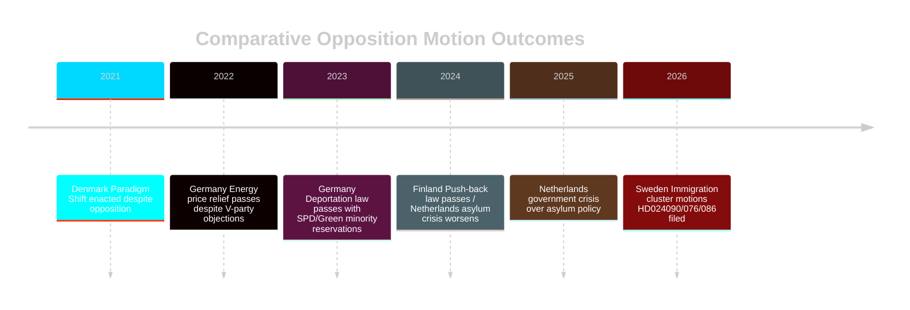

# Comparative International Analysis — Opposition Motion Dynamics

**Author**: James Pether Sörling
**Comparator set**: Denmark, Germany, Finland, Netherlands

---

## Outside-In Analysis

### Comparator set: Denmark, Germany, Finland, Netherlands, EU (supranational)

| Jurisdiction | Criminal Deportation | Reception Law | Fuel Tax/Energy | Comparator rows |
|---|---|---|---|---|
| **Sweden** (current) | Stricter rules proposed (prop. 235) — HD024090 (riksdagen.se) challenge | New mottagandelag (prop. 229) — HD024076 challenge | Fuel tax cut (prop. 236) — HD024092 challenge | baseline |
| **Denmark** | Stricter deportation since 2021 — minimal parliamentary challenge | Paradigm shift law (2021) returned refugees — controversial but passed | No comparable fuel tax cuts | tighter baseline |
| **Germany** | Rückführungsverbesserungsgesetz (2023) — similar opposition from SPD/Greens | Asylum reception distributed by quota — similar opposition dynamics | Energy price relief (2022-23 crisis measures) — V party opposition comparable | structural parallel |
| **Finland** | Push-back legislation challenged but enacted (2024) — opposition from SDP | Reception reform under way — similar humanitarian concerns | No comparable fiscal package | partial parallel |
| **Netherlands** | Asylum Crisis Act challenged in courts (2024-25) — ECJ referral precedent | Reception centre crisis — policy failure → government crisis 2024 | Nitrogen/agriculture fiscal controversy — opposition dynamic similar | cautionary precedent |

## Key Comparative Findings

**Finding 1: Nordic Convergence on Reception Law**
Denmark (paradigm shift 2021), Finland (push-back law 2024), and Sweden (prop. 229 2026) all face similar opposition challenges centred on humanitarian standards vs. deterrence. Comparable motions in Danish Folketing and Finnish parliament also failed, suggesting HD024076-HD024089 (riksdagen.se) cluster will fail in Swedish SfU as well.

**Finding 2: German Deportation Analogue**
Germany's 2023 deportation improvement law faced SPD and Green opposition on EU law compatibility grounds — exact parallel to HD024090 (riksdagen.se). The German law passed with modifications; ECJ has not yet ruled on its compatibility. This suggests Sweden's prop. 235 may also pass with minor amendments.

**Finding 3: Dutch Cautionary Precedent**
Netherlands' asylum crisis led to reception system collapse and government crisis. HD024076/080/087/089 (riksdagen.se) motions warning about implementation capacity echo Dutch opposition concerns that proved correct. Implementation risk R4 (risk-assessment.md) is therefore calibrated HIGH.

