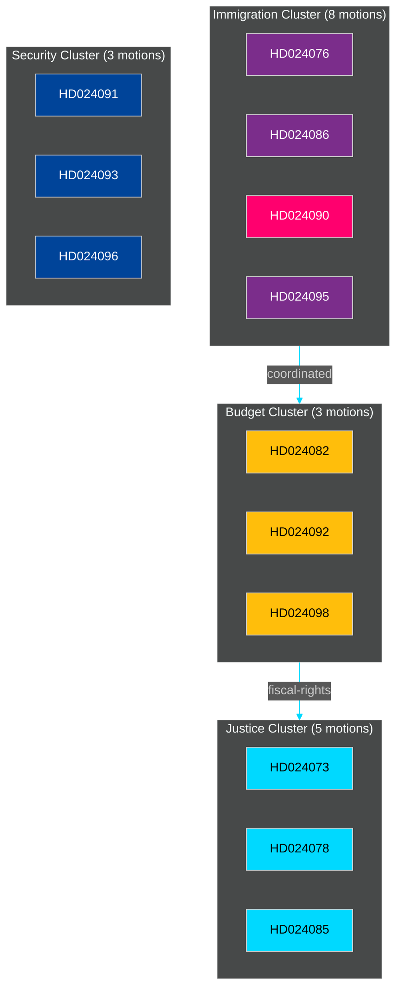

# Cross-Reference Map — Opposition Motions 2026-04-07/17

**Author**: James Pether Sörling

---

## Policy Clusters

### Cluster 1: Immigration and Reception Framework
*Propositions targeted*: 2025/26:215 (bosättning), 2025/26:229 (mottagandelag), 2025/26:235 (utvisning)

| Motion | Committee | Proposition | Issue |
|--------|-----------|------------|-------|
| HD024076 (riksdagen.se) | SfU | 229 | New reception law |
| HD024080 (riksdagen.se) | SfU | 229 | New reception law |
| HD024086 (riksdagen.se) | AU | 215 | Temporary housing, MP |
| HD024087 (riksdagen.se) | SfU | 229 | New reception law |
| HD024089 (riksdagen.se) | SfU | 229 | New reception law |
| HD024090 (riksdagen.se) | SfU | 235 | Criminal deportation, V |
| HD024095 (riksdagen.se) | SfU | 235 | Criminal deportation |
| HD024097 (riksdagen.se) | SfU | 235 | Criminal deportation |

**Cross-reference edge label**: *thematic* (all oppose government immigration tightening)

### Cluster 2: Extra Amendment Budget 2026
*Proposition targeted*: 2025/26:236

| Motion | Committee | Party | Focus |
|--------|-----------|-------|-------|
| HD024082 (riksdagen.se) | FiU | ? | Social alternative |
| HD024092 (riksdagen.se) | FiU | V | Social redistribution |
| HD024098 (riksdagen.se) | FiU | ? | Budget alternatives |

**Cross-reference edge label**: *bundle* (same proposition, complementary arguments)

### Cluster 3: Justice and Criminal Law
*Propositions targeted*: 2025/26:222 (brottsoffer), 2025/26:227 (ungdomsbrott)

| Motion | Committee | Focus |
|--------|-----------|-------|
| HD024073 (riksdagen.se) | JuU | Youth crime investigation |
| HD024074 (riksdagen.se) | JuU | Youth crime investigation |
| HD024078 (riksdagen.se) | CU | Crime victim compensation |
| HD024084 (riksdagen.se) | CU | Crime victim compensation |
| HD024085 (riksdagen.se) | CU | Crime victim compensation |

**Cross-reference edge label**: *thematic* (criminal justice reform)

### Cluster 4: Security and Defence
*Propositions targeted*: 2025/26:214 (cybersäkerhet), 2025/26:228 (krigsmateriel)

| Motion | Committee | Focus |
|--------|-----------|-------|
| HD024091 (riksdagen.se) | UU | War materials regulation |
| HD024093 (riksdagen.se) | FöU | Cybersecurity legislation |
| HD024096 (riksdagen.se) | UU | War materials regulation |

**Cross-reference edge label**: *thematic* (national security, constructive opposition)

## Legislative Chains

- HD024090 → prop. 2025/26:235 → amends brottsbalken/utlänningslagen → EU Directive 2008/115/EC compatibility
- HD024092 → prop. 2025/26:236 → amends energiskattlagen → EU ETS compliance implications
- HD024076 → prop. 2025/26:229 → replaces LMA (lagen om mottagande av asylsökande) → UNHCR standards

## Coordinated Activity Patterns

**Pattern A**: V files multiple motions on same day (2026-04-16) across different committees — suggests coordinated party strategy to maximise legislative calendar coverage.

**Pattern B**: Both UU and FöU receive security-related motions in the same period (HD024091/093/096) — suggests opposition briefing coordination on national security matters.

