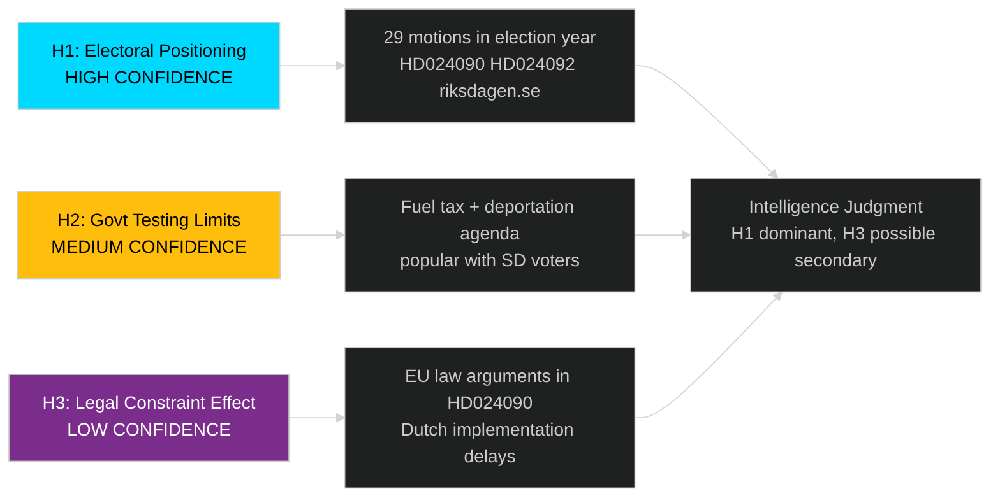

# Devil's Advocate Analysis — Swedish Opposition Motions Spring 2026

**Author**: James Pether Sörling
**Method**: ACH (Analysis of Competing Hypotheses)

---

## ACH Matrix

Three competing hypotheses tested against the evidence:

---

## H1: Opposition Motions Are Primarily Electoral Positioning [HIGH CONFIDENCE]

**Hypothesis**: The 29 motions filed in April 2026 serve primarily as electoral position papers for the September 2026 election, not genuine attempts to amend legislation.

**Evidence supporting H1**:
- Sheer volume (29 motions, 10 committees) is unusual without major external shock
- HD024090, HD024092 (riksdagen.se) — V motions filed simultaneously on deportation and fuel tax suggest coordinated PR strategy
- All filed shortly before election campaign season begins
- V and MP historically have limited ability to pass motions with current majority

**Evidence against H1**:
- HD024076 (riksdagen.se) — reception law motion filed April 13, before most others, suggests genuine policy concern not just timing
- V's legal-rights argument on HD024090 (riksdagen.se) has substantive EU law content
- Technical quality of motions (committee-specific, proposal-linked) suggests genuine legislative engagement

**ACH assessment**: H1 likely (HIGH CONFIDENCE) as the dominant motive, but coexists with genuine policy substance

---

## H2: Government Is Deliberately Testing Coalition Limits Before Election [MEDIUM CONFIDENCE]

**Hypothesis**: The government's tight spring agenda (immigration, budget, security) is deliberately designed to test whether SD remains a reliable coalition partner and to force opposition parties to take unpopular positions.

**Evidence supporting H2**:
- Fuel tax cuts (prop. 236, challenged by HD024092 riksdagen.se) are popular with rural/SD voters
- Stricter deportation (prop. 235, challenged by HD024090 riksdagen.se) is a classic SD priority
- 29 motions across 10 committees suggests government's agenda is testing opposition capacity on all fronts simultaneously

**Evidence against H2**:
- No direct evidence of strategic intent — government may simply be clearing its legislative backlog
- Some propositions (cybersecurity prop. 214, challenged constructively by HD024093 riksdagen.se) are clearly not adversarial

**ACH assessment**: H2 plausible (MEDIUM CONFIDENCE) — cannot confirm without internal government communications

---

## H3: Opposition Motions Reflect Genuine Legal Concerns That Will Constrain Implementation [LOW CONFIDENCE]

**Hypothesis**: V's legal-rights challenges (HD024090 riksdagen.se) will have substantive legal effect even if the motions fail — through court challenges, ECJ referrals, or agency reluctance to implement stricter rules.

**Evidence supporting H3**:
- HD024090 (riksdagen.se) — V's EU law compatibility argument is legally substantive
- Dutch precedent (comparative-international.md) — similar legal challenges in Netherlands delayed implementation
- Swedish administrative courts have previously referred immigration cases to ECJ

**Evidence against H3**:
- Most motions are primarily political documents, not legal briefs
- Government likely to address procedural concerns in committee
- ECJ timeline too long to affect 2026 implementation

**ACH assessment**: H3 possible (LOW CONFIDENCE) as a secondary effect; unlikely to be primary outcome

## Red Team Challenge

**Red Team Question**: What if the opposition is wrong about EU law, and HD024090 (riksdagen.se) challenge is legally weak?

If V's EU law arguments in HD024090 are rejected by Swedish courts and the ECJ:
- Government deportation policy gains legal legitimacy
- V is politically embarrassed for overstating legal risks
- SD and M use the failed challenge as evidence that the opposition is "soft on crime"
- Political cost to opposition estimated: 1-2 percentage points in election polling

**Rejected alternative hypothesis**: That the motions represent a genuine opposition majority capable of defeating the government. Rejected because: parliamentary arithmetic with SD support gives government clear majority in all relevant committees.

