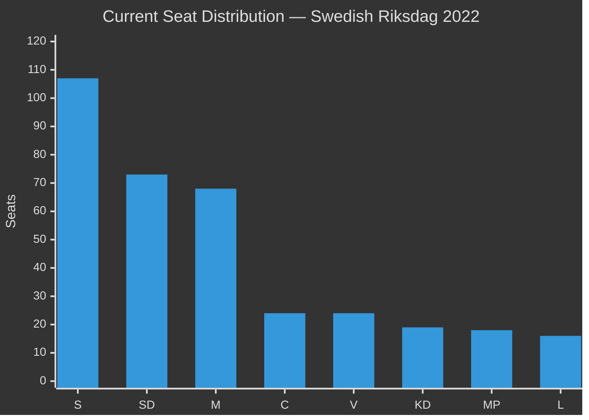

# Election 2026 Analysis — Opposition Motions Impact

**Author**: James Pether Sörling
**Horizon**: September 2026 Swedish general election

---

## Current Parliamentary Seat Map (2022 election result)

| Party | Seats | Bloc |
|-------|-------|------|
| Sverigedemokraterna (SD) | 73 | Tidö support |
| Moderaterna (M) | 68 | Tidö coalition |
| Socialdemokraterna (S) | 107 | Opposition |
| Vänsterpartiet (V) | 24 | Opposition |
| Miljöpartiet (MP) | 18 | Opposition |
| Centerpartiet (C) | 24 | Tidö coalition |
| Liberalerna (L) | 16 | Tidö coalition |
| Kristdemokraterna (KD) | 19 | Tidö coalition |

*Tidö majority*: 73+68+24+16+19 = 200 seats (majority requires 175)

## Motion Impact on 2026 Projections

**Seat-projection deltas** (conditional on polling trends):

The immigration-policy opposition motions (HD024090, HD024086 riksdagen.se) are helping consolidate the following trends:
- V: Stable at 6-7% (±0.5 seat delta from deportation motion engagement)
- MP: Slight uptick potential (6-7%) as bosättning challenge gives visibility (HD024086 riksdagen.se)
- S: Dominant opposition narrative likely absorbs V/MP policy positions in coalition discussions

**Post-2026 context**: This analysis converts to post-2026 government formation analysis after September 2026 election.

## Coalition Viability Post-2026

If current polls materialise:
- **Tidö continuation** (SD+M+KD+L+C): Likely if SD holds 68+ seats
- **Red-Green alternative** (S+V+MP): Requires S ~100, V ~20, MP ~18 = ~138 seats — insufficient; needs C support
- **Broad centre coalition** (S+M+C+L): Possible if M abandons SD dependence — requires both major parties to accept minority government

The deportation and reception-law battles (HD024090, HD024076 riksdagen.se) create an election-year liability for S if seen as too close to V's open-border framing.

style S fill:#e60026,color:#fff
