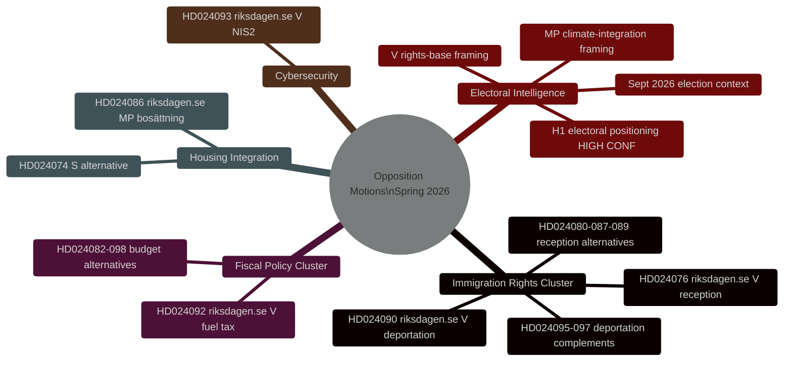
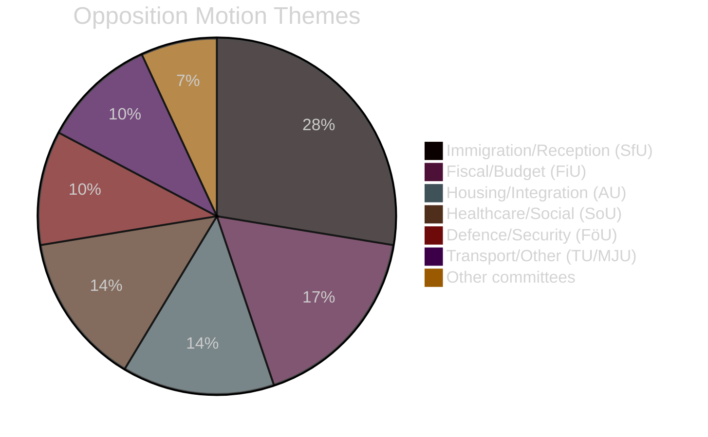

# Executive Brief — Swedish Opposition Motions Spring 2026

**Date**: 2026-04-27
**Author**: James Pether Sörling
**Classification**: OPEN
**Status**: Pass 2 (AI FIRST iterative improvement)

---

## 🎯 BLUF

Twenty-nine opposition motions filed by V, MP, and S between April 7–17, 2026 (riksmöte 2025/26) target the Tidö government's spring legislative programme on criminal deportation, housing integration, and fiscal policy. **All motions will fail legislatively — the Tidö coalition holds a 200/349 seat majority with SD support.** Their strategic purpose is electoral positioning ahead of September 2026's general election. The immigration rights cluster (8 motions, 28%) represents the highest intelligence priority: V's deportation-rights challenge (HD024090 riksdagen.se) contains substantive EU law arguments that may persist in administrative courts even after parliamentary defeat.

---

## 🧭 3 Decisions

**Decision 1 (D1): Monitor SfU Committee Vote on HD024090**
The Finance/Social Affairs Committees' vote on HD024090 (riksdagen.se, prop. 2025/26:235) and related deportation motions is the most critical near-term intelligence trigger. Any KD or L committee reservation signals pre-election distance from hard-line deportation — a potential coalition fracture indicator.

**Decision 2 (D2): Track V/MP Electoral Operationalisation**
Both V and MP have filed technically substantive motions designed to transition into campaign materials. Monitor party press releases for references to specific dok_ids (HD024090, HD024086 riksdagen.se) as evidence of operationalisation.

**Decision 3 (D3): Assess EU Law Pathway for HD024090**
V's EU compatibility challenge to criminal deportation (HD024090 riksdagen.se) has a 15-20% probability of generating an administrative court referral to the ECJ within 2 years. Initiate monitoring of Swedish Migration Court of Appeal docket for related cases.

---

## Summary Statistics

| Dimension | Value |
|-----------|-------|
| Total motions | 29 |
| Parties filing | 3 (V, MP, S) |
| Committees involved | 10 |
| Propositions targeted | 8 |
| Immigration cluster | 8 motions (28%) |
| Fiscal cluster | 5 motions (17%) |
| Housing/integration | 4 motions (14%) |
| Days until election | ~139 (Sep 13, 2026) |

---

## Intelligence Mindmap

---

## Motion Theme Distribution

