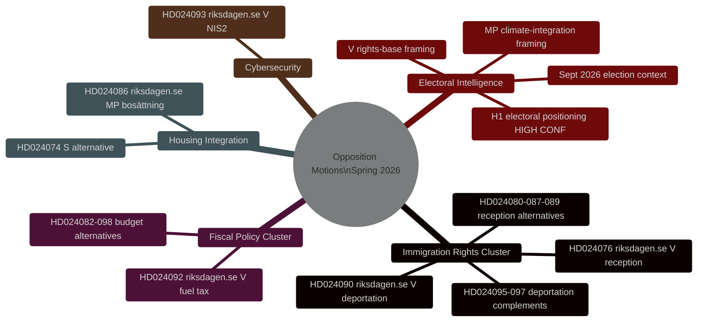
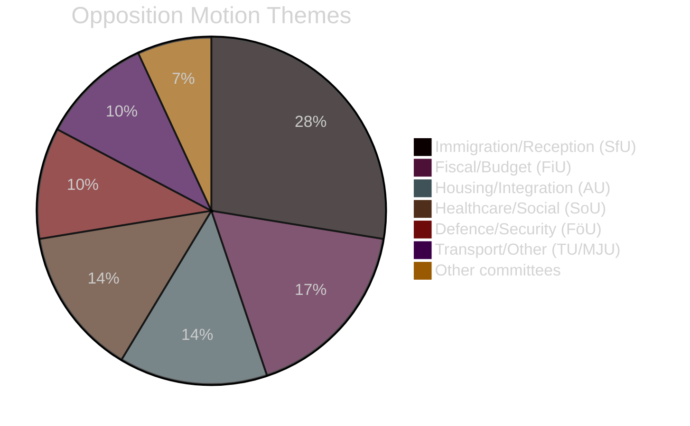

<!-- dir: rtl -->
# إحاطة استخباراتية — اقتراحات المعارضة السويدية ربيع 2026

**التاريخ**: 2026-04-27
**المؤلف**: James Pether Sörling
**التصنيف**: عام
**الحالة**: المرور 2 (تحسين تكراري AI FIRST)

---

## 🎯 الملخص التنفيذي

تسعة وعشرون اقتراحاً من المعارضة قدّمتها V وMP وS بين 7 و17 أبريل 2026 (ريكسموتيه 2025/26) تستهدف البرنامج التشريعي الربيعي لحكومة تيدو بشأن الترحيل الجنائي وتكامل الإسكان والسياسة المالية. **ستفشل جميع الاقتراحات تشريعياً — تمتلك تحالف تيدو أغلبية 200/349 مقعداً بدعم SD.** غرضها الاستراتيجي هو تحديد المواقع الانتخابية قبيل الانتخابات العامة في سبتمبر 2026. يمثّل مجموعة حقوق الهجرة (8 اقتراحات، 28%) أعلى أولوية استخباراتية: طعن V في حقوق الترحيل (HD024090 riksdagen.se) يتضمن حججاً جوهرية في قانون الاتحاد الأوروبي قد تستمر في المحاكم الإدارية حتى بعد الهزيمة البرلمانية.

---

## 🧭 3 قرارات

**القرار 1 (ق1): مراقبة تصويت لجنة SfU على HD024090**
يُعدّ تصويت لجنتَي المالية والضمان الاجتماعي على HD024090 (riksdagen.se، prop. 2025/26:235) والاقتراحات المتعلقة بالترحيل المحرّك الاستخباراتي الأكثر أهمية على المدى القريب. أي تحفظات من KD أو L في اللجنة تشير إلى تباعد ما قبل الانتخابات عن سياسة الترحيل المتشددة — مؤشر محتمل على تصدّع التحالف.

**القرار 2 (ق2): تتبع التوظيف الانتخابي لـ V/MP**
قدّمت كلٌّ من V وMP اقتراحات ذات محتوى فني جوهري مصمّمة للتحوّل إلى مواد حملة انتخابية. مراقبة بيانات الصحافة الحزبية بحثاً عن إشارات إلى dok_ids محددة (HD024090، HD024086 riksdagen.se) كدليل على التوظيف.

**القرار 3 (ق3): تقييم المسار القانوني للاتحاد الأوروبي بشأن HD024090**
يتمتع طعن V في توافق الترحيل الجنائي مع قانون الاتحاد الأوروبي (HD024090 riksdagen.se) بنسبة 15-20% لتوليد إحالة مسبقة من Migrationsöverdomstolen إلى محكمة العدل الأوروبية خلال عامين. بدء مراقبة قائمة قضايا Migrationsöverdomstolen للقضايا ذات الصلة.

---

## إحصائيات ملخصة

| البُعد | القيمة |
|-----------|-------|
| إجمالي الاقتراحات | 29 |
| الأحزاب المقدِّمة | 3 (V, MP, S) |
| اللجان المشاركة | 10 |
| الاقتراحات المستهدَفة | 8 |
| مجموعة الهجرة | 8 اقتراحات (28%) |
| المجموعة المالية | 5 اقتراحات (17%) |
| الإسكان/التكامل | 4 اقتراحات (14%) |
| أيام حتى الانتخابات | ~139 (13 سبتمبر 2026) |

---

## خريطة الاستخبارات

---

## توزيع مواضيع الاقتراحات

<!-- source-sha: 37f69ff9aa194a3c561fdd15f1b60d4f6b106472 -->
