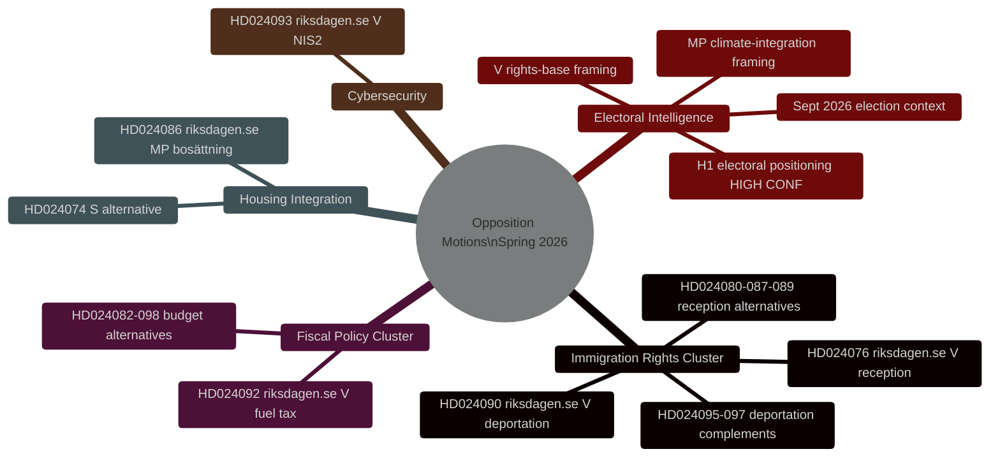
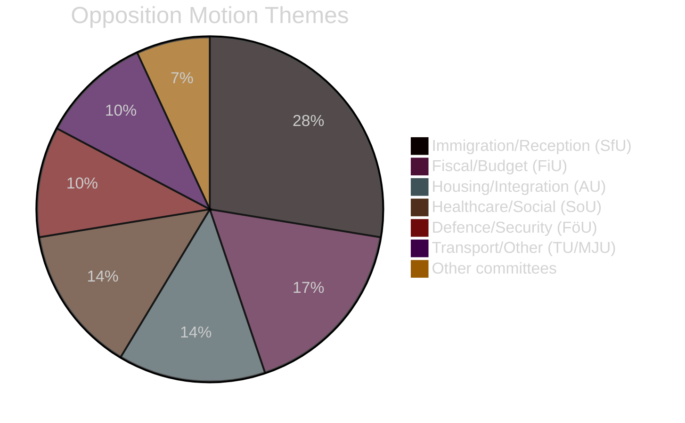

# Efterretningsbriefing — Svenske oppositionsmotioner foråret 2026

**Dato**: 2026-04-27
**Forfatter**: James Pether Sörling
**Klassifikation**: ÅBEN
**Status**: Pass 2 (AI FIRST iterativ forbedring)

---

## 🎯 Kortfattet konklusion

Ni og tyve oppositionsmotioner indgivet af V, MP og S mellem 7.–17. april 2026 (riksmöte 2025/26) retter sig mod Tidö-regeringens lovgivningsprogram for kriminel udvisning, boligintegration og finanspolitik. **Alle motioner vil falde lovgivningsmæssigt — Tidö-koalitionen har et flertal på 200/349 mandater med SD's støtte.** Deres strategiske formål er valgpositionering forud for parlamentsvalget i september 2026. Immigrationsrettigheds-klyngen (8 motioner, 28%) repræsenterer den højeste efterretningsprioritet: V's udvisningsrettighedsudfordring (HD024090 riksdagen.se) indeholder substantielle EU-retlige argumenter, der kan bestå i forvaltningsdomstolene selv efter parlamentarisk nederlag.

---

## 🧭 3 Beslutninger

**Beslutning 1 (B1): Overvåg SfU-udvalgets afstemning om HD024090**
Finans- og socialudvalgets afstemning om HD024090 (riksdagen.se, prop. 2025/26:235) og relaterede udvisningsmotioner er den vigtigste efterretningsgivende udløser på kort sigt. Eventuelle reservationer fra KD eller L i udvalget signalerer forudvalgsdistancering fra hårdhændet udvisningspolitik — en potentiel koalitionsbrudindikator.

**Beslutning 2 (B2): Følg V's/MP's valoperationalisering**
Både V og MP har indgivet teknisk substantielle motioner designet til at overgå til kampagnemateriale. Overvåg partiernes pressemeddelelser for henvisninger til specifikke dok-id'er (HD024090, HD024086 riksdagen.se) som bevis på operationalisering.

**Beslutning 3 (B3): Vurder EU-retlig sti for HD024090**
V's EU-kompatibilitetsudfordring til kriminel udvisning (HD024090 riksdagen.se) har 15–20% sandsynlighed for at generere en forelæggelse fra Migrationsöverdomstolen til EF-Domstolen inden for 2 år. Igangsæt overvågning af Migrationsöverdomstolens sagsliste for relaterede sager.

---

## Sammenfatningsstatistik

| Dimension | Værdi |
|-----------|-------|
| Motioner i alt | 29 |
| Partier der indgiver | 3 (V, MP, S) |
| Involverede udvalg | 10 |
| Målrettede propositioner | 8 |
| Immigrationsklynge | 8 motioner (28%) |
| Finansklynge | 5 motioner (17%) |
| Bolig/integration | 4 motioner (14%) |
| Dage til valg | ~139 (13. sep 2026) |

---

## Efterretningskort

---

## Fordeling af motionernes temaer

<!-- source-sha: 37f69ff9aa194a3c561fdd15f1b60d4f6b106472 -->
