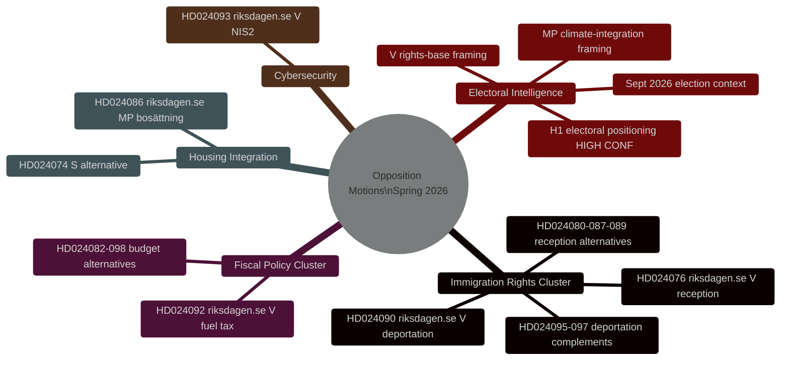
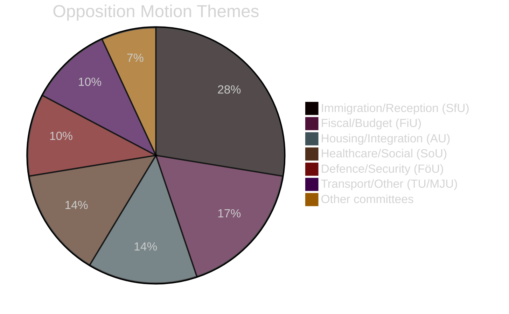

# Nachrichtenbriefing — Schwedische Oppositionsmotionen Frühjahr 2026

**Datum**: 2026-04-27
**Autor**: James Pether Sörling
**Einstufung**: ÖFFENTLICH
**Status**: Pass 2 (AI FIRST iterative Verbesserung)

---

## 🎯 Kurzfassung

Neunundzwanzig Oppositionsmotionen von V, MP und S zwischen dem 7.–17. April 2026 (Riksmöte 2025/26) zielen auf das Frühjahrsgesetzgebungsprogramm der Tidö-Regierung zu krimineller Ausweisung, Wohnraumintegration und Finanzpolitik ab. **Alle Motionen werden legislativ scheitern — die Tidö-Koalition hält eine Mehrheit von 200/349 Mandaten mit SD-Unterstützung.** Ihr strategischer Zweck ist die Wahlpositionierung vor der Reichstagswahl im September 2026. Das Einwanderungsrechts-Cluster (8 Motionen, 28%) stellt die höchste Nachrichtendienstpriorität dar: V's Abschiebungsrechts-Herausforderung (HD024090 riksdagen.se) enthält substanzielle EU-rechtliche Argumente, die auch nach parlamentarischer Niederlage in Verwaltungsgerichten Bestand haben könnten.

---

## 🧭 3 Entscheidungen

**Entscheidung 1 (E1): SfU-Ausschussabstimmung zu HD024090 überwachen**
Die Abstimmung des Finanz- und Sozialversicherungsausschusses über HD024090 (riksdagen.se, Prop. 2025/26:235) und verwandte Ausweisungsmotionen ist der wichtigste kurzfristige Nachrichtendienstauslöser. Vorbehalte von KD oder L im Ausschuss signalisieren vorwahlbedingte Distanzierung von einer harten Ausweisungspolitik — ein potenzieller Koalitionsbruch-Indikator.

**Entscheidung 2 (E2): V's/MP's Wahloperationalisierung verfolgen**
Sowohl V als auch MP haben technisch substanzielle Motionen eingereicht, die als Kampagnenmaterial dienen sollen. Parteipressemitteilungen auf Verweise auf spezifische Dok-IDs (HD024090, HD024086 riksdagen.se) als Beweis der Operationalisierung überwachen.

**Entscheidung 3 (E3): EU-rechtlichen Pfad für HD024090 bewerten**
V's EU-Kompatibilitäts-Herausforderung zur kriminellen Ausweisung (HD024090 riksdagen.se) hat eine 15–20%ige Wahrscheinlichkeit, innerhalb von 2 Jahren eine Vorabentscheidungsvorlage des Migrationsöverdomstolen an den EuGH zu erzeugen. Überwachung des Rollenspiels des Migrationsöverdomstolen für verwandte Fälle einleiten.

---

## Zusammenfassende Statistiken

| Dimension | Wert |
|-----------|-------|
| Motionen gesamt | 29 |
| Einreichende Parteien | 3 (V, MP, S) |
| Beteiligte Ausschüsse | 10 |
| Adressierte Propositionen | 8 |
| Einwanderungs-Cluster | 8 Motionen (28%) |
| Finanz-Cluster | 5 Motionen (17%) |
| Wohnen/Integration | 4 Motionen (14%) |
| Tage bis zur Wahl | ~139 (13. Sep 2026) |

---

## Nachrichtendienstliche Mindmap

---

## Verteilung der Motionsthemen

<!-- source-sha: 37f69ff9aa194a3c561fdd15f1b60d4f6b106472 -->
