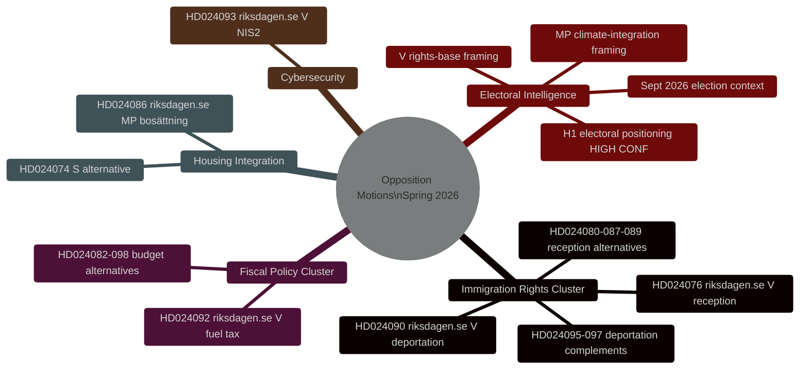
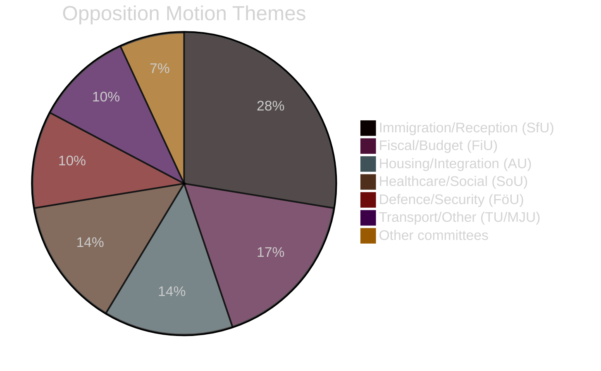

# Informe de inteligencia — Mociones de la oposición sueca primavera 2026

**Fecha**: 2026-04-27
**Autor**: James Pether Sörling
**Clasificación**: PÚBLICO
**Estado**: Pasada 2 (mejora iterativa AI FIRST)

---

## 🎯 Resumen ejecutivo

Veintinueve mociones de la oposición presentadas por V, MP y S entre el 7 y el 17 de abril de 2026 (riksmöte 2025/26) se dirigen al programa legislativo de primavera del gobierno Tidö sobre deportación criminal, integración habitacional y política fiscal. **Todas las mociones fracasarán legislativamente — la coalición Tidö tiene una mayoría de 200/349 escaños con el apoyo del SD.** Su propósito estratégico es el posicionamiento electoral de cara a las elecciones generales de septiembre de 2026. El grupo de derechos migratorios (8 mociones, 28%) representa la mayor prioridad de inteligencia: el desafío de derechos de deportación de V (HD024090 riksdagen.se) contiene argumentos sustanciales de derecho de la UE que podrían persistir en los tribunales administrativos incluso después de una derrota parlamentaria.

---

## 🧭 3 Decisiones

**Decisión 1 (D1): Supervisar la votación del comité SfU sobre HD024090**
La votación de los comités de finanzas y asuntos sociales sobre HD024090 (riksdagen.se, prop. 2025/26:235) y las mociones de deportación relacionadas es el disparador de inteligencia más crítico a corto plazo. Cualquier reserva de KD o L en comité señala un alejamiento preelectoral de la política de deportación dura — indicador potencial de fractura de la coalición.

**Decisión 2 (D2): Rastrear la operacionalización electoral de V/MP**
Tanto V como MP han presentado mociones técnicamente sustanciales diseñadas para convertirse en material de campaña. Supervisar los comunicados de prensa de los partidos para referencias a dok_ids específicos (HD024090, HD024086 riksdagen.se) como prueba de operacionalización.

**Decisión 3 (D3): Evaluar la vía del derecho de la UE para HD024090**
El desafío de compatibilidad con el derecho de la UE de V sobre deportación criminal (HD024090 riksdagen.se) tiene una probabilidad del 15–20% de generar una remisión prejudicial del Migrationsöverdomstolen al TJUE dentro de 2 años. Iniciar el seguimiento del expediente del Migrationsöverdomstolen para casos relacionados.

---

## Estadísticas de resumen

| Dimensión | Valor |
|-----------|-------|
| Total de mociones | 29 |
| Partidos presentadores | 3 (V, MP, S) |
| Comités involucrados | 10 |
| Proposiciones dirigidas | 8 |
| Grupo de inmigración | 8 mociones (28%) |
| Grupo fiscal | 5 mociones (17%) |
| Vivienda/integración | 4 mociones (14%) |
| Días hasta las elecciones | ~139 (13 sep. 2026) |

---

## Mapa de inteligencia

---

## Distribución de temas de las mociones

<!-- source-sha: 37f69ff9aa194a3c561fdd15f1b60d4f6b106472 -->
