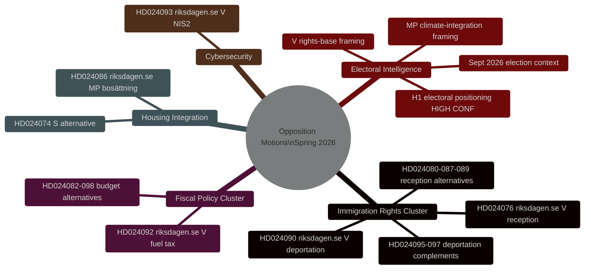
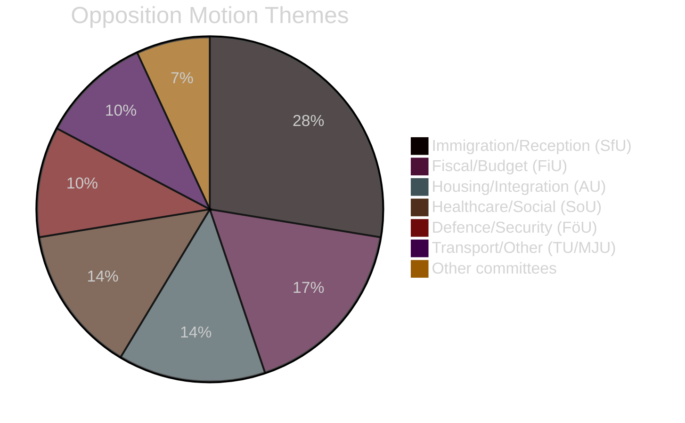

# Tiedustelubriifing — Ruotsin oppositiomoottorit kevät 2026

**Päiväys**: 2026-04-27
**Kirjoittaja**: James Pether Sörling
**Luokitus**: AVOIN
**Tila**: Pass 2 (AI FIRST iteratiivinen parannus)

---

## 🎯 Lyhyt yhteenveto

Kaksikymmentäyhdeksän V:n, MP:n ja S:n 7.–17. huhtikuuta 2026 jättämää oppositiomootion (riksmöte 2025/26) kohdistavat Tidö-hallituksen kevään lainsäädäntöohjelman rikosperusteisiin käännytyksiin, asumisintegraatioon ja finanssipolitiikkaan. **Kaikki moottiot kaatuvat lainsäädännöllisesti — Tidö-koalitio hallitsee 200/349 paikkaa SD:n tuella.** Niiden strateginen tarkoitus on vaaliasemoituminen syyskuun 2026 yleisten vaalien edellä. Maahanmuuttooikeusryväs (8 mootion, 28%) edustaa korkeinta tiedusteluprioriteettia: V:n karkotusperusteinen oikeushakopetos (HD024090 riksdagen.se) sisältää substansiaalisia EU-oikeudellisia argumentteja, jotka voivat säilyä hallinto-oikeuksissa parlamentaarisen tappion jälkeenkin.

---

## 🧭 3 Päätöstä

**Päätös 1 (P1): Seuraa SfU-valiokunnan äänestystä HD024090:stä**
Talous- ja sosiaaliturvavaliokunnan äänestys HD024090:stä (riksdagen.se, prop. 2025/26:235) ja siihen liittyvistä karkotusmoottioista on tärkein lähiajan tiedusteluliipaisin. Mahdolliset KD:n tai L:n varaumat valiokunnassa signaloivat etäisyydenottoa ennen vaaleja kovaa käännytyspolitiikkaa kohtaan — mahdollinen koalitiohajoamisen indikaattori.

**Päätös 2 (P2): Seuraa V:n/MP:n vaalioperationalisointia**
Sekä V että MP ovat jättäneet teknisesti substantiaalisia moottioita, jotka on suunniteltu siirtymään kampanjamateriaaliksi. Seuraa puolueiden lehdistötiedotteita viittauksille tiettyihin dok-id:ihin (HD024090, HD024086 riksdagen.se) operationalisoinnin todisteena.

**Päätös 3 (P3): Arvioi EU-oikeudellinen polku HD024090:lle**
V:n EU-yhteensopivuushaaste rikosperusteiseen käännytykseen (HD024090 riksdagen.se) tuottaa 15–20% todennäköisyydellä Migrationsöverdomstolista EY-tuomioistuimelle tehtävän ennakkoratkaisupyynnön 2 vuoden sisällä. Käynnistä Migrationsöverdomstolens asialistaseuranta aiheeseen liittyviä tapauksia varten.

---

## Yhteenvetotilastot

| Ulottuvuus | Arvo |
|-----------|-------|
| Moottioita yhteensä | 29 |
| Jättävät puolueet | 3 (V, MP, S) |
| Mukana olevat valiokunnat | 10 |
| Kohdepropositiot | 8 |
| Maahanmuuttoryväs | 8 mootion (28%) |
| Rahoitusryväs | 5 mootion (17%) |
| Asuminen/integraatio | 4 mootion (14%) |
| Päiviä vaaleihin | ~139 (13. syysk. 2026) |

---

## Tiedustelukartta

---

## Moottioteemojen jakauma

<!-- source-sha: 37f69ff9aa194a3c561fdd15f1b60d4f6b106472 -->
