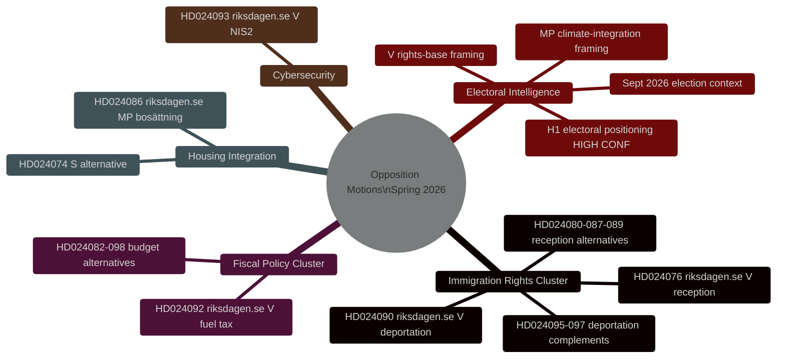
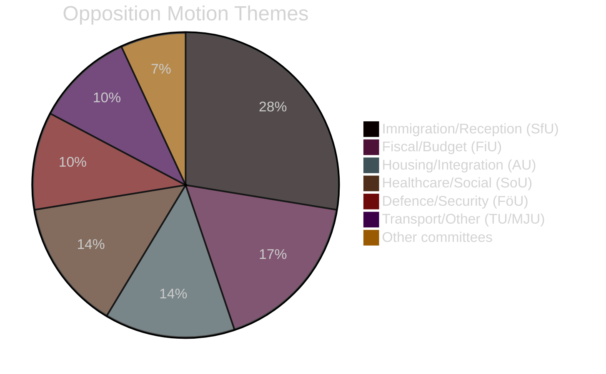

# Briefing de renseignement — Motions d'opposition suédoises printemps 2026

**Date**: 2026-04-27
**Auteur**: James Pether Sörling
**Classification**: PUBLIC
**Statut**: Pass 2 (amélioration itérative AI FIRST)

---

## 🎯 Synthèse

Vingt-neuf motions d'opposition déposées par V, MP et S entre le 7 et le 17 avril 2026 (riksmöte 2025/26) ciblent le programme législatif du printemps du gouvernement Tidö sur l'expulsion criminelle, l'intégration par le logement et la politique fiscale. **Toutes les motions échoueront législativement — la coalition Tidö détient une majorité de 200/349 sièges avec le soutien du SD.** Leur objectif stratégique est le positionnement électoral à l'approche des élections législatives de septembre 2026. Le groupe droits migratoires (8 motions, 28 %) représente la priorité de renseignement la plus élevée : le défi sur les droits d'expulsion de V (HD024090 riksdagen.se) contient des arguments de droit européen substantiels qui pourraient persister devant les tribunaux administratifs même après une défaite parlementaire.

---

## 🧭 3 Décisions

**Décision 1 (D1): Surveiller le vote du comité SfU sur HD024090**
Le vote des comités des finances et des affaires sociales sur HD024090 (riksdagen.se, prop. 2025/26:235) et les motions d'expulsion connexes est le déclencheur de renseignement le plus critique à court terme. Toute réserve de KD ou L en comité signale une distanciation préélectorale d'une politique d'expulsion sévère — indicateur potentiel de fracture de la coalition.

**Décision 2 (D2): Suivre l'opérationnalisation électorale de V/MP**
V et MP ont tous deux déposé des motions techniquement substantielles destinées à se transformer en matériaux de campagne. Surveiller les communiqués de presse des partis pour des références à des dok_ids spécifiques (HD024090, HD024086 riksdagen.se) comme preuve d'opérationnalisation.

**Décision 3 (D3): Évaluer la voie du droit de l'UE pour HD024090**
Le défi de compatibilité avec le droit de l'UE de V sur l'expulsion criminelle (HD024090 riksdagen.se) a une probabilité de 15 à 20% de générer un renvoi préjudiciel du Migrationsöverdomstolen à la CJUE dans les 2 ans. Initier une surveillance du rôle du Migrationsöverdomstolen pour les affaires connexes.

---

## Statistiques récapitulatives

| Dimension | Valeur |
|-----------|-------|
| Motions totales | 29 |
| Partis déposants | 3 (V, MP, S) |
| Comités impliqués | 10 |
| Propositions ciblées | 8 |
| Groupe immigration | 8 motions (28%) |
| Groupe fiscal | 5 motions (17%) |
| Logement/intégration | 4 motions (14%) |
| Jours avant l'élection | ~139 (13 sept. 2026) |

---

## Carte de renseignement

---

## Répartition des thèmes des motions

<!-- source-sha: 37f69ff9aa194a3c561fdd15f1b60d4f6b106472 -->
