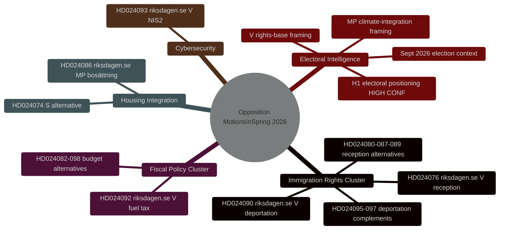
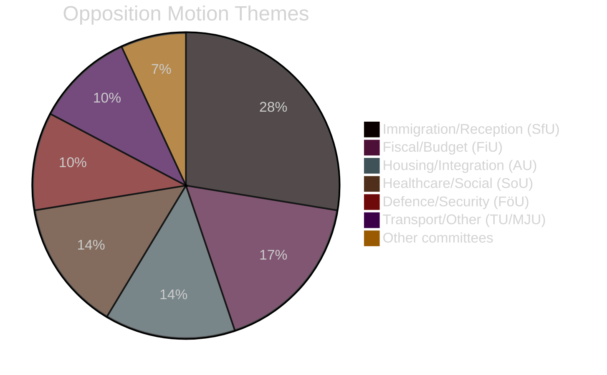

<!-- dir: rtl -->
# סיכום מודיעין — הצעות המתנגדים השוודיים אביב 2026

**תאריך**: 2026-04-27
**מחבר**: James Pether Sörling
**סיווג**: ציבורי
**מצב**: מעבר 2 (שיפור איטרטיבי AI FIRST)

---

## 🎯 סיכום עיקרי

עשרים ותשע הצעות אופוזיציה שהגישו V, MP ו-S בין 7–17 באפריל 2026 (ריקסמוטה 2025/26) מכוונות לתכנית החקיקתית של ממשלת תידו לאביב בנושא גירוש פלילי, שילוב דיור ומדיניות פיסקלית. **כל ההצעות ייכשלו חקיקתית — קואליציית תידו מחזיקה ב-200/349 מנדטים עם תמיכת SD.** מטרתן האסטרטגית היא מיצוב בחירותי לקראת הבחירות הכלליות בספטמבר 2026. אשכול זכויות ההגירה (8 הצעות, 28%) מייצג את עדיפות המודיעין הגבוהה ביותר: אתגר זכויות הגירוש של V (HD024090 riksdagen.se) מכיל טיעוני משפט האיחוד האירופי מהותיים שעשויים להישמר בבתי המשפט המנהליים גם לאחר תבוסה פרלמנטרית.

---

## 🧭 3 החלטות

**החלטה 1 (ח1): ניטור הצבעת ועדת SfU על HD024090**
הצבעת ועדות האוצר והביטוח הסוציאלי על HD024090 (riksdagen.se, prop. 2025/26:235) וההצעות הקשורות לגירוש הן הטריגר המודיעיני הקריטי ביותר בטווח הקרוב. כל הסתייגויות של KD או L בוועדה מסמנות ריחוק טרום-בחירות ממדיניות גירוש קשוחה — אינדיקטור פוטנציאלי לסדק בקואליציה.

**החלטה 2 (ח2): מעקב אחר אופרציונליזציה בחירותית של V/MP**
גם V וגם MP הגישו הצעות בעלות תוכן טכני מהותי המיועדות להפוך לחומר קמפיין. לנטר הודעות לעיתונות מפלגתיות לאיתור הפניות ל-dok_ids ספציפיים (HD024090, HD024086 riksdagen.se) כעדות לאופרציונליזציה.

**החלטה 3 (ח3): הערכת נתיב משפט האיחוד האירופי עבור HD024090**
לאתגר התאימות לחוק האיחוד האירופי של V לגירוש פלילי (HD024090 riksdagen.se) יש הסתברות של 15–20% לייצר הפניה מקדמית מ-Migrationsöverdomstolen לבית הדין האירופי לצדק תוך 2 שנים. להתחיל מעקב אחר תיק Migrationsöverdomstolen בנושאים קשורים.

---

## סטטיסטיקת סיכום

| מימד | ערך |
|-----------|-------|
| סך הצעות | 29 |
| מפלגות מגישות | 3 (V, MP, S) |
| ועדות מעורבות | 10 |
| הצעות חוק ממוקדות | 8 |
| אשכול הגירה | 8 הצעות (28%) |
| אשכול פיסקלי | 5 הצעות (17%) |
| דיור/שילוב | 4 הצעות (14%) |
| ימים לבחירות | ~139 (13 ספטמבר 2026) |

---

## מפת מודיעין

---

## התפלגות נושאי ההצעות

<!-- source-sha: 37f69ff9aa194a3c561fdd15f1b60d4f6b106472 -->
