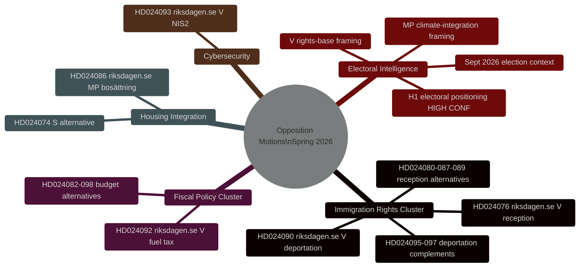
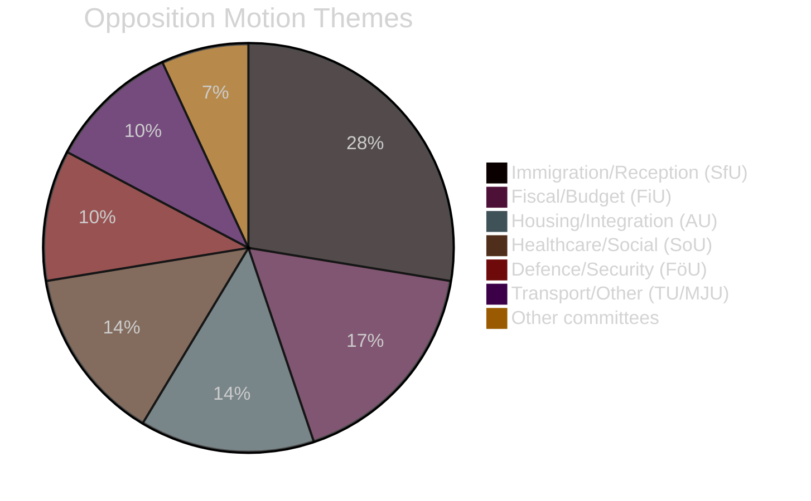

# インテリジェンス概要 — スウェーデン野党動議 2026年春

**日付**: 2026-04-27
**著者**: James Pether Sörling
**分類**: 公開
**状態**: パス2（AI FIRST反復改善）

---

## 🎯 要点

V、MP、Sが2026年4月7日から17日の間（riksmöte 2025/26）に提出した29件の野党動議は、ティドー政府の春季立法プログラム（刑事追放、住宅統合、財政政策）を標的としている。**すべての動議は立法的に失敗する — ティドー連立はSDの支持により200/349議席の過半数を保持している。** その戦略的目的は2026年9月の総選挙に向けた選挙ポジショニングである。移民権クラスター（8動議、28%）が最高の情報優先度を示す：Vの追放権への挑戦（HD024090 riksdagen.se）は、議会での敗北後も行政裁判所で持続する可能性のある実質的なEU法の論拠を含んでいる。

---

## 🧭 3つの意思決定

**意思決定1（D1）：HD024090に関するSfU委員会の投票を監視**
HD024090（riksdagen.se、prop. 2025/26:235）および関連する追放動議に関する財務・社会保険委員会の投票は、最も重要な近期の情報トリガーである。委員会でのKDまたはLの留保は、強硬な追放政策からの選挙前の距離を取りを示す — 連立亀裂の可能性指標。

**意思決定2（D2）：V/MPの選挙的操作化を追跡**
VとMPの両方が、選挙運動材料に移行するよう設計された技術的に実質的な動議を提出している。特定のdok_id（HD024090、HD024086 riksdagen.se）への参照を操作化の証拠として政党のプレスリリースを監視すること。

**意思決定3（D3）：HD024090のEU法経路を評価**
刑事追放に対するVのEU適合性への挑戦（HD024090 riksdagen.se）は、2年以内にMigrationsöverdomstolenからECJへの先決裁定申請を生成する確率が15〜20%ある。関連事件について移住最高裁判所のドケットの監視を開始すること。

---

## サマリー統計

| 項目 | 値 |
|-----------|-------|
| 動議総数 | 29 |
| 提出政党 | 3（V、MP、S）|
| 関係委員会 | 10 |
| 標的命題 | 8 |
| 移民クラスター | 8動議（28%）|
| 財政クラスター | 5動議（17%）|
| 住宅/統合 | 4動議（14%）|
| 選挙まで | 約139日（2026年9月13日）|

---

## インテリジェンス・マインドマップ

---

## 動議テーマ分布

<!-- source-sha: 37f69ff9aa194a3c561fdd15f1b60d4f6b106472 -->
