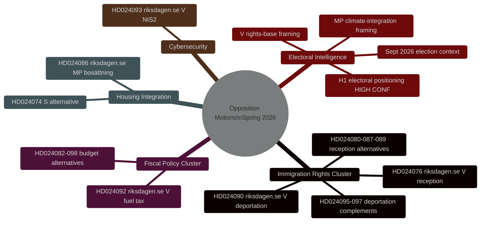
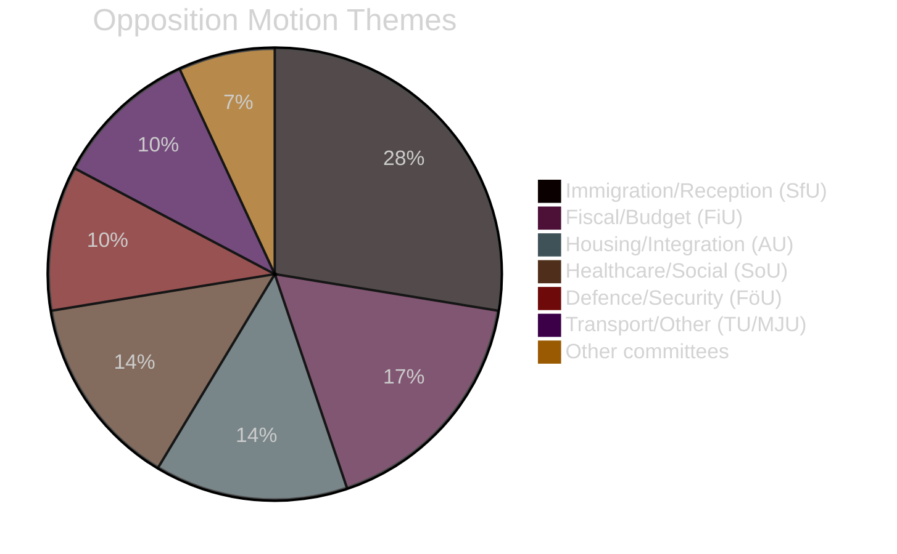

# 인텔리전스 개요 — 스웨덴 야당 발의 2026년 봄

**날짜**: 2026-04-27
**저자**: James Pether Sörling
**분류**: 공개
**상태**: 패스 2（AI FIRST 반복 개선）

---

## 🎯 핵심 요약

V, MP, S가 2026년 4월 7일~17일 사이(riksmöte 2025/26)에 제출한 29건의 야당 발의는 티도 정부의 봄 입법 프로그램(형사 추방, 주거 통합, 재정 정책)을 겨냥하고 있다. **모든 발의는 입법적으로 실패할 것이다 — 티도 연립은 SD의 지원으로 200/349 의석 과반수를 보유하고 있다.** 전략적 목적은 2026년 9월 총선을 앞둔 선거 포지셔닝이다. 이민 권리 클러스터(8건 발의, 28%)가 최고 정보 우선순위를 나타낸다: V의 추방 권리 도전(HD024090 riksdagen.se)은 의회 패배 후에도 행정법원에서 지속될 수 있는 실질적인 EU법 논거를 포함하고 있다.

---

## 🧭 3가지 의사결정

**의사결정 1 (D1): HD024090에 관한 SfU위원회 투표 모니터링**
HD024090(riksdagen.se, prop. 2025/26:235)과 관련 추방 발의에 대한 재정·사회보험위원회의 투표는 단기적으로 가장 중요한 정보 트리거이다. 위원회에서 KD나 L의 유보는 강경한 추방 정책으로부터의 선거 전 거리두기를 신호한다 — 잠재적 연립 균열 지표.

**의사결정 2 (D2): V/MP의 선거적 운용화 추적**
V와 MP 모두 캠페인 자료로 전환하도록 설계된 기술적으로 실질적인 발의를 제출했다. 운용화의 증거로 특정 dok_id(HD024090, HD024086 riksdagen.se)에 대한 참조를 위해 정당 보도자료를 모니터링할 것.

**의사결정 3 (D3): HD024090의 EU법 경로 평가**
형사 추방에 대한 V의 EU 적합성 도전(HD024090 riksdagen.se)은 2년 내 Migrationsöverdomstolen에서 ECJ로의 선결적 판결 신청을 생성할 확률이 15~20%이다. 관련 사건에 대한 이민 최고법원 사건목록 모니터링을 시작할 것.

---

## 요약 통계

| 항목 | 값 |
|-----------|-------|
| 총 발의 | 29건 |
| 제출 정당 | 3개 (V, MP, S) |
| 관련 위원회 | 10개 |
| 표적 발의안 | 8개 |
| 이민 클러스터 | 8건 (28%) |
| 재정 클러스터 | 5건 (17%) |
| 주거/통합 | 4건 (14%) |
| 선거까지 | 약 139일 (2026년 9월 13일) |

---

## 인텔리전스 마인드맵

---

## 발의 주제 분포

<!-- source-sha: 37f69ff9aa194a3c561fdd15f1b60d4f6b106472 -->
