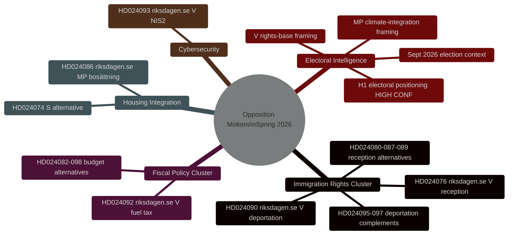
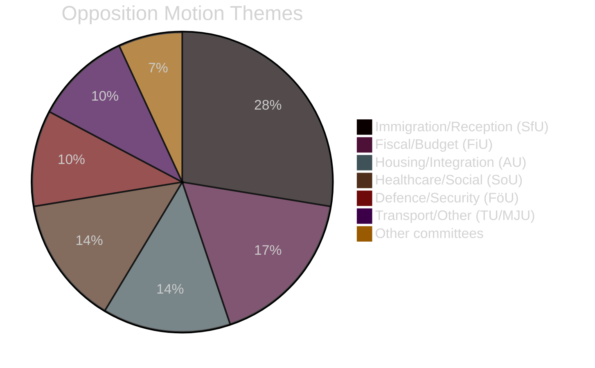

# Inlichtingenbriefing — Zweedse oppositiemoties voorjaar 2026

**Datum**: 2026-04-27
**Auteur**: James Pether Sörling
**Classificatie**: OPENBAAR
**Status**: Pass 2 (AI FIRST iteratieve verbetering)

---

## 🎯 Beknopte samenvatting

Negenentwintig oppositiemoties ingediend door V, MP en S tussen 7–17 april 2026 (riksmöte 2025/26) richten zich op het voorjaarswetgevingsprogramma van de Tidö-regering inzake criminele uitzetting, woonintegratie en begrotingsbeleid. **Alle moties zullen wetgevend falen — de Tidö-coalitie heeft een meerderheid van 200/349 zetels met SD-steun.** Hun strategisch doel is electorale positionering voorafgaand aan de verkiezingen van september 2026. De cluster migratierechten (8 moties, 28%) vormt de hoogste inlichtingenprioriteit: V's aanvechting van uitzettingsrechten (HD024090 riksdagen.se) bevat substantiële EU-rechtelijke argumenten die ook na parlementaire nederlaag bij bestuursrechters kunnen standhouden.

---

## 🧭 3 Beslissingen

**Beslissing 1 (B1): Stem SfU-commissie over HD024090 volgen**
De stemming van de financiën- en sociale zekerheidcommissies over HD024090 (riksdagen.se, prop. 2025/26:235) en aanverwante uitzettingsmoties is de belangrijkste kortetermijn inlichtingenuitlöser. Eventuele voorbehouden van KD of L in de commissie signaleren pre-electorale distantiëring van een harde uitzettingspolitiek — een potentiële coalitiebreuk-indicator.

**Beslissing 2 (B2): V's/MP's electorale operationalisering volgen**
Zowel V als MP hebben technisch substantiële moties ingediend die zijn ontworpen om campagnemateriaal te worden. Partijpersberichten monitoren op verwijzingen naar specifieke dok-id's (HD024090, HD024086 riksdagen.se) als bewijs van operationalisering.

**Beslissing 3 (B3): EU-rechtelijk pad voor HD024090 beoordelen**
V's EU-compatibiliteitschallenge voor criminele uitzetting (HD024090 riksdagen.se) heeft een kans van 15–20% om binnen 2 jaar een prejudiciële verwijzing van het Migrationsöverdomstolen naar het HvJ-EU te genereren. Monitoring van de rol van het Migrationsöverdomstolen voor verwante zaken initiëren.

---

## Samenvattende statistieken

| Dimensie | Waarde |
|-----------|-------|
| Totale moties | 29 |
| Indiende partijen | 3 (V, MP, S) |
| Betrokken commissies | 10 |
| Gerichte proposities | 8 |
| Immigratiecluster | 8 moties (28%) |
| Financieel cluster | 5 moties (17%) |
| Wonen/integratie | 4 moties (14%) |
| Dagen tot verkiezingen | ~139 (13 sep. 2026) |

---

## Inlichtingenkaart

---

## Verdeling van motieonderwerpen

<!-- source-sha: 37f69ff9aa194a3c561fdd15f1b60d4f6b106472 -->
