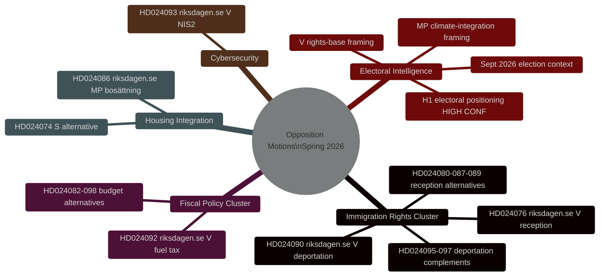
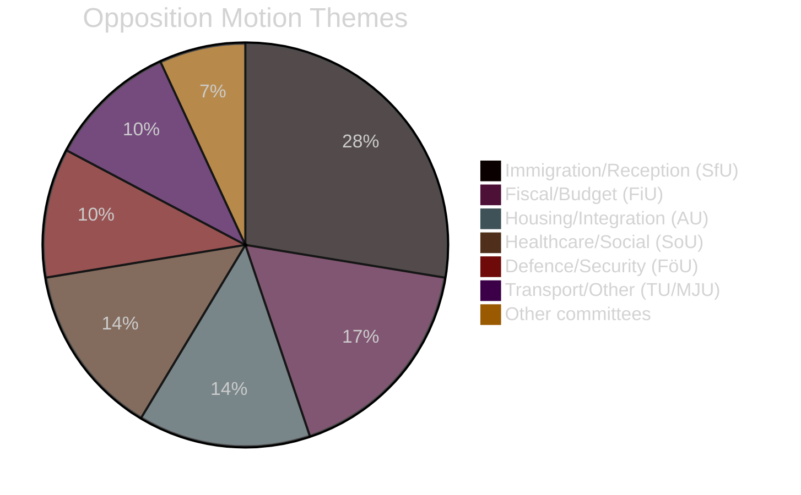

# Etterretningsbriefing — Svenske opposisjonsmotioner våren 2026

**Dato**: 2026-04-27
**Forfatter**: James Pether Sörling
**Klassifisering**: ÅPEN
**Status**: Pass 2 (AI FIRST iterativ forbedring)

---

## 🎯 Kortfattet konklusjon

Tjueni opposisjonsmotioner innlevert av V, MP og S mellom 7.–17. april 2026 (riksmöte 2025/26) retter seg mot Tidö-regjeringens lovgivningsprogram for kriminell utvisning, boligintegrering og finanspolitikk. **Alle motioner vil falle lovgivningsmessig — Tidö-koalisjonen har et flertall på 200/349 mandater med SD-støtte.** Deres strategiske formål er valgposisjonering foran stortingsvalget i september 2026. Innvandringsrettighetsklyngen (8 motioner, 28%) representerer den høyeste etterretningsprioriteten: V's utvisningsrettighetsutfordring (HD024090 riksdagen.se) inneholder substansielle EU-rettslige argumenter som kan bestå i forvaltningsdomstolene selv etter parlamentarisk nederlag.

---

## 🧭 3 Beslutninger

**Beslutning 1 (B1): Overvåk SfU-komiteens avstemning om HD024090**
Finans- og sosialkomiteens avstemning om HD024090 (riksdagen.se, prop. 2025/26:235) og relaterte utvisningsmosjoner er den viktigste etterretningsgivende utløseren på kort sikt. Eventuelle reservasjoner fra KD eller L i komiteen signaliserer forhåndsvalgsavstandtagen fra hardhendt utvisningspolitikk — en potensiell koalisjonsbrukkindikator.

**Beslutning 2 (B2): Følg V's/MP's valgoperasjonalisering**
Både V og MP har levert inn teknisk substansielle motioner designet til å gå over til kampanjemateriell. Overvåk partienes pressemeldinger for referanser til spesifikke dok-id'er (HD024090, HD024086 riksdagen.se) som bevis på operasjonalisering.

**Beslutning 3 (B3): Vurder EU-rettslig sti for HD024090**
V's EU-kompatibilitetsutfordring til kriminell utvisning (HD024090 riksdagen.se) har 15–20% sannsynlighet for å generere en forhåndsbeslutning fra Migrationsöverdomstolen til EU-domstolen innen 2 år. Igangsett overvåking av Migrationsöverdomstolens saksliste for relaterte saker.

---

## Oppsummeringsstatistikk

| Dimensjon | Verdi |
|-----------|-------|
| Totalt antall motioner | 29 |
| Innleverende partier | 3 (V, MP, S) |
| Involverte komiteer | 10 |
| Målrettede proposisjoner | 8 |
| Innvandringsklynge | 8 motioner (28%) |
| Finansklynge | 5 motioner (17%) |
| Bolig/integrering | 4 motioner (14%) |
| Dager til valg | ~139 (13. sep 2026) |

---

## Etterretningskart

---

## Fordeling av mosjonstemaer

<!-- source-sha: 37f69ff9aa194a3c561fdd15f1b60d4f6b106472 -->
