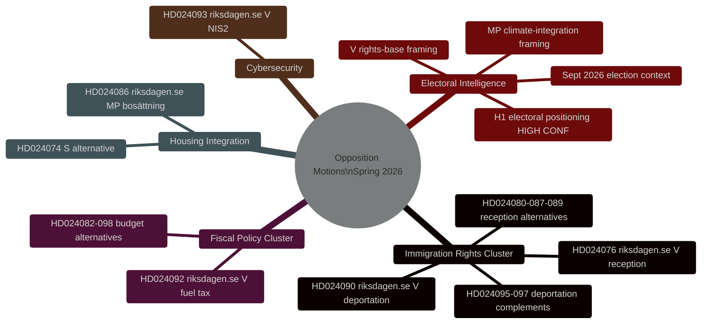
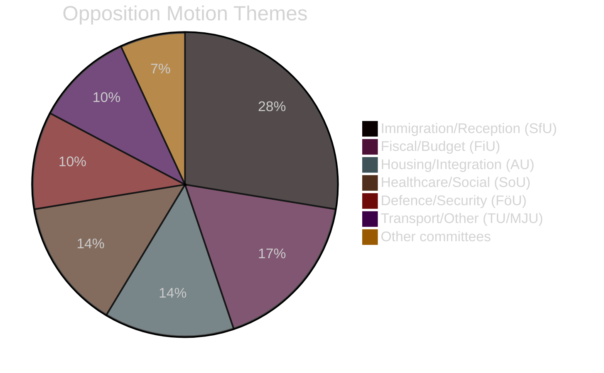

# Underrättelsebriefing — Svenska oppositionsmotioner våren 2026

**Datum**: 2026-04-27
**Författare**: James Pether Sörling
**Klassificering**: ÖPPEN
**Status**: Pass 2 (AI FIRST iterativ förbättring)

---

## 🎯 Kortfattad slutsats

Tjugonio oppositionsmotioner inlämnade av V, MP och S mellan den 7–17 april 2026 (riksmötet 2025/26) riktar sig mot Tidöregeringens lagstiftningsprogram för brottsutvisning, bostadsintegration och finanspolitik. **Alla motioner kommer att falla legislativt — Tidökoalitionen innehar en majoritet på 200/349 mandat med SD:s stöd.** Deras strategiska syfte är valpositionering inför riksdagsvalet i september 2026. Migrationsrättighetsklustret (8 motioner, 28%) representerar den högsta underrättelseprioriteten: V:s utvisningsrättsutmaning (HD024090 riksdagen.se) innehåller substantiella EU-rättsliga argument som kan bestå i förvaltningsdomstolarna även efter parlamentariskt nederlag.

---

## 🧭 3 Beslut

**Beslut 1 (B1): Övervaka SfU-utskottets omröstning om HD024090**
Finans- och socialförsäkringsutskottets omröstning om HD024090 (riksdagen.se, prop. 2025/26:235) och relaterade utvisningsmotioner är den viktigaste underrättelsegivande triggern på kort sikt. Eventuella reservationer från KD eller L i utskottet signalerar distansering inför valet från hårdfört utvisningspolitik — ett potentiellt indikation på koalitionsspricka.

**Beslut 2 (B2): Följ V:s/MP:s valopererande**
Både V och MP har lämnat in tekniskt substantiella motioner avsedda att övergå till kampanjmaterial. Bevaka partiernas pressmeddelanden för hänvisningar till specifika dok-id (HD024090, HD024086 riksdagen.se) som bevis på operationalisering.

**Beslut 3 (B3): Bedöm EU-rättslig väg för HD024090**
V:s EU-kompatibilitetsutmaning mot brottsutvisning (HD024090 riksdagen.se) har 15–20% sannolikhet att generera en hänskjutning från Migrationsöverdomstolen till EG-domstolen inom 2 år. Initiera bevakning av Migrationsöverdomstolens docket för relaterade mål.

---

## Sammanfattande statistik

| Dimension | Värde |
|-----------|-------|
| Totalt antal motioner | 29 |
| Inlämnande partier | 3 (V, MP, S) |
| Berörda utskott | 10 |
| Riktade propositioner | 8 |
| Migrationskluster | 8 motioner (28%) |
| Finanskluster | 5 motioner (17%) |
| Bostad/integration | 4 motioner (14%) |
| Dagar till valet | ~139 (13 sep 2026) |

---

## Underrättelsekarta

---

## Fördelning av motionsteman

<!-- source-sha: 37f69ff9aa194a3c561fdd15f1b60d4f6b106472 -->
