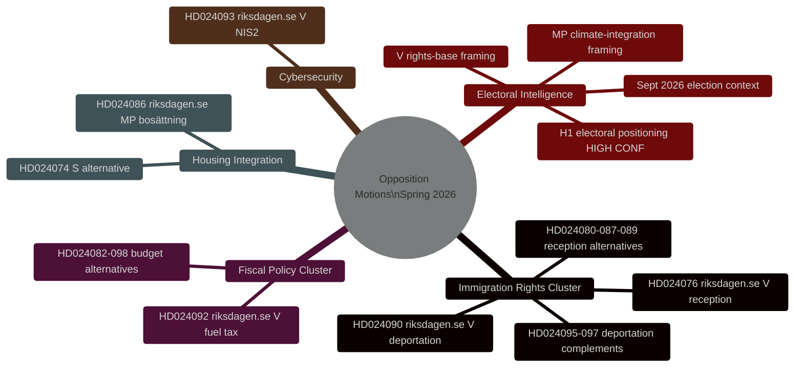
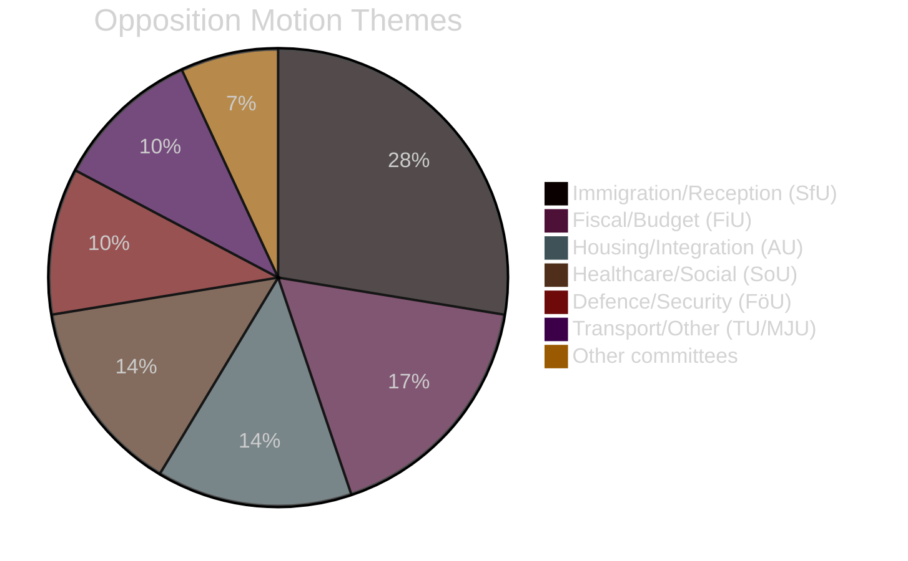

# 情报概要 — 瑞典反对派动议 2026年春

**日期**: 2026-04-27
**作者**: James Pether Sörling
**分类**: 公开
**状态**: 第2遍（AI FIRST迭代改进）

---

## 🎯 核心结论

V、MP和S于2026年4月7日至17日（riksmöte 2025/26）提交的二十九份反对派动议针对蒂多政府春季立法议程中的刑事驱逐、住房融合和财政政策。**所有动议将在立法层面失败——蒂多联合政府凭借SD支持掌握200/349席位的多数。** 其战略目的是为2026年9月大选进行竞选定位。移民权利集群（8份动议，28%）代表最高情报优先级：V对驱逐权利的挑战（HD024090 riksdagen.se）包含实质性欧盟法律论点，即使在议会失败后也可能在行政法院持续发酵。

---

## 🧭 3项决策

**决策1（D1）：监测SfU委员会对HD024090的投票**
财政和社会保险委员会对HD024090（riksdagen.se，prop. 2025/26:235）及相关驱逐动议的投票是最关键的近期情报触发器。委员会中KD或L的任何保留意见标志着选前与强硬驱逐政策的距离——潜在联盟裂痕指标。

**决策2（D2）：追踪V/MP的选举运作化**
V和MP均提交了技术上实质性的动议，旨在转化为竞选材料。监测党派新闻稿中对特定dok_id（HD024090、HD024086 riksdagen.se）的引用，作为运作化的证据。

**决策3（D3）：评估HD024090的欧盟法律路径**
V对刑事驱逐的欧盟兼容性挑战（HD024090 riksdagen.se）在2年内引发Migrationsöverdomstolen向欧洲法院提出先决裁决申请的概率为15–20%。启动对移民最高法院相关案件档案的监测。

---

## 摘要统计

| 维度 | 值 |
|-----------|-------|
| 动议总数 | 29 |
| 提交政党 | 3个（V、MP、S）|
| 涉及委员会 | 10 |
| 针对提案 | 8 |
| 移民集群 | 8份（28%）|
| 财政集群 | 5份（17%）|
| 住房/融合 | 4份（14%）|
| 距选举天数 | 约139天（2026年9月13日）|

---

## 情报思维导图

---

## 动议主题分布

<!-- source-sha: 37f69ff9aa194a3c561fdd15f1b60d4f6b106472 -->
