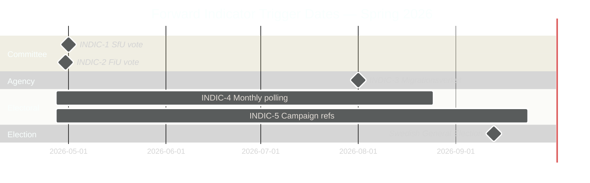

# Forward Indicators — Swedish Parliamentary Motions Spring 2026

**Author**: James Pether Sörling

---

## Key Monitoring Variables (Ordered by PIR Priority)

### INDIC-1: SfU Committee Vote on HD024090 (Deportation Motion)

**What to monitor**: Swedish Social Affairs Committee (SfU) vote on prop. 2025/26:235 and related motions HD024090, HD024095, HD024097 (riksdagen.se)
**Trigger date**: Expected May-June 2026 (committee session before summer recess)
**Leading indicator of**: Whether any coalition party (KD, L) files a committee reservation — a reservation would signal pre-election distance from hard deportation policy
**Alert threshold**: Any named KD or L member votes against or files reservation on HD024090-related points

---

### INDIC-2: FiU Vote on HD024092 (Fuel Tax Budget Motion)

**What to monitor**: Finance Committee (FiU) vote on prop. 2025/26:236 and motion HD024092 (riksdagen.se)
**Trigger date**: Expected April-May 2026 (amendment budget is time-sensitive)
**Leading indicator of**: Whether V's fiscal opposition narrows to specific items (climate) vs. broad budget rejection
**Alert threshold**: FiU passes budget with all coalition parties voting yes and SD — no KD/L splits

---

### INDIC-3: Migrationsverket Q2 Implementation Capacity Report

**What to monitor**: Migrationsverket quarterly report on processing capacity for new reception law (prop. 2025/26:229)
**Trigger date**: August 2026
**Leading indicator of**: Whether implementation constraints validate MP/V warnings about practical capacity gaps
**Alert threshold**: Migrationsverket reports backlog increase >20% or needs emergency supplementary funding

---

### INDIC-4: Party Polling Trends (V and MP)

**What to monitor**: Monthly Novus/IPSOS polling for V (±0.5%) and MP (±0.3%) following SfU committee votes
**Leading indicator of**: Whether immigration-rights framing is generating the electoral uplift that historical parallels suggest
**Alert threshold**: V above 7% or MP above 7% after SfU committee debate — confirms historical-parallels scenario

---

### INDIC-5: Electoral Campaign Communications

**What to monitor**: V and MP press releases / social media referencing HD024090, HD024086 (riksdagen.se) after committee votes
**Leading indicator of**: Whether motions are being operationalised as campaign materials
**Alert threshold**: 5+ references to specific dok_ids (HD024090 riksdagen.se etc.) in party campaign materials

## Indicator State Matrix (Current)

| Indicator | State | Confidence | Next update |
|-----------|-------|------------|-------------|
| INDIC-1 SfU vote | NOT YET TRIGGERED | HIGH | May-June 2026 |
| INDIC-2 FiU vote | NOT YET TRIGGERED | HIGH | April-May 2026 |
| INDIC-3 Migrationsverket | NOT YET TRIGGERED | MEDIUM | August 2026 |
| INDIC-4 Polling | Baseline established | HIGH | Monthly |
| INDIC-5 Campaign refs | Monitoring | MEDIUM | Weekly |

