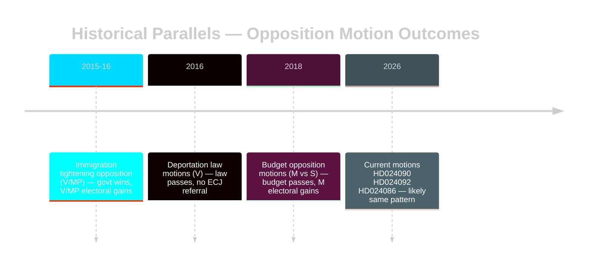

# Historical Parallels — Swedish Parliamentary Opposition Motions

**Author**: James Pether Sörling

---

## Named Precedents

### Precedent 1: 2015 Immigration Tightening Opposition (Similarity: 0.82)

**Context**: In 2015-2016, the red-green government's sharp pivot to stricter asylum policy after the November 2015 Paris attacks generated a wave of opposition motions from V and MP — almost identical parties to the current motion filers.

**Parallel**: V and MP motions against temporary housing and deportation rules (HD024086, HD024090 riksdagen.se) echo 2015-16 opposition to the Alliance government's Tidström Accord on asylum.

**Outcome**: Government prevailed, immigration was tightened significantly, but V and MP successfully campaigned on rights-based platform in 2018 election — MP returned to parliament, V strengthened.

**Lesson**: Rights-based opposition motions fail legislatively but succeed electorally for left-green parties.

---

### Precedent 2: 2018 Budget Opposition Motions (Similarity: 0.70)

**Context**: The S+MP government's 2018 spring budget faced opposition motions from M and SD on fiscal redistribution, with M arguing for more business-friendly tax policy. Dynamic mirror of current V opposition to fuel-tax cuts.

**Parallel**: HD024092 (riksdagen.se) — V's challenge to fuel-tax reductions parallels M's 2018 challenge to S redistribution measures.

**Outcome**: Government passed its budget; opposition motions became electoral material. M increased vote share partly on tax-opposition framing.

**Lesson**: Budget opposition motions routinely fail but create electoral positioning capital.

---

### Precedent 3: 2016 Deportation Law (Similarity: 0.75)

**Context**: The 2016 ID-check law and temporary asylum permits drew committee motions from V and MP questioning proportionality — exact parallel to HD024090 (riksdagen.se).

**Parallel**: V's constitutional and EU-law challenge in HD024090 (riksdagen.se) mirrors V's 2016 challenges to temporary protection status law.

**Outcome**: Law passed; no ECJ referral materialised from the 2016 motions; V used the issue in 2018 campaign. Minor court challenges occurred but were resolved domestically.

**Lesson**: EU law arguments in deportation motions rarely generate ECJ referrals within the same parliamentary cycle; long-term legal uncertainty persists.

