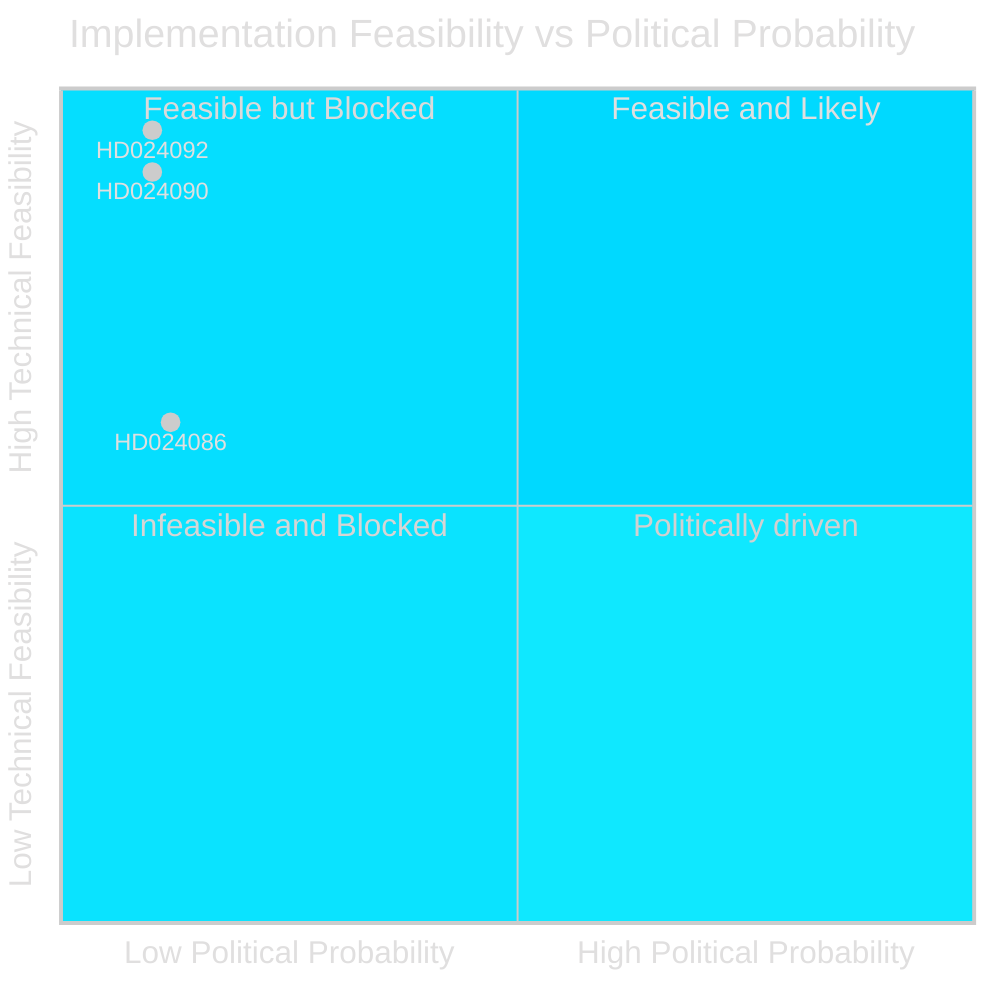

# Implementation Feasibility Assessment — Opposition Motion Alternatives

**Author**: James Pether Sörling

---

## Feasibility Assessment Framework

Each major opposition motion proposes an alternative to government policy. This analysis assesses the technical, administrative, and political feasibility of the proposed alternatives.

---

## HD024090 — V: Rights-Based Deportation Limits

**Proposal**: Maintain stricter proportionality review and EU compatibility check before expanding criminal deportation.
**Technical feasibility**: HIGH — Swedish administrative courts already have proportionality review; this is an existing mechanism
**Administrative feasibility**: HIGH — Migrationsverket and Migration Court of Appeal have established procedures
**Political feasibility**: LOW — Requires majority to oppose prop. 2025/26:235 which government will pass
**Implementation timeline if adopted**: 6-12 months (new guidance, revised templates)
**Assessment**: Feasible if political will existed; blocked by parliamentary arithmetic alone

---

## HD024092 — V: Block Fuel Tax Cuts

**Proposal**: Reject fuel tax reduction in extra amendment budget (prop. 2025/26:236); maintain current fuel excise levels.
**Technical feasibility**: HIGH — status quo requires no implementation; simply maintaining existing rates
**Administrative feasibility**: HIGH — Skatteverket has stable processes for existing tax levels
**Political feasibility**: LOW — Rural voters and SD strongly support the cuts; government will not reverse
**Implementation timeline if adopted**: Immediate (no change needed from current system)
**Assessment**: Easiest alternative to implement technically; hardest politically

---

## HD024086 — MP: Alternative Housing-Integration Framework

**Proposal**: Reject prop. 2025/26:215's temporary housing cap and maintain open settlement rights.
**Technical feasibility**: MEDIUM — existing settlement (bosättning) procedures could continue
**Administrative feasibility**: MEDIUM — municipalities already have settlement obligations under current law
**Political feasibility**: LOW — Government and SD see municipal opt-out as essential for reform
**Implementation timeline if adopted**: 3-6 months (amend implementation guidance)
**Assessment**: Administratively feasible but politically deadlocked

## Summary Table

| Motion | Technical | Administrative | Political | Overall |
|--------|-----------|----------------|-----------|---------|
| HD024090 (riksdagen.se) | HIGH | HIGH | LOW | BLOCKED |
| HD024092 (riksdagen.se) | HIGH | HIGH | LOW | BLOCKED |
| HD024086 (riksdagen.se) | MEDIUM | MEDIUM | LOW | BLOCKED |

**Common finding**: All major opposition alternatives are technically feasible; they are blocked exclusively by parliamentary arithmetic.

