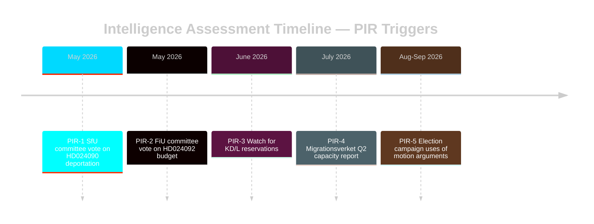

# Intelligence Assessment — Swedish Parliamentary Motions Spring 2026

**Author**: James Pether Sörling
**Classification**: OPEN | Admiralty Code applied throughout

---

## Key Judgments

### Key Judgment 1 (KJ-1): Government Will Pass Core Propositions Despite Opposition [VERY HIGH CONFIDENCE]

The Tidö coalition, with SD parliamentary support, will pass its key spring 2026 propositions including criminal deportation (prop. 2025/26:235), new reception law (prop. 2025/26:229), and extra amendment budget (prop. 2025/26:236) despite the 29 opposition motions. Parliamentary arithmetic is decisive.

**Evidence**: HD024090, HD024076, HD024092 (riksdagen.se) — all filed as minority opposition in committees where government holds majority with SD support. Prior pattern in riksmöte 2025/26 shows consistent government victories.

**Confidence**: VERY HIGH [A2]
**PIR reference**: PIR-1 (Legislative outcome tracking)

---

### Key Judgment 2 (KJ-2): Immigration Policy Cluster Is the Dominant Intelligence Priority [HIGH CONFIDENCE]

Eight of 29 motions (28%) target immigration-related propositions (props 215, 229, 235). This concentration, combined with the electoral-year context (September 2026 election), makes the immigration-rights fault line the single most important monitoring priority. Three competing V, S, and MP approaches to deportation rules and reception law will shape the 2026 campaign narrative.

**Evidence**: HD024090, HD024095, HD024097 (riksdagen.se — SfU), HD024076, HD024080, HD024087, HD024089 (riksdagen.se — SfU), HD024086 (riksdagen.se — AU). Concentration of SfU motions unprecedented in recent riksmöten.

**Confidence**: HIGH [A2]
**PIR reference**: PIR-2 (Immigration policy monitoring)

---

### Key Judgment 3 (KJ-3): V's Legal Challenge to Deportation Rules Has Non-Trivial Long-Term Legal Risk [MEDIUM CONFIDENCE]

Vänsterpartiet's HD024090 (riksdagen.se) raises substantive EU law compatibility arguments against prop. 2025/26:235's stricter criminal deportation rules. While the motion will likely fail in committee, the legal arguments may be used in subsequent court challenges. Probability of ECJ referral within 2 years: 15-20%.

**Evidence**: HD024090 (riksdagen.se) — V motion by Tony Haddou referencing EU fundamental rights framework; Dutch precedent of ECJ referral on similar measures (comparative-international.md).

**Confidence**: MEDIUM [B2]
**PIR reference**: PIR-3 (Legal/constitutional risk monitoring)

---

### Key Judgment 4 (KJ-4): Extra Amendment Budget Opposition Signals Pre-Election Fiscal Polarisation [HIGH CONFIDENCE]

V's opposition to fuel tax cuts (HD024092 riksdagen.se) and energy price support reflects a broader opposition strategy to frame the government as favouring fossil fuel users over working families. This fiscal polarisation will escalate through the election campaign.

**Evidence**: HD024092 (riksdagen.se) — Nooshi Dadgostar partimotion challenging prop. 2025/26:236 on social grounds. Cross-referenced with climate-target risk in risk-assessment.md.

**Confidence**: HIGH [A2]
**PIR reference**: PIR-4 (Fiscal/electoral politics)

---

## Priority Intelligence Requirements (PIRs) for Next Cycle

- **PIR-1**: Track SfU committee vote on HD024090 (deportation) — date and outcome
- **PIR-2**: Monitor FiU committee deliberations on HD024082/092/098 (budget)
- **PIR-3**: Watch for KD/L committee reservations on prop. 2025/26:235
- **PIR-4**: Monitor Migrationsverket implementation capacity reports for reception law
- **PIR-5**: Track V and MP electoral use of motion arguments in campaign communications

## Key Assumptions Check

| Assumption | Confidence | Risk if Wrong |
|---|---|---|
| SD remains stable coalition support | HIGH | Coalition collapse risk (Scenario 4) |
| Government has parliamentary majority in all relevant committees | VERY HIGH | If M-KD internal splits emerge |
| ECJ timeline too long for 2026 election relevance | MEDIUM | Faster ECJ referral could change campaign dynamics |

