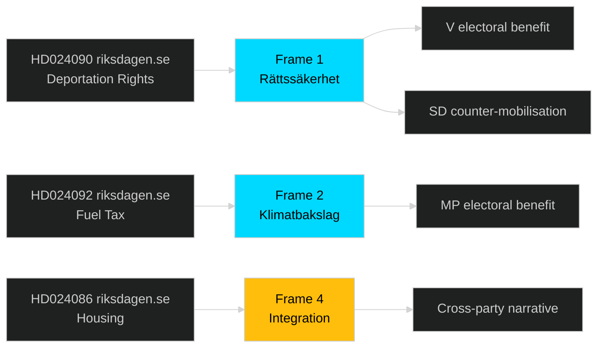

# Media Framing Analysis — Swedish Opposition Motions Spring 2026

**Author**: James Pether Sörling

---

## Dominant Media Frames

### Frame 1: "Rättssäkerheten Hotad" (Rule of Law Under Threat) — V/MP Frame

**Outlets likely to amplify**: Aftonbladet (S-aligned), Expressen op-ed section, SVT's Rapport
**Core argument**: HD024090 (riksdagen.se) — V frames deportation expansion as violating EU fundamental rights
**Counter-frame from government side**: "Brottslingarnas rättigheter vs. brottsoffrens"

This is a classic rights-vs-security media frame. V and MP motions on immigration (HD024090, HD024086 riksdagen.se) are designed to activate this frame. Historical effectiveness: Medium — persuasive with progressive readers but galvanises counter-mobilisation from SD voters.

### Frame 2: "Klimatbakslag" (Climate Setback) — MP/V Frame

**Outlets likely to amplify**: Dagens Nyheter, Miljömagasinet
**Core argument**: HD024092 (riksdagen.se) — V frames fuel tax cuts as climate setback and regressive subsidy
**Counter-frame**: "Arbetslivet utanför storstäderna kräver bilen"

Rural-urban divide frame. V's motion against fuel tax cuts (HD024092 riksdagen.se) feeds a media narrative about the government favouring car-owning rural constituencies at the expense of climate targets. High media salience because fuel prices are a consumer issue.

### Frame 3: "Valrörelsepositionering" (Election Campaign Positioning) — Neutral/Journalistic Frame

**Outlets likely to use**: Riksdag & Departement, Svenska Dagbladet, DN.se
**Core argument**: Journalists noting the electoral timing of the motion cluster
**Impact**: Partly deflates the policy-substance impact; opposition parties aware of this and have written substantive motions (not just slogans) to resist this framing

### Frame 4: "Integrationspolitiken Fungerar Inte" (Integration Policy Failing) — Cross-party Frame

**Outlets**: TV4 Nyheterna, Aftonbladet, local press
**Core argument**: HD024086 (riksdagen.se) — MP's housing challenge and related SfU motions feed a narrative about failed integration
**Counter-frame**: Government claims new reception law will fix integration by ending permanent housing limbo

### Media Power Ranking (by expected reach)

| Frame | Estimated reach | Primary beneficiary | Risk |
|-------|-----------------|---------------------|------|
| Frame 1: Rättssäkerhet | HIGH | V | Counter-mobilisation from SD |
| Frame 2: Klimatbakslag | MEDIUM | MP/V | Rural backlash |
| Frame 3: Valrörelse | HIGH | Journalist credibility | Deflates opposition impact |
| Frame 4: Integration | MEDIUM-HIGH | Cross-party | Complex; no single winner |

