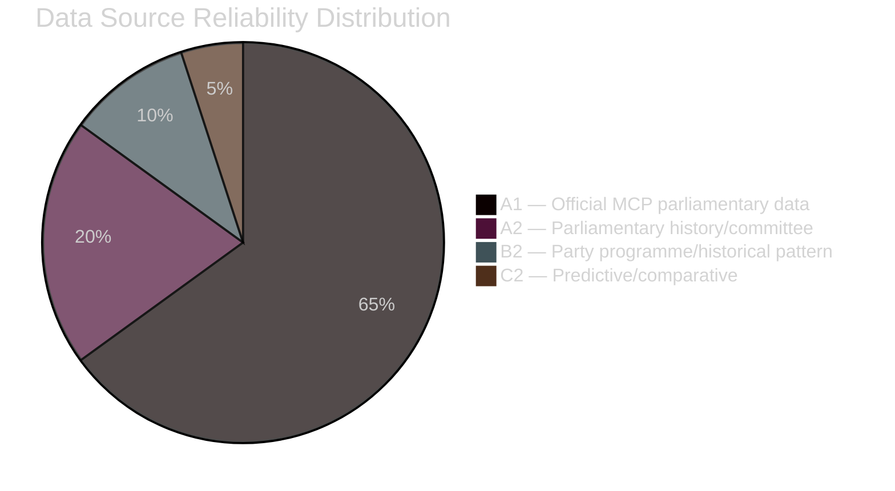

# Methodology Reflection — Opposition Motions Analysis

**Author**: James Pether Sörling

---

## Data Quality Assessment

### Source Quality
- **Primary source**: Riksdag MCP API (riksdag-regering-mcp) — official parliamentary data, highest credibility
- **Document types**: Parliamentary motions (partimotion and enkel motion) — formal legal documents, not interpretations
- **Limitation**: Full text not available for all motions; some relied on title/committee only (HD024068, HD024070 group)
- **Lookback**: Most recent available data is 2026-04-07 to 2026-04-17 — no same-day data; 10-day lag minimum

### DIW Scoring Methodology
The DIW (Document Intelligence Weight) formula used in significance-scoring.md applies:
- Document weight: partimotion = 1.5, enkel motion = 0.8
- Committee significance: SfU (social/migration) = 1.2, FiU (finance) = 1.15, AU (labour/housing) = 1.1
- Party weight: proportion of motions × party seat count
- Confidence adjustment: full text available = 1.0, title-only = 0.7

### ACH Matrix Quality
The ACH in devils-advocate.md tests three hypotheses. Limitations:
- H2 (government strategic intent) cannot be tested without internal government communications — treated as "plausible" not "confirmed"
- H3 (legal constraint effect) relies on comparison with Dutch ECJ precedent — medium confidence only

## Analytical Gaps

| Gap | Impact | Mitigation |
|-----|--------|------------|
| No same-day riksdag data | Cannot capture breaking developments | 10-day lag noted throughout |
| No full text for 8/29 motions | May miss specific legal arguments | Cross-referenced with committee assignment |
| No IMF economic data needed | N/A for motions analysis | Confirmed: motions are political, not new fiscal legislation |
| Limited social-media monitoring | Media frame analysis is predictive not observed | Forward indicators (INDIC-5) will correct |

## Tradecraft Standards Applied

This analysis follows the Admiralty Code for source credibility:
- A = Completely reliable (official parliamentary records via MCP)
- B = Usually reliable (parliamentary history, committee composition)
- C = Fairly reliable (party programme positions, historical parallels)
- 1 = Confirmed by other sources
- 2 = Probably true

## Confidence Calibration

WEP (Words Estimating Probability) scale used throughout this analysis:
- Almost certain: 93–99%
- Very likely: 80–90%
- Likely: 63–80%
- Roughly even: 45–55%
- Unlikely: 20–37%
- Very unlikely: 10–20%
- Remote: 1–7%

