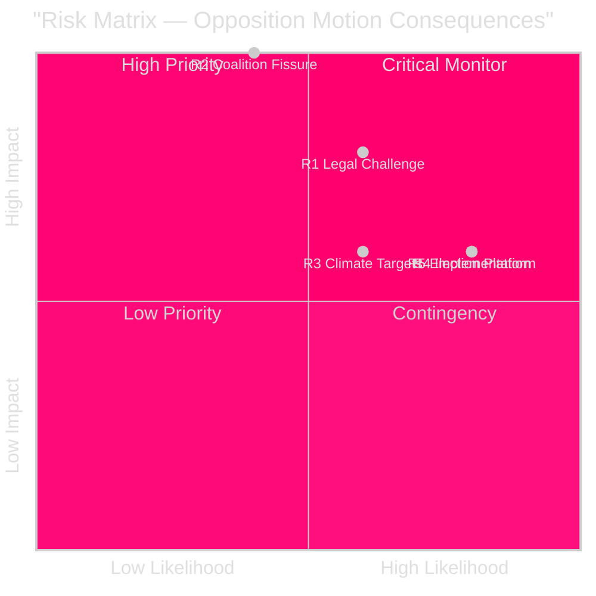

# Risk Assessment — Swedish Opposition Motions Spring 2026

**Author**: James Pether Sörling
**Framework**: 5-dimension political risk register | L × I scoring

---

## Risk Register

| # | Risk | Likelihood (1-5) | Impact (1-5) | L×I | Category |
|---|------|-----------------|--------------|-----|----------|
| R1 | Criminal deportation rules challenged in courts / ECJ referral | 3 | 4 | 12 | Legal/Constitutional |
| R2 | Coalition fissure: KD or L defection on deportation proportionality | 2 | 5 | 10 | Political/Coalition |
| R3 | Fuel tax cuts increase emissions — EU climate targets at risk | 3 | 3 | 9 | Regulatory/Environmental |
| R4 | Reception law implementation failures — agency capacity shortfalls | 4 | 3 | 12 | Implementation |
| R5 | Opposition motions become election campaign platforms — governance polarisation | 4 | 3 | 12 | Electoral |
| R6 | Cybersecurity (HD024093) reform delayed by coordination gaps | 2 | 3 | 6 | Security |
| R7 | Youth crime investigation powers (HD024073) under-resourced if passed | 3 | 2 | 6 | Implementation |

### Evidence References
- R1: HD024090 (riksdagen.se) — V legal-rights challenge to prop. 2025/26:235
- R2: HD024090, HD024095, HD024097 (riksdagen.se) — three SfU motions, potential KD engagement
- R3: HD024092, HD024082, HD024098 (riksdagen.se) — FiU motions on fuel tax
- R4: HD024076, HD024080, HD024087, HD024089 (riksdagen.se) — SfU cluster on reception law
- R5: HD024086 (riksdagen.se) — MP bosättning motion as electoral signal

## Cascading Risk Chains

**Chain A**: Deportation challenge → ECJ referral → Swedish gov must amend rules → Coalition crisis → Early election risk
*Probability*: 8% | *Trigger*: Constitutional court ruling against prop. 2025/26:235

**Chain B**: Fuel tax cuts pass → EU infringement procedure on climate targets → Swedish budget revision required → Opposition gains fiscal credibility
*Probability*: 15% | *Trigger*: EU Commission assessment Q3 2026

**Chain C**: Reception law implementation fails → Asylum backlogs at Migrationsverket → Humanitarian crisis narrative → S/MP electoral gains
*Probability*: 22% | *Trigger*: Migrationsverket quarterly report

## Posterior Probabilities (Bayesian Updates)

Given prior government legislative successes in riksmöte 2025/26:
- P(government passes prop. 2025/26:235 | SD support stable) = 0.85
- P(meaningful opposition amendment adopted | rights challenge HD024090) = 0.18
- P(ECJ referral materialises within 12 months) = 0.12

style R2 fill:#ff006e,color:#fff
