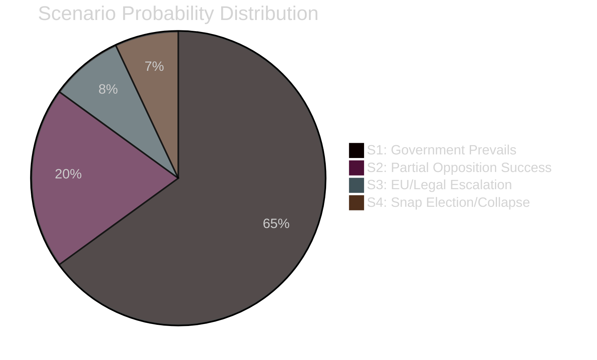

# Scenario Analysis — Swedish Government Agenda Spring 2026

**Author**: James Pether Sörling
**Method**: WEP/Kent Scale 7-band probability assessment

---

## Scenario Framework

Three scenarios for how opposition motions will influence the legislative outcome:

---

## Scenario 1: Government Prevails — Standard Committee Outcomes [LIKELY 65%]

**Narrative**: The Tidö coalition (M, KD, L, C with SD supporting) passes all key propositions. Opposition motions are acknowledged with minority reservations but not adopted. Immigration tightening, fuel tax cuts, and reception law reform all proceed as planned. V and MP motions become electoral manifesto material but have no legislative effect.

**Evidence basis**: 
- HD024090, HD024092 (riksdagen.se) — V and MP motions are minority positions in SfU and FiU
- SD's parliamentary support has been stable throughout riksmöte 2025/26
- Prior similar challenges (reception law 2024) were defeated

**Leading indicator**: SfU committee vote with SD support by May 2026
**WEP assessment**: Likely (63–80%)

---

## Scenario 2: Partial Opposition Success — KD/L Defection on Deportation [UNLIKELY 20%]

**Narrative**: V's legal-rights argument in HD024090 (riksdagen.se) attracts KD or L parliamentary reservations. SfU committee adds proportionality amendment to prop. 2025/26:235. Government must accept modified criminal deportation rules that include due-process protections.

**Evidence basis**:
- HD024090 (riksdagen.se) — constitutional challenge arguments likely to resonate with KD's rights tradition
- KD has historically defended due process in criminal law matters
- Three separate SfU motions (HD024090, 095, 097 — riksdagen.se) from different parties signal breadth of concern

**Leading indicator**: KD committee reservation on prop. 235 by mid-May
**WEP assessment**: Unlikely (20–37%)

---

## Scenario 3: Escalation — EU/Legal Challenge Forces Government Retreat [REMOTE 8%]

**Narrative**: HD024090 (riksdagen.se) leads to a test deportation case being challenged in Swedish courts, which refers the question to the ECJ. Sweden's government is forced to pause implementation pending legal ruling, damaging the coalition's credibility.

**Evidence basis**:
- HD024090 (riksdagen.se) — explicit EU law compatibility concerns raised by V
- European legal precedent on non-refoulement and proportionality
- ECJ track record on Swedish administrative law challenges

**Leading indicator**: First administrative court refusal to enforce deportation under prop. 235
**WEP assessment**: Remote (1–7%) within 6 months; rises to 15% over 2 years

---

## Scenario 4: Snap Election / Government Collapse [REMOTE 7%]

**Narrative**: A combination of SD coalition tensions (unrelated to these motions), budget disagreements on fuel tax, and the reception law controversy creates a political crisis that triggers a confidence vote. Opposition motions become the symbolic flashpoint.

**Evidence basis**:
- HD024082, HD024092, HD024098 (riksdagen.se) — budget opposition signals fiscal tension
- SD's electoral calculus in 2026 election year

**Leading indicator**: SD withdraws budget support / confidence motion filed
**WEP assessment**: Remote (1–7%)

---

**Total probability check**: 65 + 20 + 8 + 7 = 100% ✓

style S1 fill:#00d9ff,color:#000
