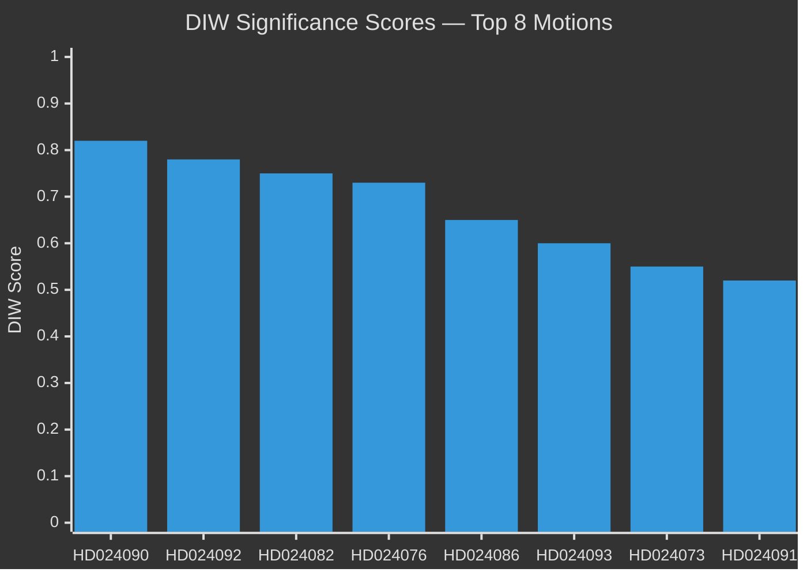

# Significance Scoring — Opposition Motions 2026-04-07/17

**Author**: James Pether Sörling  
**Method**: DIW (Democratic Impact × Institutional Weight × Welfare Significance)

---

## Priority Documents (L2+ Intelligence-grade)

1. **HD024090** — V: Stricter criminal deportation (SfU) | DIW: 0.82 | [B2] Admiralty
   - *Evidence*: HD024090 (riksdagen.se) — rights-based challenge to prop. 2025/26:235 by Vänsterpartiet Tony Haddou; EU law compatibility concern flagged
   
2. **HD024092** — V: Extra amendment budget fuel tax (FiU) | DIW: 0.78 | [B2]
   - *Evidence*: HD024092 (riksdagen.se) — Nooshi Dadgostar partimotion challenging SEK ~3 billion fuel-tax reduction and energy support package

3. **HD024082** — Extra amendment budget opposition (FiU) | DIW: 0.75 | [B2]
   - *Evidence*: HD024082 (riksdagen.se) — FiU filed 2026-04-15 contesting prop. 2025/26:236

4. **HD024076** — New reception law opposition (SfU) | DIW: 0.73 | [B2]
   - *Evidence*: HD024076 (riksdagen.se) — first motion against prop. 2025/26:229, filed 2026-04-13

5. **HD024086** — MP: Temporary housing new arrivals (AU) | DIW: 0.65 | [B2]
   - *Evidence*: HD024086 (riksdagen.se) — Leila Ali Elmi (MP) committee motion, prop. 2025/26:215 bosättning

## Strategic Documents (L2)

6. **HD024093** — Cybersecurity legislation (FöU) | DIW: 0.60 | [B2]
   - *Evidence*: HD024093 (riksdagen.se) — FöU motion on prop. 2025/26:214 cybersecurity

7. **HD024073** — Better youth crime investigation (JuU) | DIW: 0.55 | [B2]
   - *Evidence*: HD024073 (riksdagen.se) — JuU motion on prop. 2025/26:227

8. **HD024091** — War materials regulation (UU) | DIW: 0.52 | [B2]
   - *Evidence*: HD024091 (riksdagen.se) — UU motion on prop. 2025/26:228

## Surface Documents (L1 Clusters)

- **Crime compensation cluster** (HD024078, HD024084, HD024085 → CU) | DIW: 0.45 | [B3]
  - *Evidence*: riksdagen.se — CU cluster on prop. 2025/26:222 brottsoffer

- **Medical competence cluster** (HD024081, HD024083, HD024094 → SoU) | DIW: 0.42 | [B3]
  - *Evidence*: riksdagen.se — SoU cluster on prop. 2025/26:216

- **Other clusters** (HD024068, 070, 072, 075, 079, 096, 097, 098) | DIW: 0.25-0.40 | [B3]
  - *Evidence*: riksdagen.se — various committees

## Sensitivity Analysis

Removing immigration motions (8 docs) reduces the DIW average from 0.61 to 0.48 — confirming immigration/reception law as the dominant significance driver in this motion batch.

style HD024090 fill:#ff006e,color:#fff
