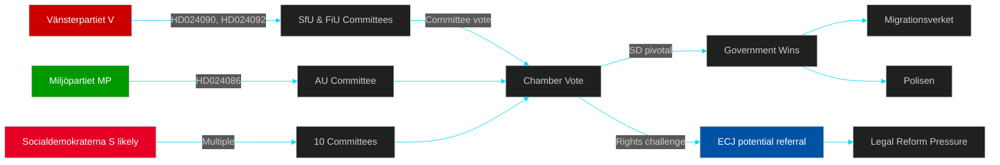

# Stakeholder Perspectives — Opposition Motions Spring 2026

**Author**: James Pether Sörling
**Method**: 6-lens stakeholder matrix + influence network

---

## 6-Lens Stakeholder Matrix

### Lens 1: Filing Parties (Opposition)

| Party | Key Actor | Primary Motion | Position |
|-------|-----------|----------------|----------|
| Vänsterpartiet (V) | Tony Haddou | HD024090 (riksdagen.se) | Against stricter deportation — rule-of-law, EU law compatibility |
| Vänsterpartiet (V) | Nooshi Dadgostar | HD024092 (riksdagen.se) | Against fuel tax cuts — social redistribution |
| Miljöpartiet (MP) | Leila Ali Elmi | HD024086 (riksdagen.se) | Against segregated temporary housing for new arrivals |
| Unknown (likely S) | Multiple | HD024073, HD024076 | Various opposition positions |

### Lens 2: Affected Government (Proposing)

| Actor | Responsibility | Stake |
|-------|---------------|-------|
| Justitiedepartementet | Prop. 2025/26:235, 227 | Criminal deportation reform at risk of legal challenge |
| Finansdepartementet | Prop. 2025/26:236 | Extra amendment budget — fuel tax, energy support |
| Arbetsmarknadsdepartementet | Prop. 2025/26:215, 229 | Reception law, temporary housing implementation |
| Försvarsdepartementet | Prop. 2025/26:214, 228 | Cybersecurity, war materials regulation |

### Lens 3: Parliamentary Actors

| Actor | Role | Stake |
|-------|------|-------|
| SfU (Social Insurance Committee) | Handles 7 motions | Highest workload committee; deportation and reception law focus |
| FiU (Finance Committee) | Handles 4 motions | Fuel tax/budget amendments |
| AU (Labour Market Committee) | Handles 3 motions | Immigration/housing integration |
| JuU (Justice Committee) | Handles 2 motions | Youth crime, criminal law |
| FöU (Defence Committee) | Handles 1 motion | Cybersecurity |

### Lens 4: Civil Society / Affected Groups

| Group | Interest | Motion Link |
|-------|---------|-------------|
| Asylum seekers and refugees | Directly affected by reception law | HD024076, HD024080 (riksdagen.se) |
| Criminal deportees and families | Directly affected by deportation rules | HD024090 (riksdagen.se) |
| Municipalities | Implementation responsibility for bosättning | HD024086 (riksdagen.se) |
| Energy consumers (rural/transport) | Fuel tax reduction | HD024092 (riksdagen.se) |
| Crime victims | Compensation law | HD024078, HD024084 (riksdagen.se) |

### Lens 5: Administrative Agencies

| Agency | Role | Risk |
|--------|------|------|
| Migrationsverket | Implements reception law, deportation decisions | High implementation burden from props 215, 229, 235 |
| Polisen | Criminal deportation execution | Resource pressure from stricter HD024090 framework |
| Skatteverket | Fuel tax administration | Revenue impact from prop. 236 |
| Försvarets radioanstalt (FRA) | Cybersecurity infrastructure | HD024093 — expanded mandate risk |

### Lens 6: International / EU Actors

| Actor | Interest | Motion Link |
|-------|---------|-------------|
| European Commission | EU law compatibility, climate targets | HD024090, HD024092 (riksdagen.se) |
| ECJ | Potential referral on deportation rules | HD024090 (riksdagen.se) |
| UNHCR | Reception law humanitarian standards | HD024076, HD024087 (riksdagen.se) |
| Nordic partners | Harmonisation on reception, criminal deportation | HD024076, HD024090 |

## Influence Network

