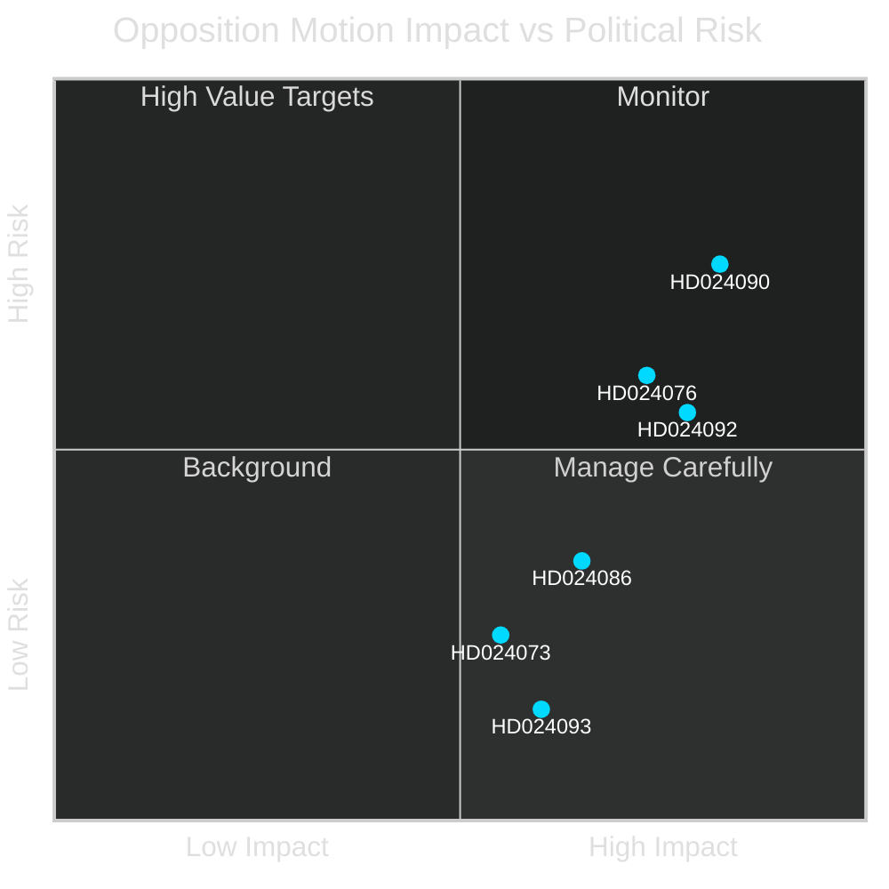

# SWOT Analysis — Swedish Opposition Motions Spring 2026

**Author**: James Pether Sörling  
**Scope**: Parliamentary opposition motions 2026-04-07 to 2026-04-17

---

### Strengths (Opposition Position)

- **Legal and constitutional grounding**: HD024090 (riksdagen.se) — V's challenge to criminal deportation rules on EU law compatibility grounds gives the opposition strong institutional footing in legal committees and potential ECJ referral leverage
- **Cross-party breadth**: Multiple parties (V, MP, likely S) filing across 10 committees demonstrates coordinated and broad-based opposition, not a fringe protest — HD024086 (riksdagen.se) (MP), HD024092 (riksdagen.se) (V)
- **Electoral narrative clarity**: The immigration-versus-rights fault line (HD024090, HD024076, HD024080, HD024087, HD024089 — all riksdagen.se) gives opposition parties a single coherent message for the 2026 election
- **Budget equity argument**: HD024092 (riksdagen.se) — Nooshi Dadgostar's challenge to fuel tax cuts as regressive redistribution appeals to urban and lower-income voter segments

### Weaknesses (Opposition Position)

- **Numerical minority**: With SD supporting the Tidö coalition, government retains reliable chamber majority — opposition motions are likely to fail procedurally in most committees (riksdagen.se parliamentary arithmetic)
- **Fragmentation risk**: 29 motions across 10 committees (riksdagen.se) dilutes narrative focus; media and public attention is finite; too many simultaneous battles risks diluted impact
- **Limited immigration alternativ**: Opposition's counter-narrative on prop. 2025/26:229 (reception law — HD024076, riksdagen.se) risks appearing obstructionist without credible alternative framework
- **Timing**: Spring 2026 motions filed late in the legislative cycle — some may not be fully debated before summer recess (riksdagen.se committee calendar)

### Opportunities

- **KD/L coalition fissures**: Rule-of-law and proportionality concerns on deportation rules (HD024090, riksdagen.se) could attract reservations from KD (Christian Democrats) who traditionally defend legal due process
- **ECJ referral potential**: EU law compatibility issues in HD024090 (riksdagen.se) could escalate to European Court of Justice, giving opposition a supranational pressure point
- **Energy transition framing**: Budget motions (HD024092, riksdagen.se) coincide with rising Swedish public concern about climate; V's social-redistribution alternative can be framed as both green and equitable
- **Cybersecurity consensus**: HD024093 (riksdagen.se) — FöU motion indicates cross-party alignment on cybersecurity, providing opportunity for opposition to claim national security credibility

### Threats (to opposition strategy)

- **SD electoral erosion of SD voters from mainstream parties**: If government's immigration tightening succeeds politically, opposition faces the risk that their rights-based counter-narrative is unpopular with persuadable voters — risk of being outflanked by SD on law-and-order messaging
- **Budget populism backfire**: V's opposition to fuel tax cuts (HD024092, riksdagen.se) may be perceived by rural/working-class voters as out-of-touch with everyday transport costs
- **Government controls legislative timeline**: HD024086 (riksdagen.se) opposition on bosättning law — government can accelerate committee votes, limiting opposition amendment opportunities
- **Minority committee voices absorbed**: Many motions (HD024073, HD024091 — riksdagen.se) receive only a minority reservation rather than defeating the bill; minority-reservation culture limits genuine legislative impact

## TOWS Strategic Matrix

| | Opportunities | Threats |
|---|---|---|
| **Strengths** | Use legal grounding (HD024090) to exploit KD/L fissures on rule-of-law (SO) | Deploy electoral narrative clarity early — frame immigration rights for the campaign before SD pre-empts (ST) |
| **Weaknesses** | Overcome fragmentation by selecting 2-3 flagship motions (HD024090, HD024092) for concentrated media engagement (WO) | Address rural transport cost concerns directly to neutralise fuel-tax criticism of HD024092 (WT) |

