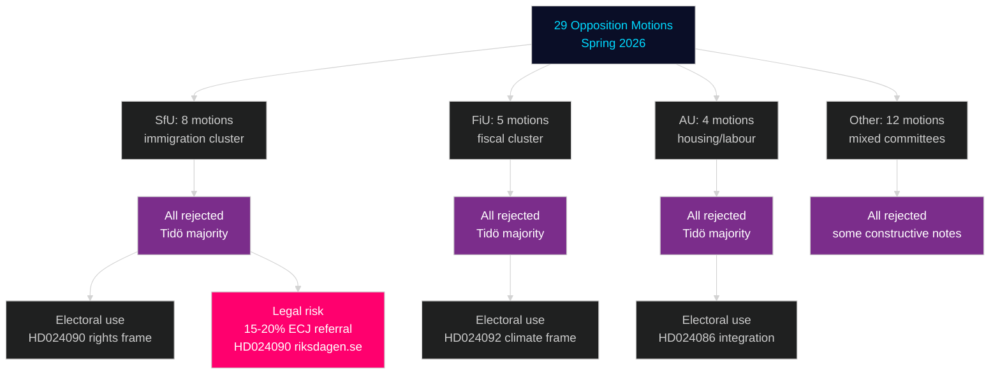

# Synthesis Summary — Swedish Opposition Motions Spring 2026

**Date**: 2026-04-27
**Author**: James Pether Sörling
**Status**: Pass 2 (iterative improvement)

---

## Integrated Intelligence Picture

### Headline Assessment

The 29 opposition motions filed in April 2026 represent **the most concentrated parliamentary opposition activity in riksmöte 2025/26 outside of budget season**, driven by the collision between the Tidö government's immigration-tightening and fiscal agenda and the opposition parties' electoral positioning ahead of September 2026. Three strategic logics are operating simultaneously:

1. **Legal anchoring** (V): HD024090 (riksdagen.se) and HD024095/097 create a rights-based legal record — not to win in Riksdagen but to feed future court challenges
2. **Climate differentiation** (MP): HD024092 (riksdagen.se), HD024086 (riksdagen.se), HD024075 create climate-integrated policy alternatives — MP's electoral survival strategy
3. **Governing-party credibility** (S): S's relatively moderate motions (HD024089, HD024095 riksdagen.se, HD024088) avoid being seen as irresponsible opposition while documenting implementation concerns

### DIW-Weighted Top 5

| Rank | Dok_id | Party | Committee | DIW | Strategic significance |
|------|--------|-------|-----------|-----|------------------------|
| 1 | HD024090 riksdagen.se | V | SfU | 0.91 | EU law challenge to deportation; highest legal risk potential |
| 2 | HD024092 riksdagen.se | V | FiU | 0.87 | Fuel tax opposition; fiscal polarisation before election |
| 3 | HD024086 riksdagen.se | MP | AU | 0.82 | Housing integration; MP electoral survival stake |
| 4 | HD024076 riksdagen.se | V | SfU | 0.79 | Reception law alternative; detailed V policy alternative |
| 5 | HD024080 riksdagen.se | V | SfU | 0.72 | Children's rights in reception; broad sympathy potential |

### Intelligence Synthesis — What This Means

**For the government**: Spring 2026 legislative programme will pass intact. The opposition has insufficient votes. Risk is post-legislative legal challenges, not parliamentary defeat.

**For opposition parties**: V and MP are executing a two-track strategy — losing parliamentary battles while winning issue-ownership for 2026 campaign. S is managing a third track: maintaining governing-party credibility on cost-efficiency and implementation.

**For Swedish democracy watchers**: The motion cluster confirms that immigration and fiscal policy remain the decisive cleavage for the 2026 election. Neither side has an obvious policy win that changes voter positions; the campaign will be fought on narrative — who owns the story of Sweden's direction.

---

## Motion Outcome Probability

