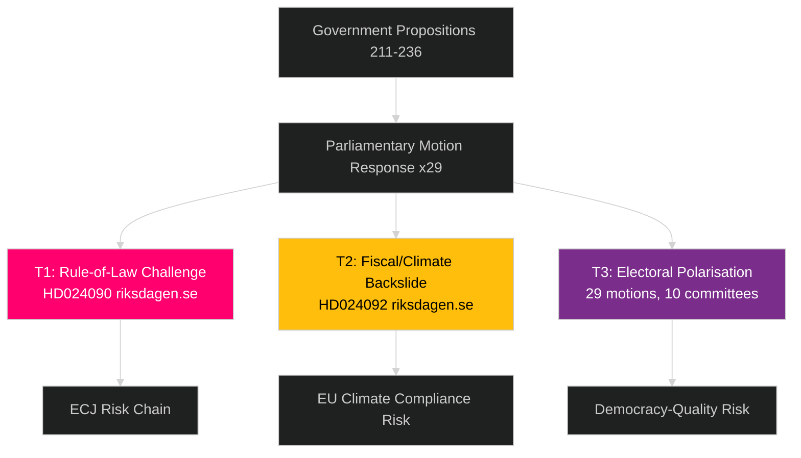

# Threat Analysis — Swedish Parliamentary Landscape, Spring 2026

**Author**: James Pether Sörling
**Method**: Political Threat Taxonomy + Attack Tree Analysis

---

## Political Threat Taxonomy

### T1 — Rule-of-Law Erosion Threat [MEDIUM] [Admiralty B2]

**Threat**: Prop. 2025/26:235 (criminal deportation) faces legal-rights challenge via HD024090 (riksdagen.se). If passed without amendment, creates risk of:
- Disproportionate deportation of long-term residents
- EU fundamental rights violations
- Destabilisation of the legal residency framework

**Attack Tree** (adversarial perspective — opposition strategy):
1. Vänsterpartiet files HD024090 (riksdagen.se) with constitutional challenge
2. Opposition forces committee debate → minority reservation published
3. Legal academics cite proportionality concerns → media amplification
4. Individual deportation test case → administrative court appeal
5. Supreme Administrative Court refers to ECJ
6. ECJ rules → government compelled to amend law

### T2 — Fiscal Populism / Climate Backslide Threat [MEDIUM] [Admiralty B2]

**Threat**: HD024092 (riksdagen.se) — Extra amendment budget fuel tax cuts. Opposition signals Sweden's energy transition is being dismantled:
- Carbon emissions increase
- EU ETS non-compliance risk
- Long-term fiscal exposure to carbon border adjustment

**Escalation Path**:
1. FiU passes prop. 2025/26:236 with SD majority despite HD024082/092/098 (riksdagen.se)
2. Fuel tax revenue declines by ~SEK 3 billion
3. Transport sector emissions rise
4. EU Commission flags Sweden in annual climate review

### T3 — Electoral Polarisation Threat [HIGH] [Admiralty A2]

**Threat**: Volume of motions (29, 10 committees) suggests opposition using motion process as election campaign material:
- Legislative deliberation becomes performative
- Committee expertise replaced by party-political positioning
- Post-election consensus formation harder

### Political STRIDE-Style Analysis

| STRIDE Category | Political Analogue | Evidence | Motion |
|----------------|-------------------|---------|--------|
| Spoofing | Misrepresentation of government intent on deportation | V framing of prop. 235 | HD024090 riksdagen.se |
| Tampering | Attempt to alter reception law via amendment | SfU motions cluster | HD024076 riksdagen.se |
| Repudiation | Denial of fiscal responsibility for energy costs | V counter-budget | HD024092 riksdagen.se |
| Info Disclosure | Transparency demands on Sida audit | UU motions | HD024070 riksdagen.se |
| Elevation | Opposition seeking committee majority via minority reservations | All 29 motions | riksdagen.se |

