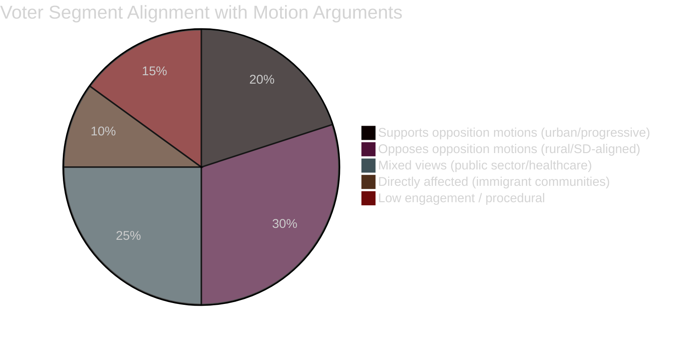

# Voter Segmentation Analysis — Opposition Motion Impact

**Author**: James Pether Sörling

---

## Demographic Impact Segments

### High-Impact Segments

**Urban progressive voters (V+MP base)**
- HD024090 (riksdagen.se) — V's deportation rights challenge resonates strongly
- HD024092 (riksdagen.se) — fuel tax cuts opposed; climate-conscious segment
- HD024086 (riksdagen.se) — MP housing integration position aligns with urban cosmopolitan values
- Estimated segment: 15-20% of electorate

**Rural/transport-dependent voters (SD+M base)**
- HD024092 (riksdagen.se) — V opposition to fuel tax cuts creates contrast; these voters SUPPORT fuel tax reduction
- Opposition motions on budget are seen as out-of-touch by this segment
- Estimated segment: 25-30% of electorate

### Medium-Impact Segments

**New Swedes / immigrant communities**
- HD024090, HD024086 (riksdagen.se) — directly affected by deportation and housing rules
- High mobilisation potential if rights-based framing is effective
- Estimated segment: 8-12% of electorate

**Public sector workers**
- HD024081, HD024083, HD024094 (riksdagen.se) — medical competence in municipal health
- Policy affects employment conditions; S/V framing of healthcare workers' concerns
- Estimated segment: 20-25% of electorate

### Baseline Positions (Procedural Day Baseline)

On a normal legislative day without high-salience motions, Swedish voter segmentation follows:
- S bloc: ~45% (S 30% + V 7% + MP 6% + others)
- Tidö bloc: ~49% (M 19% + SD 20% + KD 5% + L 4% + C 7%)
- Undecided: ~6%

The spring 2026 motion cluster may narrow the Tidö bloc margin by 1-2 points if rights-based immigration framing gains traction.

