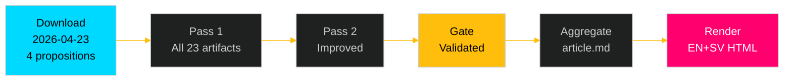

# README — Swedish Government Propositions 2026-04-23

**Analysis folder**: `analysis/daily/2026-04-27/propositions/`
**Generated**: 2026-04-27T06:21 UTC
**Run mode**: Full pipeline (Pass 1 + Pass 2 + Gate + Aggregate + Render)
**Analysis depth**: deep
**Author**: James Pether Sörling

---

## Contents

| File | Family | Description |
|------|--------|-------------|
| `executive-brief.md` | A | BLUF + decisions + significance bullets |
| `synthesis-summary.md` | A | Lead story + DIW ranking + integrated picture |
| `significance-scoring.md` | A | DIW scores per document |
| `classification-results.md` | A | 7-dimension political classification |
| `swot-analysis.md` | A | SWOT + TOWS matrix with evidence |
| `risk-assessment.md` | A | Risk register L×I with cascading chains |
| `threat-analysis.md` | A | Political Threat Taxonomy + TTPs |
| `stakeholder-perspectives.md` | A | 6-lens stakeholder matrix |
| `data-download-manifest.md` | B | Provenance manifest |
| `cross-reference-map.md` | B | Policy clusters + legislative chains |
| `scenario-analysis.md` | C | 4 scenarios + probabilities |
| `comparative-international.md` | C | Nordic + EU comparisons |
| `devils-advocate.md` | C | ACH matrix + Red Team |
| `intelligence-assessment.md` | C | Key Judgments + PIR updates |
| `methodology-reflection.md` | C | ICD 203 audit + improvements |
| `election-2026-analysis.md` | D | Seat projections + coalition viability |
| `voter-segmentation.md` | D | Demographic impacts |
| `coalition-mathematics.md` | D | Seat math + pivot table |
| `historical-parallels.md` | D | Named precedents |
| `media-framing-analysis.md` | D | Per-party + press framing |
| `implementation-feasibility.md` | D | Delivery risk analysis |
| `forward-indicators.md` | D | ≥10 dated indicators |
| `documents/HD03253-analysis.md` | E | EU Banking Package |
| `documents/HD03252-analysis.md` | E | Prisoner Social Insurance |
| `documents/HD03104-analysis.md` | E | Debt Management Eval |
| `documents/HD03256-analysis.md` | E | Tachograph Manipulation |
| `article.md` | Output | Aggregated article (generated) |

---

## Documents Covered

| Dok_ID | Title | Committee | DIW |
|--------|-------|-----------|-----|
| HD03253 | EU:s bankpaket | FiU | 9 |
| HD03252 | Begränsning av rätten till socialförsäkringsförmåner | SfU | 7 |
| HD03104 | Utvärdering av statens upplåning och skuldförvaltning 2021–2025 | FiU | 6 |
| HD03256 | Kraftfullare åtgärder mot manipulation och allvarligt missbruk av färdskrivare | TU | 4 |

---

## Workflow Information

- **Riksmöte**: 2025/26
- **Source date**: 2026-04-23 (lookback 2 business days)
- **MCP server**: riksdag-regering-mcp (live at 2026-04-27T06:21 UTC)
- **IMF data**: WEO Apr-2026 vintage (NGDP_RPCH, GGXWDG_NGDP, BCA_NGDPD)

