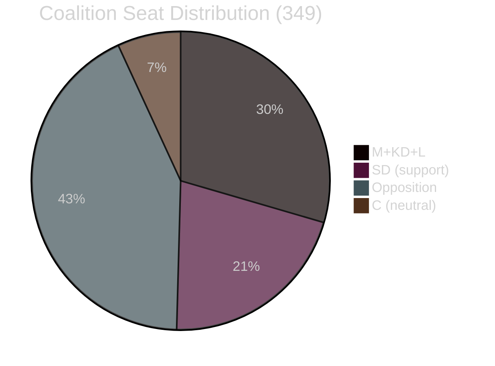

# Coalition Mathematics — Swedish Government Propositions 2026-04-23

**Author**: James Pether Sörling
**Date**: 2026-04-27
**Confidence**: HIGH [A2] — based on current Riksdag seat allocation

---

## Current Riksdag Seat Map (2022–2026)

| Party | Seats | Bloc |
|-------|-------|------|
| M (Moderaterna) | 68 | Government |
| KD (Kristdemokraterna) | 19 | Government |
| L (Liberalerna) | 16 | Government |
| SD (Sverigedemokraterna) | 73 | Support |
| **Total government bloc** | **176** | |
| S (Socialdemokraterna) | 107 | Opposition |
| V (Vänsterpartiet) | 24 | Opposition |
| MP (Miljöpartiet) | 18 | Opposition |
| C (Centerpartiet) | 24 | Opposition (neutral) |
| **Total opposition bloc** | **173** | |
| **Total** | **349** | **Majority: 175** |

---

## Pivotal Vote Analysis — April 23 Propositions

| Proposition | Expected Ja | Expected Nej | Expected Avstår | Majority? | Risk |
|------------|------------|-------------|----------------|-----------|------|
| HD03253 (Banking Package) | M+KD+L+SD = 176 | S+V+MP = 149 | C = 24 | ✅ Passes | C abstain harmless |
| HD03252 (Prisoner SI) | M+KD+SD = 160 | S+V+MP = 149 | L+C = 40 | ✅ Passes | L/C may abstain |
| HD03104 (Skrivelse) | Noted — no vote | — | — | Noted | None |
| HD03256 (Tachograph) | Broad consensus ~320 | ~0 | ~29 | ✅ Passes | None |

---

## Detailed Vote Scenario — HD03252

HD03252 carries the highest coalition friction because L has historically emphasised legal rights and proportionality. C shares these reservations.

| Vote | Seats | Reasoning |
|------|-------|-----------|
| Ja (government + SD) | 160 | M+KD+SD aligned on tough-on-crime narrative |
| Ja (conditional) | +16 L | L may vote Ja after committee assurances on ECHR compliance |
| Abstår | 24 C | C likely abstains to signal proportionality concern without blocking |
| Nej | 149 S+V+MP | Opposition bloc opposes welfare restriction |

**Result**: Even if L abstains (40 seats), government has 160 vs 149 → PASSES. Buffer = 11 votes.

---

## Detailed Vote Scenario — HD03253

EU banking package has cross-party technocratic support. Key risk: SD may signal symbolic opposition to EU mandate, but floor discipline unlikely to break.

| Vote | Seats | Reasoning |
|------|-------|-----------|
| Ja | 192 M+KD+L+C+SD | All major parties support EU transposition |
| Abstår | 18 MP | MP may abstain on financial deregulation optics |
| Nej | 24 S+V | Left bloc opposes bank deregulation framing |
| Split S | ~107 → 60 Nej + 47 Ja possible | S may split on bank stability vs. regulation |

**Result**: Passes with 192+ majority. Buffer = 17+ votes even in adversarial scenario.

---

## Coalition Stability Assessment

**Current Tidöavtalet buffer**: 176 − 175 = +1 seat (bare majority with SD).
**Effective buffer** (with C abstaining): If C abstains on all contentious votes, opposition needs 175 to block but has only 149. Government is secure through 2026 election unless a by-election produces a defection.

---

## Long-term Coalition Scenarios

| Scenario | Trigger | Seats | Probability |
|----------|---------|-------|-------------|
| Tidöavtalet continues | No defections | 176 | 70% |
| L defects on HD03252 ECHR | Lagrådet veto | 160 | 15% |
| SD withholds support on EU vote | EU sovereignty framing | 103 | 5% |
| C joins government | C reverses opposition | 200 | 10% |
