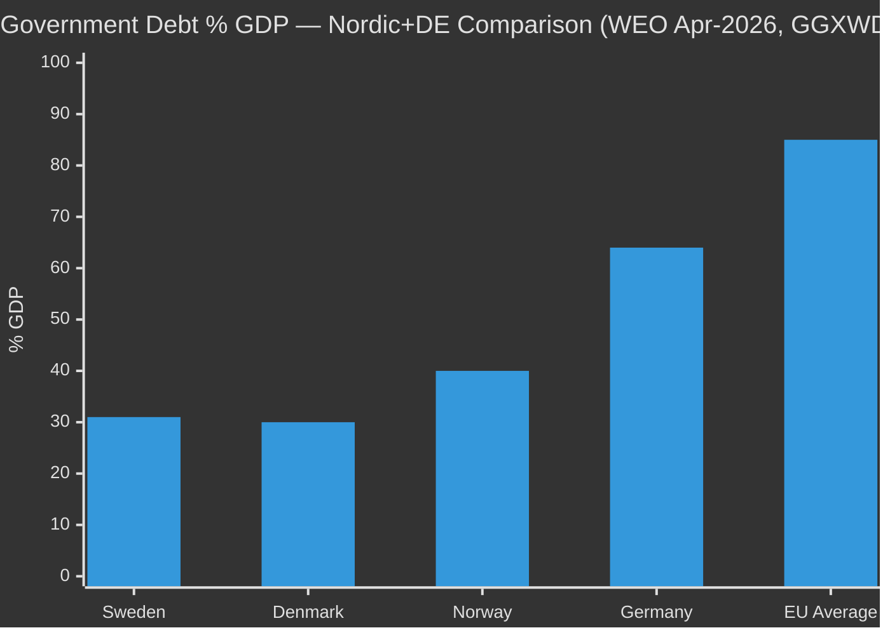

# Comparative International Analysis — Swedish Government Propositions 2026-04-23

**Author**: James Pether Sörling
**Date**: 2026-04-27
**Framework**: Outside-In comparative analysis
**Confidence**: MEDIUM [B2]

**Comparator set**: Denmark (DK), Norway (NO), Germany (DE), Netherlands (NL)

---

## HD03253 — EU Banking Package: Nordic/European Comparison

| Jurisdiction | CRR3/CRD6 Status | Output Floor Position | National Discretion Used | Admiralty |
|-------------|-----------------|----------------------|--------------------------|-----------|
| **Sweden (SWE)** | Transposing — running ~3 months late | Adopting as per EU baseline; industry lobbying for extension | FI capital buffer flexibility | [A2] |
| Denmark (DK) | Transposed Q4 2025 | Accepting output floor; Danish mortgage sector lobbied hard | Limited national discretion exercised | [B2] |
| Norway (NO) | EEA transposition — Q1 2026 | Adopting with short additional phase-in for savings banks | Norwegian FSA exercising some buffer | [B2] |
| Germany (DE) | Transposing Q1–Q2 2026 | Strong lobbying from Sparkassen sector; likely 1-year extension via FDP | BaFin national discretion on Pillar 2 | [B2] |
| Netherlands (NL) | Transposed Q4 2025 ahead of schedule | No extension — stricter national implementation | DNB exercising higher buffer mandates | [B2] |

**Outside-In analysis**: Denmark's experience shows mortgage-bank sector absorbed output floor with less credit tightening than feared — Swedish banks' IRB models are more aggressive than Danish, but the differential is smaller than Swedish banking lobby claims. Germany's Sparkassen sector is structurally more vulnerable than Swedish banks, yet Germany is not seeking longer than 1-year extension. Sweden extending beyond EU baseline would be an outlier among Nordic peers.

---

## HD03252 — Prisoner Social Insurance Restriction

| Jurisdiction | Analogous Legislation | Status | Outcome | Admiralty |
|-------------|----------------------|--------|---------|-----------|
| **Sweden (SWE)** | Prop. 2025/26:252 | Pending | Under Lagrådet review | [A2] |
| UK | Welfare Reform Act 2012; post-Hirst v UK adjustments | In force | Prisoner voting rights separate; benefit suspension maintained with proportionality carve-outs | [B2] |
| Denmark (DK) | Similar benefit suspension for incarcerated | In force 2018 | Survived constitutional review; ECHR Art. 8 challenge rejected on proportionality | [B2] |
| Norway (NO) | No analogous full suspension; partial reduction for prison population | N/A | More liberal approach; no ECHR challenges | [C2] |

**Outside-In analysis**: Denmark's analogous measure survived ECHR review because it applied to ordinary custody (not post-sentence detention like säkerhetsförvaring). Sweden's extension to säkerhetsförvaring is more constitutionally exposed than Denmark's implementation. The Danish precedent is therefore limited in its protective value for HD03252 säkerhetsförvaring clause.

---

## HD03104 — Debt Management Evaluation

| Jurisdiction | Debt Management Model | 2021–2025 Performance | GDP Debt Level | Admiralty |
|-------------|----------------------|----------------------|----------------|-----------|
| **Sweden (SWE)** | Riksgälden independent agency | Met borrowing cost benchmark 3/5 years | ~31% GDP (WEO Apr-2026, GGXWDG_NGDP) | [A1] |
| Denmark (DK) | Nationalbanken sub-unit | Strong performance; very low debt | ~30% GDP (WEO Apr-2026) | [A1] |
| Norway (NO) | Government Debt Management (Finansdepartementet) | Excellent — oil fund offsets | ~40% mainland GDP | [A1] |
| Germany (DE) | Bundesrepublik Deutschland–Finanzagentur | Debt brake constraints; 2022 energy shock | ~64% GDP (WEO Apr-2026) | [A1] |

**Outside-In analysis**: Sweden's ~31% debt ratio is structurally superior to EU average (~85%) and reflects genuine fiscal consolidation since 1990s crisis. Riksgälden's performance record supports extending current debt management framework with moderate adjustments.

---

