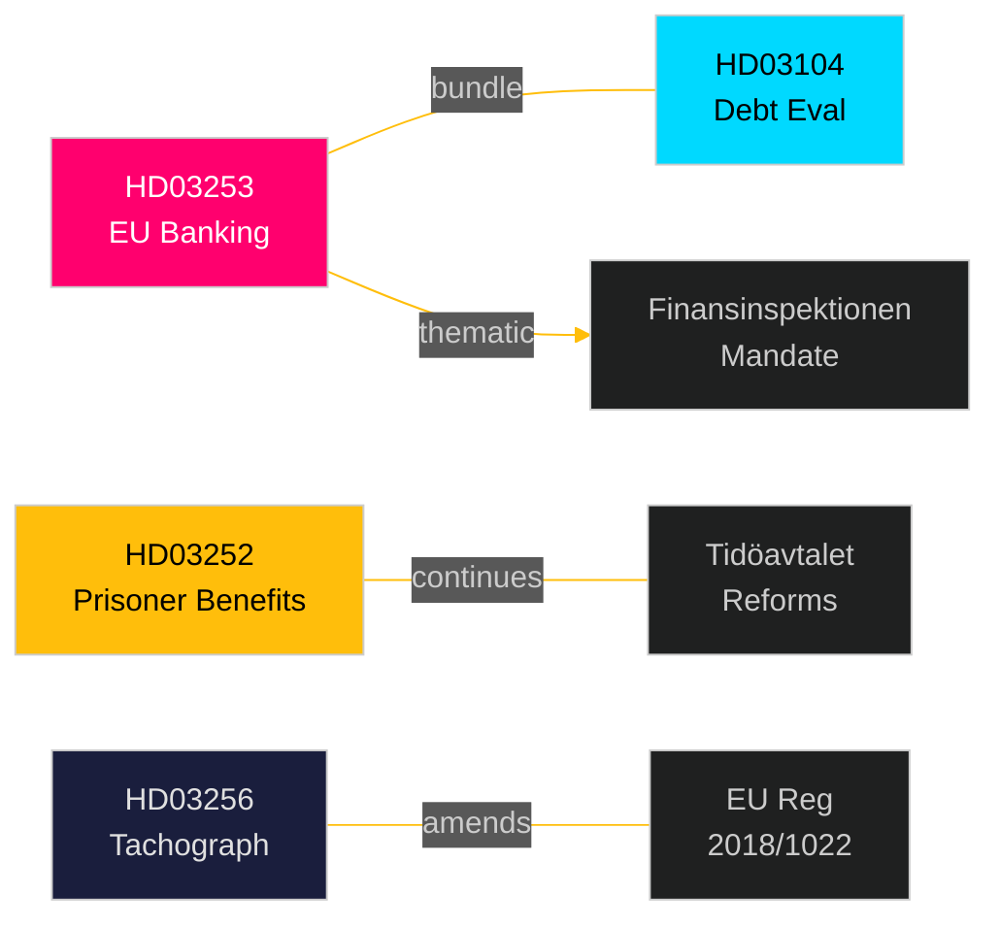

# Cross-Reference Map — Swedish Government Propositions 2026-04-23

**Author**: James Pether Sörling
**Date**: 2026-04-27
**Confidence**: HIGH [B2]

---

## Policy Clusters

### Cluster A: Financial Regulation & Fiscal Framework

**Documents**: `HD03253` (EU Banking Package), `HD03104` (Debt Management Evaluation)

**Legislative chain**: HD03253 → FiU review → Finansinspektionen mandate → CRR3 national rules; HD03104 → next Riksgälden mandate 2026–2031.

**Cross-reference**: Both documents are referred to FiU and handled by Finansdepartementet under Niklas Wykman. The debt evaluation (HD03104) provides the fiscal credibility backdrop that makes the banking package (HD03253) politically feasible — Sweden's low government debt (~31% GDP, WEO Apr-2026, GGXWDG_NGDP) supports absorbing capital tightening costs without fiscal strain.

**Coordinated filing**: Same day (2026-04-23), same department — coordinated spring package.

**Edge label**: `bundle`

---

### Cluster B: Criminal Justice & Social Insurance

**Documents**: `HD03252` (Prisoner Social Insurance Restriction)

**Legislative chain**: HD03252 → SfU review → Lagrådet opinion → potentially SF (social insurance) and JU (judiciary) cross-referral.

**Context**: Part of Tidöavtalet reform programme — links to earlier prisoner reform measures (electronic monitoring expansion 2024, Prop. 2024/25:xx). Extends benefit-restriction logic from ordinary prisoners to säkerhetsförvaring and kontrollerat boende.

**Related earlier legislation**: Prop. 2023/24:137 (expanded elektronisk övervakning, references Riksdagen) — thematically linked.

**Edge label**: `continues`

---

### Cluster C: EU Transport Regulation

**Documents**: `HD03256` (Tachograph Manipulation)

**Legislative chain**: HD03256 → TU review → Transportstyrelsen enforcement mandate update.

**EU linkage**: EU Regulation 2018/1022 (direct effect, but Sweden needs national penalty provisions); links to Road Haulage Enforcement Act amendments.

**Edge label**: `amends`

---

## Sibling Folder Citations

| Analysis folder | Relationship | Relevance |
|----------------|-------------|----------|
| `analysis/daily/2026-04-16/interpellations/` | Thematic precedent | Earlier interpellations on banking supervision and social insurance touch same policy areas |

---

## Cross-Reference Summary Diagram

---

## Coordinated Activity Patterns

- **Finansdepartementet spring package**: HD03253 + HD03104 submitted same day — typical pre-recess legislative bundle (spring recess late April/early May 2026).
- **Government reform momentum**: HD03252 closes a gap in Tidöavtalet criminal justice programme; signals continued delivery ahead of 2026 election campaign.
- **EU compliance batch**: HD03253 + HD03256 are both EU transposition obligations — government may be batching EU-deadline items to demonstrate compliance efficiency.
