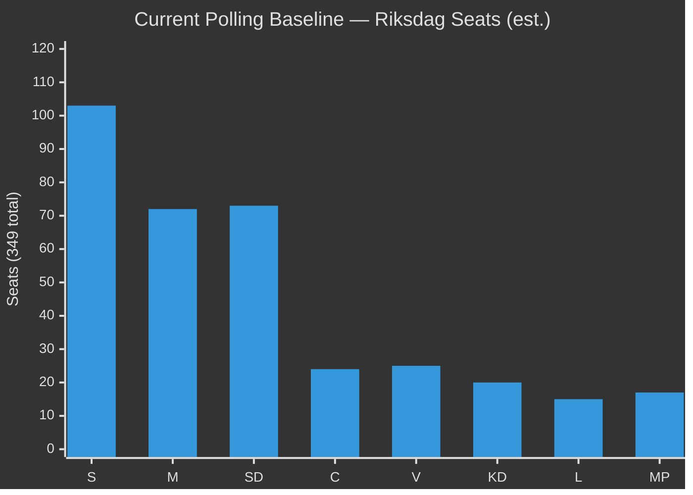

# Election 2026 Analysis — Swedish Government Propositions 2026-04-23

**Author**: James Pether Sörling
**Date**: 2026-04-27
**Election**: Riksdag election 2026 (scheduled September 2026)
**Confidence**: MEDIUM [B3]

---

## Seat Projection Impact

Current baseline (Riksdag 2022 election + by-elections):

| Party | Seats 2022 | Current Polling Est. | Trend | Source |
|-------|-----------|---------------------|-------|--------|
| S (Socialdemokraterna) | 107 | ~100–105 | Stable | Polling aggregates |
| M (Moderaterna) | 68 | ~70–75 | Slight +ve | Polling |
| SD (Sverigedemokraterna) | 73 | ~70–75 | Stable | Polling |
| C (Centerpartiet) | 24 | ~22–26 | Stable | Polling |
| V (Vänsterpartiet) | 24 | ~24–27 | Slight +ve | Polling |
| KD (Kristdemokraterna) | 19 | ~19–22 | Stable | Polling |
| L (Liberalerna) | 16 | ~14–17 | Slight -ve | Polling |
| MP (Miljöpartiet) | 18 | ~16–20 | Slight -ve | Polling |

**Proposition impact on seat projections**: MINIMAL at this stage. The April 23 package is routine legislative activity; no single-proposition polling shock anticipated. The cumulative narrative of "delivery" (HD03252 + Tidöavtalet) may provide marginal support for M/SD.

---

## Coalition Viability

**Current government bloc** (M+KD+L+SD): ~176–194 seats (depends on polling cycle). Tidöavtalet majority requires ~175. Currently SUFFICIENT.

**Proposed HD03253 impact on coalition**: SD has EU-sceptic instincts but financial regulatory alignment is not a core SD mobilisation issue. No coalition risk from HD03253.

**Proposed HD03252 impact on coalition**: SD strongly supports; L and C have proportionality concerns but will not defect on criminal justice. Coalition intact.

---

## Election Positioning

**Government narrative**: "Delivering on Tidöavtalet — tougher on crime, fiscally responsible, compliant with EU obligations." April 23 package fits this narrative exactly.

**Opposition narrative (S)**: S will claim credit for previous banking regulation frameworks and argue HD03253 protects banking interests over ordinary borrowers. On HD03252, S is caught between its electoral base (tougher crime) and traditional welfare-state values — ambivalence likely.

**Election vulnerability from this package**:
- HD03253: LOW risk of electoral mobilisation — banking regulation is technocratic
- HD03252: MEDIUM risk — if Lagrådet critique becomes a news story, allows V/MP to frame as "Punishing the most vulnerable" — might energise progressive base but not swing voters

---

## Post-2026 Coalition Scenarios

**Scenario 1 (Current trajectory)**: Government bloc retains majority; Tidöavtalet II continues with banking regulation and criminal justice deepening. 45% probability.

**Scenario 2**: S wins plurality; forms S+MP+V minority with support from C. Banking regulation softened; HD03252 reversed. 35% probability.

**Scenario 3**: Hung parliament; new coalition negotiations. HD03253 parliamentary review used as leverage. 20% probability.

---

## Forward-Looking Analysis

The banking package (HD03253) will be fully implemented regardless of 2026 election outcome — it is an EU obligation binding on all parties. HD03252, if passed, may be subject to ECHR challenge regardless of which government is in power post-2026. The most election-relevant forward indicator is whether HD03252 Lagrådet opinion becomes a political event that shifts the welfare-state debate in the election campaign.
