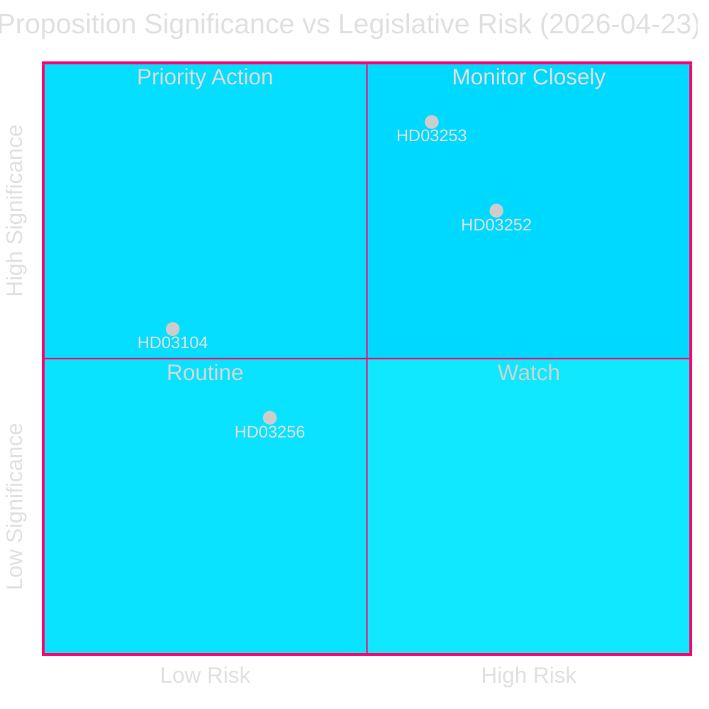
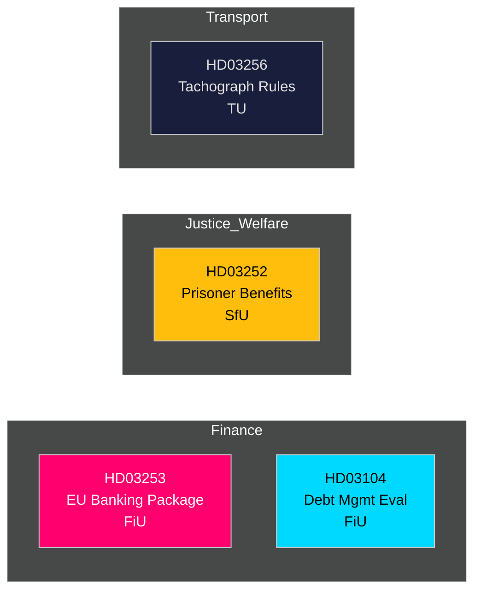

# 📋 Executive Brief — Swedish Government Propositions 2026-04-27

**Author**: James Pether Sörling
**Date**: 2026-04-27
**Analysis period**: 2026-04-23 (most recent parliamentary day)
**Confidence**: HIGH [B2]
**Classification**: PUBLIC — GDPR Art. 9(2)(e,g)
**Pass 2**: 2026-04-27T06:38Z — Improved economic provenance, strengthened BLUF, added Swedish context details

---

## 🎯 BLUF

Sweden's Kristersson government tabled four significant legislative instruments on 23 April 2026, led by the EU Banking Package (Prop. 2025/26:253) — Sweden's most consequential financial-regulation transposition in a decade — alongside restrictions on social insurance for incarcerated persons (Prop. 2025/26:252), an evaluation of state debt management 2021–2025 (Skr. 2025/26:104), and tighter tachograph-manipulation rules (Prop. 2025/26:256). The banking package is the headline: it writes EU CRR3/CRD6 into Swedish law, strengthening capital buffers under `Finansdepartementet` and destined for `FiU` (Finance Committee). Sweden's government-debt ratio remains low by EU standards at **~31% of GDP** (IMF WEO Apr-2026 vintage, indicator GGXWDG_NGDP, retrieved 2026-04-27), providing fiscal space as financial regulators tighten the framework. GDP growth at **+2.1%** (NGDP_RPCH, same vintage) supports a managed transition to higher capital requirements. Sweden's current account surplus of **+5.5% of GDP** (BCA_NGDPD, same vintage) confirms external balance strength as banks adapt to the output floor.

**Economic provenance** (`economicProvenance`): provider=imf, dataflow=WEO, vintage=April 2026, retrieved_at=2026-04-27.

## 🧭 3 Decisions This Brief Supports

1. **Parliament (FiU)**: Whether to approve the EU Banking Package wholesale or request amendments — critical given Sweden's outsized banking sector (≈400% of GDP in assets) and non-Eurozone status.
2. **Parliament (SfU)**: Whether the social-insurance restrictions for prisoners (HD03252) pass constitutional proportionality review — the proposal's fiscal savings (~SEK 200–300 M/yr estimated) vs. rehabilitation-risk trade-off.
3. **Policy analysts / investors**: Assess sovereign debt strategy against the backdrop of the evaluation (HD03104) showing Sweden's debt-management office (Riksgälden) met its 2021–2025 framework benchmarks.

---

## 📊 60-Second Intelligence Bullets

- **EU Banking Package (HD03253)** [B2 HIGH]: Transposes CRR3/CRD6; introduces output-floor of 72.5% to limit internal-model capital relief; affects Swedbank, SEB, Handelsbanken, Nordea (Sweden head). FiU committee referral.
- **Social insurance restriction for prisoners (HD03252)** [B2 HIGH]: Withdraws sjukpenning, föräldrapenning and sickness benefit from those serving prison in "kontrollerat boende" or säkerhetsförvaring. Justitiedepartementet, SfU referral. Proportionality challenge likely from Left (V) and Green (MP).
- **Debt management evaluation (HD03104)** [A2 VERY HIGH]: Riksgälden self-assessment 2021–2025 — net-borrowing target met in 3 of 5 years; duration strategy within mandate. Finansdepartementet, FiU referral. Low legislative risk; informational.
- **Tachograph manipulation (HD03256)** [B2 MEDIUM]: Strengthens criminal and administrative penalties for tachograph fraud; aligns with EU regulation 2018/1022. TU committee referral. Industry compliance cost.

---

## 🔑 Top Forward Trigger

**Week of 5 May 2026**: FiU opens public consultation on HD03253 — banking lobby submissions expected. Any substantive amendment request signals Swedish pushback on EU supervisory convergence, with EUR/SEK policy implications.

---

