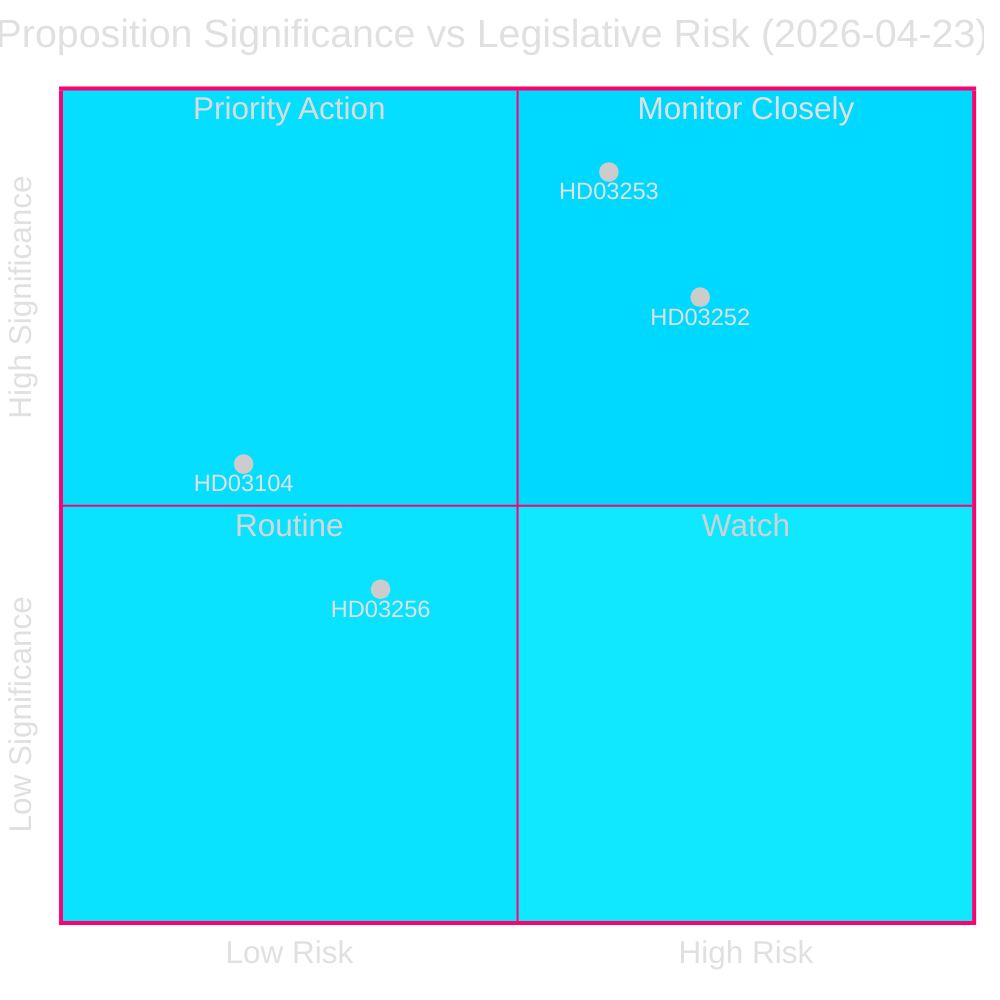
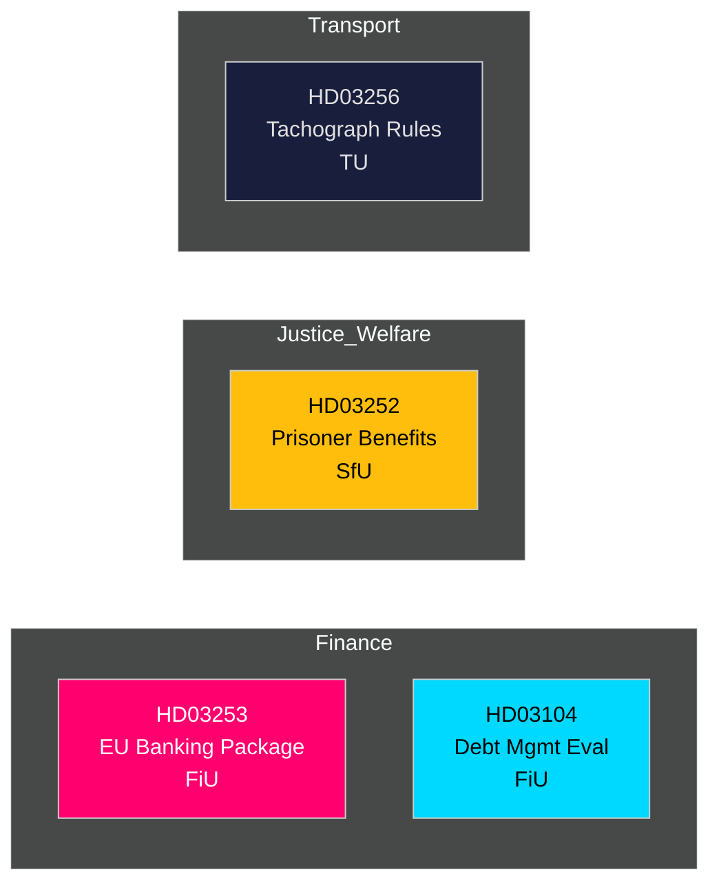

<!-- dir: rtl -->
# 📋 موجز استخباراتي — مقترحات الحكومة السويدية 2026-04-27

**المؤلف**: James Pether Sörling
**التاريخ**: 2026-04-27
**فترة التحليل**: 2026-04-23 (آخر يوم برلماني)
**الثقة**: عالية [B2]
**التصنيف**: عام — المادة 9(2)(ه,ز) من اللائحة العامة لحماية البيانات
**المراجعة 2**: 2026-04-27T06:38Z — تحسين المصدر الاقتصادي، تعزيز الرسالة الجوهرية، إضافة تفاصيل السياق السويدي

---

## 🎯 الرسالة الجوهرية

قدّمت حكومة كريسترسون أربعة أدوات تشريعية مهمة في 23 أبريل 2026، بقيادة حزمة الاتحاد الأوروبي المصرفية (Prop. 2025/26:253) — التحويل التنظيمي المالي الأكثر أهمية في السويد خلال عقد — إلى جانب قيود على التأمين الاجتماعي للمحتجزين (Prop. 2025/26:252)، وتقييم لإدارة الدين العام 2021–2025 (Skr. 2025/26:104)، وقواعد مشددة لمكافحة التلاعب بالمسجّلات (Prop. 2025/26:256). الحزمة المصرفية هي العنصر الرئيسي: إذ تدرج CRR3/CRD6 الأوروبي في القانون السويدي، مما يعزز احتياطيات رأس المال تحت `Finansdepartementet` وتُحال إلى `FiU` (لجنة المالية). تبقى نسبة الدين العام السويدي منخفضة وفق المعايير الأوروبية عند **~31% من الناتج المحلي الإجمالي** (صندوق النقد الدولي، آفاق الاقتصاد العالمي أبريل 2026، مؤشر GGXWDG_NGDP، استُرجع في 2026-04-27)، مما يوفر مجالاً مالياً بينما يشدد المنظمون الماليون الإطار. نمو الناتج المحلي الإجمالي بنسبة **+2.1%** (NGDP_RPCH، المصدر ذاته) يدعم انتقالاً منضبطاً نحو متطلبات رأس المال الأعلى. يؤكد فائض الحساب الجاري السويدي البالغ **+5.5% من الناتج المحلي الإجمالي** (BCA_NGDPD، المصدر ذاته) القوة الخارجية بينما تتكيف البنوك مع الحد الأدنى للناتج.

**المصدر الاقتصادي** (`economicProvenance`): provider=imf، dataflow=WEO، vintage=أبريل 2026، retrieved_at=2026-04-27.

## 🧭 3 قرارات يدعمها هذا الموجز

1. **الريكسداغ (FiU)**: هل يُوافَق على الحزمة المصرفية الأوروبية بالكامل أم تُطلَب تعديلات؟ — أمر بالغ الأهمية نظراً للقطاع المصرفي السويدي الضخم (≈400% من الناتج المحلي الإجمالي في أصول) ووضعه خارج منطقة اليورو.
2. **الريكسداغ (SfU)**: هل تجتاز قيود التأمين الاجتماعي للسجناء (HD03252) الاختبار الدستوري للتناسب؟ — الوفورات المالية (~200–300 مليون كرونة سويدية/سنة) مقابل مخاطر إعادة التأهيل.
3. **المحللون السياسيون / المستثمرون**: تقييم استراتيجية الدين العام في ضوء التقييم (HD03104) الذي يُظهر تحقيق Riksgälden لأهداف إطار 2021–2025.

---

## 📊 نقاط استخباراتية في 60 ثانية

- **الحزمة المصرفية الأوروبية (HD03253)** [B2 عالية]: تنقل CRR3/CRD6؛ تُدخل حداً أدنى للناتج بنسبة 72.5% للحدّ من تخفيف رأس المال بالنماذج الداخلية؛ تؤثر على Swedbank وSEB وHandelsbanken وNordea (السويد). إحالة إلى FiU.
- **قيود التأمين الاجتماعي للمحتجزين (HD03252)** [B2 عالية]: تسحب مخصصات المرض والوالدين والمرض من المحتجزين في `مسكن خاضع للرقابة` أو الاحتجاز الأمني. Justitiedepartementet، إحالة SfU. من المرجح اعتراض تناسبية من V وMP.
- **تقييم إدارة الدين العام (HD03104)** [A2 عالية جداً]: التقييم الذاتي لـ Riksgälden 2021–2025 — تحقيق هدف الاقتراض الصافي لمدة 3 من أصل 5 سنوات؛ استراتيجية المدة ضمن الولاية. Finansdepartementet، إحالة FiU. مخاطر تشريعية منخفضة؛ معلوماتي.
- **التلاعب بالمسجّلات (HD03256)** [B2 متوسطة]: يشدد العقوبات الجنائية والإدارية للتلاعب بالمسجّلات؛ يتوافق مع لائحة الاتحاد الأوروبي 2018/1022. إحالة TU. تكلفة امتثال القطاع.

---

## 🔑 أهم محفّز مستقبلي

**أسبوع 5 مايو 2026**: يفتح FiU استشارة عامة حول HD03253 — تُتوقع مرئيات لوبي البنوك. أي طلب تعديل جوهري يُشير إلى مقاومة سويدية للتقارب الرقابي الأوروبي، مع انعكاسات على سياسة EUR/SEK.

---

<!-- source-sha: 7156ec83294bd3d7360cfe9849ab2c3c69f409dc -->
