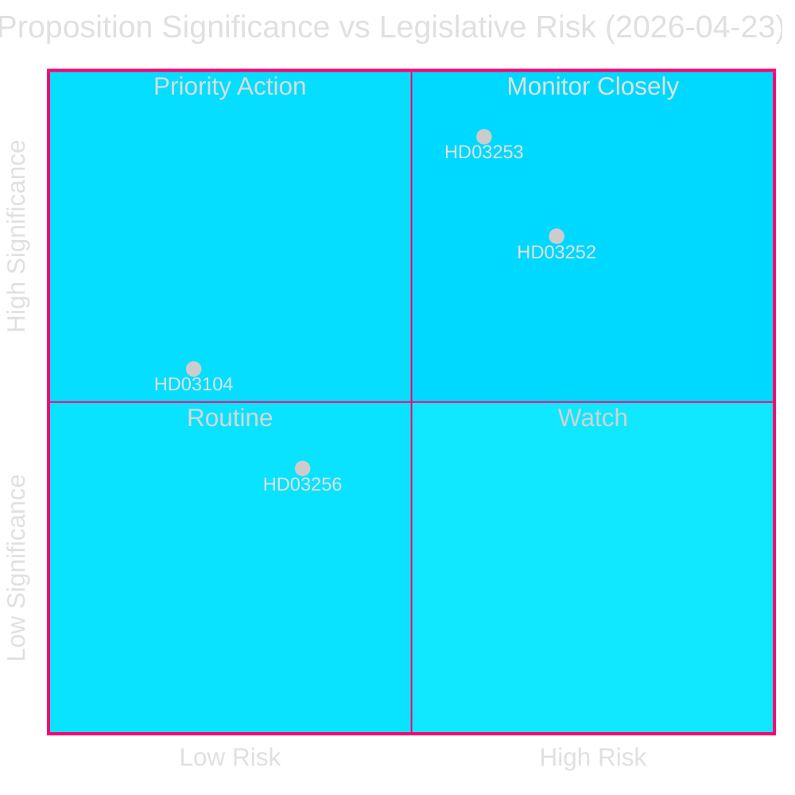
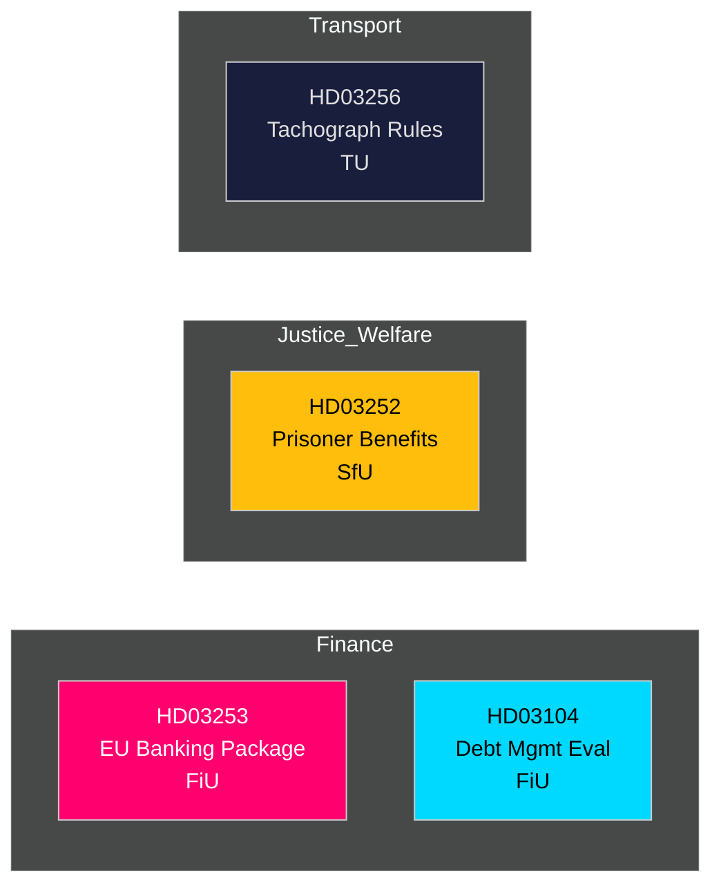

# 📋 Efterretningsoverblik — Svenske Regeringsforslag 2026-04-27

**Forfatter**: James Pether Sörling
**Dato**: 2026-04-27
**Analyseperiode**: 2026-04-23 (seneste parlamentariske dag)
**Konfidens**: HØJ [B2]
**Klassificering**: OFFENTLIG — GDPR Art. 9(2)(e,g)
**Gennemgang 2**: 2026-04-27T06:38Z — Forbedret økonomisk oprindelse, styrket BLUF, tilføjede svenske kontekstdetaljer

---

## 🎯 Kernebudskab

Kristersson-regeringen fremlagde fire betydelige lovgivningsinstrumenter den 23. april 2026, anført af EU-bankpakken (Prop. 2025/26:253) — Sveriges mest konsekvensrige finansregulatoriske transponering i et årti — sammen med restriktioner på socialforsikring for fængslede (Prop. 2025/26:252), en evaluering af statsgældsforvaltningen 2021–2025 (Skr. 2025/26:104) og skærpede regler mod fartskriversvindel (Prop. 2025/26:256). Bankpakken er det centrale element: det skriver EU's CRR3/CRD6 ind i svensk lov, styrker kapitalbuffere under `Finansdepartementet` og sendes til `FiU` (Finansudvalget). Sveriges statsgældskvote forbliver lav efter EU-standarder på **~31% af BNP** (IMF WEO apr-2026, indikator GGXWDG_NGDP, hentet 2026-04-27), hvilket giver finanspolitisk råderum, mens finansielle regulatorer strammes. BNP-vækst på **+2,1%** (NGDP_RPCH, samme kilde) støtter en kontrolleret overgang til højere kapitalkrav. Sveriges løbende konto-overskud på **+5,5% af BNP** (BCA_NGDPD, samme kilde) bekræfter ekstern styrke, mens banker tilpasser sig gulvkravet.

**Økonomisk oprindelse** (`economicProvenance`): provider=imf, dataflow=WEO, vintage=april 2026, retrieved_at=2026-04-27.

## 🧭 3 Beslutninger Denne Oversigt Støtter

1. **Riksdagen (FiU)**: Hvorvidt EU-bankpakken godkendes fuldt ud eller ændringsforslag kræves — afgørende i betragtning af Sveriges overstigende banksektor (≈400% af BNP i aktiver) og position uden for euroområdet.
2. **Riksdagen (SfU)**: Hvorvidt socialforsikringsrestriktionerne for fængslede (HD03252) består en forfatningsretlig proportionalitetsprøvelse — forslagets besparelser (~200–300 MSEK/år) mod rehabiliteringsrisikoen.
3. **Politiske analytikere / investorer**: Vurder statsgældsstrategien i lyset af evalueringen (HD03104), som viser, at Riksgälden opfyldte 2021–2025-ramværksmålene.

---

## 📊 60-Sekunders Efterretningspunkter

- **EU-bankpakken (HD03253)** [B2 HØJ]: Gennemfører CRR3/CRD6; indfører et outputgulv på 72,5% for at begrænse interne modellers kapitallettelse; berører Swedbank, SEB, Handelsbanken, Nordea (Sverige). FiU-høring.
- **Socialforsikringsrestriktion for fængslede (HD03252)** [B2 HØJ]: Fratrækker sygedagpenge, barselsdagpenge og sygeydelse for dem, der afsoner straf i `kontrolleret boende` eller `säkerhetsförvaring`. Justitiedepartementet, SfU-høring. Proportionalitetsindsigelse fra V og MP sandsynlig.
- **Evaluering af statsgældsforvaltning (HD03104)** [A2 MEGET HØJ]: Riksgäldens selvevaluering 2021–2025 — nettolånsmål opfyldt 3 ud af 5 år; durations-strategi inden for mandatet. Finansdepartementet, FiU-høring. Lav lovgivningsmæssig risiko; informativ.
- **Fartskriversvindel (HD03256)** [B2 MIDDEL]: Skærper straf og administrative sanktioner for fartskriversvindel; tilpasses EU-forordning 2018/1022. TU-høring. Brancheomkostning ved overholdelse.

---

## 🔑 Vigtigste Fremtidige Trigger

**Uge 5. maj 2026**: FiU åbner offentlig høring om HD03253 — banksektorens indlæg forventes. Eventuelle væsentlige ændringsforslag signalerer svensk modstand mod EU's tilsynskonvergens, med implikationer for EUR/SEK-politikken.

---

<!-- source-sha: 7156ec83294bd3d7360cfe9849ab2c3c69f409dc -->
