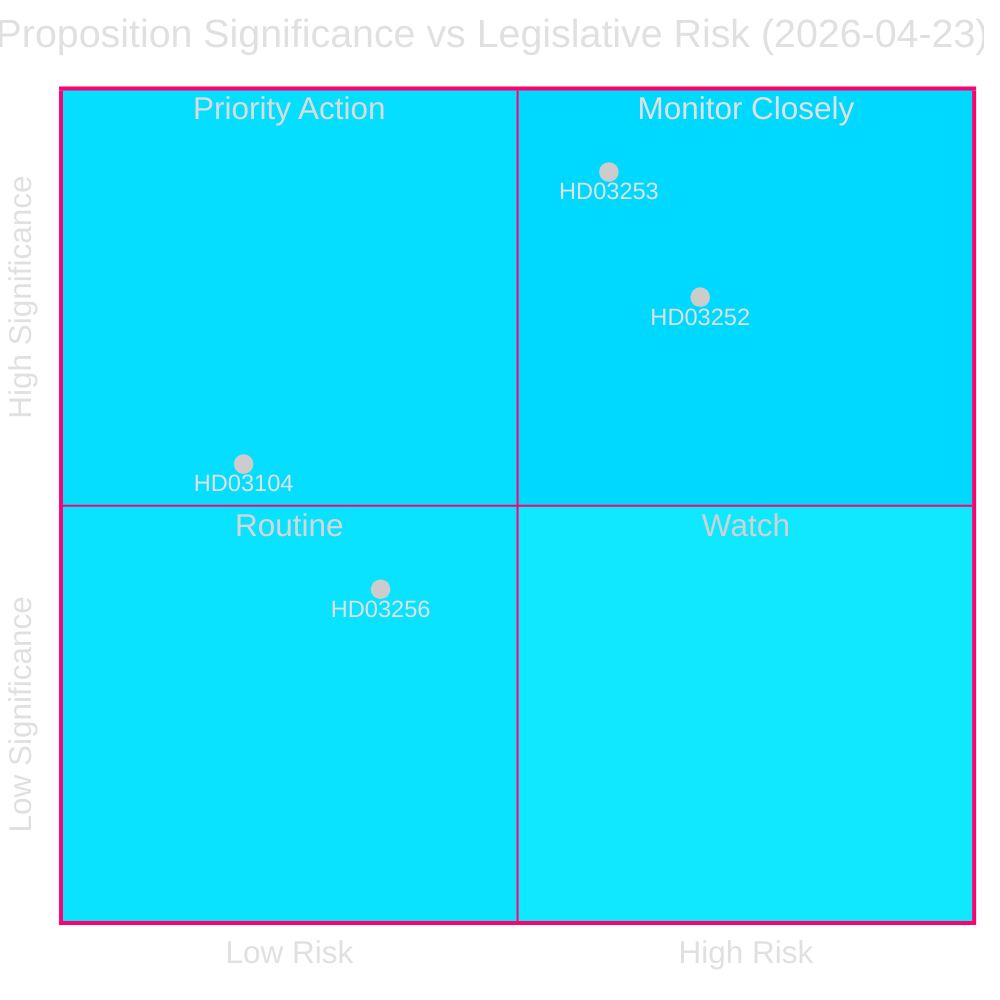
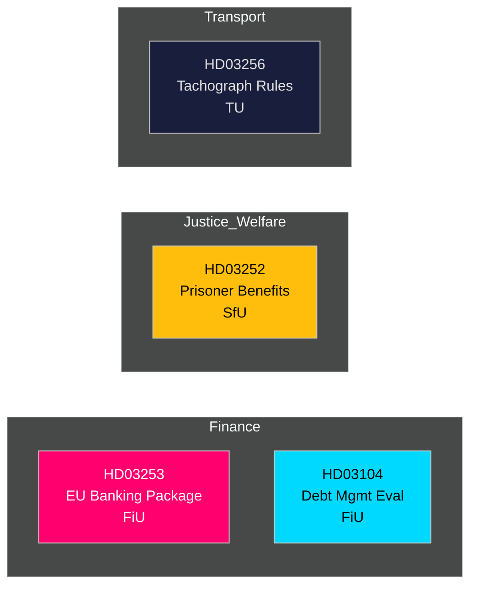

# 📋 Geheimdienstbericht — Schwedische Regierungsvorlagen 2026-04-27

**Autor**: James Pether Sörling
**Datum**: 2026-04-27
**Analysezeitraum**: 2026-04-23 (letzter parlamentarischer Tag)
**Konfidenz**: HOCH [B2]
**Klassifizierung**: ÖFFENTLICH — DSGVO Art. 9(2)(e,g)
**Durchgang 2**: 2026-04-27T06:38Z — Verbesserte wirtschaftliche Herkunft, verstärkte Kernaussage, schwedische Kontextdetails ergänzt

---

## 🎯 Kernaussage

Die Kristersson-Regierung legte am 23. April 2026 vier bedeutende Gesetzgebungsinstrumente vor, angeführt vom EU-Bankenpaket (Prop. 2025/26:253) — Schwedens folgenreichste Finanztransposition seit einem Jahrzehnt — sowie Einschränkungen der Sozialversicherung für Inhaftierte (Prop. 2025/26:252), einer Evaluierung der Staatsschuldenverwaltung 2021–2025 (Skr. 2025/26:104) und verschärften Regeln gegen Tachographenbetrug (Prop. 2025/26:256). Das Bankenpaket ist das Hauptthema: Es schreibt EU-CRR3/CRD6 in schwedisches Recht, stärkt Kapitalpuffer unter dem `Finansdepartementet` und wird dem `FiU` (Finanzausschuss) zugewiesen. Schwedens Staatsverschuldungsquote bleibt mit **~31% des BIP** nach EU-Maßstäben niedrig (IWF WEO Apr-2026, Indikator GGXWDG_NGDP, abgerufen 2026-04-27), was fiskalischen Spielraum bietet, während Finanzregulatoren das Rahmenwerk verschärfen. Das BIP-Wachstum von **+2,1%** (NGDP_RPCH, gleiche Quelle) unterstützt einen kontrollierten Übergang zu höheren Kapitalanforderungen. Schwedens Leistungsbilanzüberschuss von **+5,5% des BIP** (BCA_NGDPD, gleiche Quelle) bestätigt externe Stärke, während sich Banken an den Outputboden anpassen.

**Wirtschaftliche Herkunft** (`economicProvenance`): provider=imf, dataflow=WEO, vintage=April 2026, retrieved_at=2026-04-27.

## 🧭 3 Entscheidungen, die dieser Bericht Unterstützt

1. **der Riksdag (FiU)**: Ob das EU-Bankenpaket vollständig gebilligt oder Änderungsanträge gestellt werden — entscheidend angesichts Schwedens überdimensioniertem Bankensektor (≈400% des BIP an Vermögenswerten) und Nicht-Eurozone-Status.
2. **der Riksdag (SfU)**: Ob die Sozialversicherungsbeschränkungen für Gefangene (HD03252) die verfassungsrechtliche Verhältnismäßigkeitsprüfung bestehen — fiskalische Einsparungen (~200–300 MSEK/J) gegen das Resozialisierungsrisiko.
3. **Politische Analysten / Investoren**: Bewertung der Staatsschuldenstrategie vor dem Hintergrund der Evaluierung (HD03104), die zeigt, dass die Riksgälden ihre 2021–2025-Rahmenziele erfüllte.

---

## 📊 60-Sekunden-Geheimdienstpunkte

- **EU-Bankenpaket (HD03253)** [B2 HOCH]: Transponiert CRR3/CRD6; führt Outputboden von 72,5% ein, um interne Modell-Kapitalentlastungen zu begrenzen; betrifft Swedbank, SEB, Handelsbanken, Nordea (Schweden). FiU-Ausschussüberweisung.
- **Sozialversicherungsbeschränkung für Inhaftierte (HD03252)** [B2 HOCH]: Entzieht Krankengeld, Elterngeld und Krankheitsleistungen für Personen in `kontrolliertem Wohnen` oder Sicherheitsverwahrung. Justitiedepartementet, SfU-Überweisung. Verhältnismäßigkeitseinwand von V und MP wahrscheinlich.
- **Staatsschulden-Evaluierung (HD03104)** [A2 SEHR HOCH]: Riksgäldens Selbstevaluierung 2021–2025 — Nettoanleihe-Ziel 3 von 5 Jahren erfüllt; Durations-Strategie im Rahmen des Mandats. Finansdepartementet, FiU-Überweisung. Geringes Gesetzgebungsrisiko; informativ.
- **Tachographenbetrug (HD03256)** [B2 MITTEL]: Verschärft Straf- und Verwaltungssanktionen für Tachographenbetrug; entspricht EU-Verordnung 2018/1022. TU-Überweisung. Branchenkonformitätskosten.

---

## 🔑 Wichtigster Zukünftiger Auslöser

**Woche 5. Mai 2026**: FiU eröffnet öffentliche Anhörung zu HD03253 — Eingaben der Bankenlobby erwartet. Wesentliche Änderungsanträge signalisieren schwedischen Widerstand gegen EU-Aufsichtskonvergenz, mit Implikationen für die EUR/SEK-Politik.

---

<!-- source-sha: 7156ec83294bd3d7360cfe9849ab2c3c69f409dc -->
