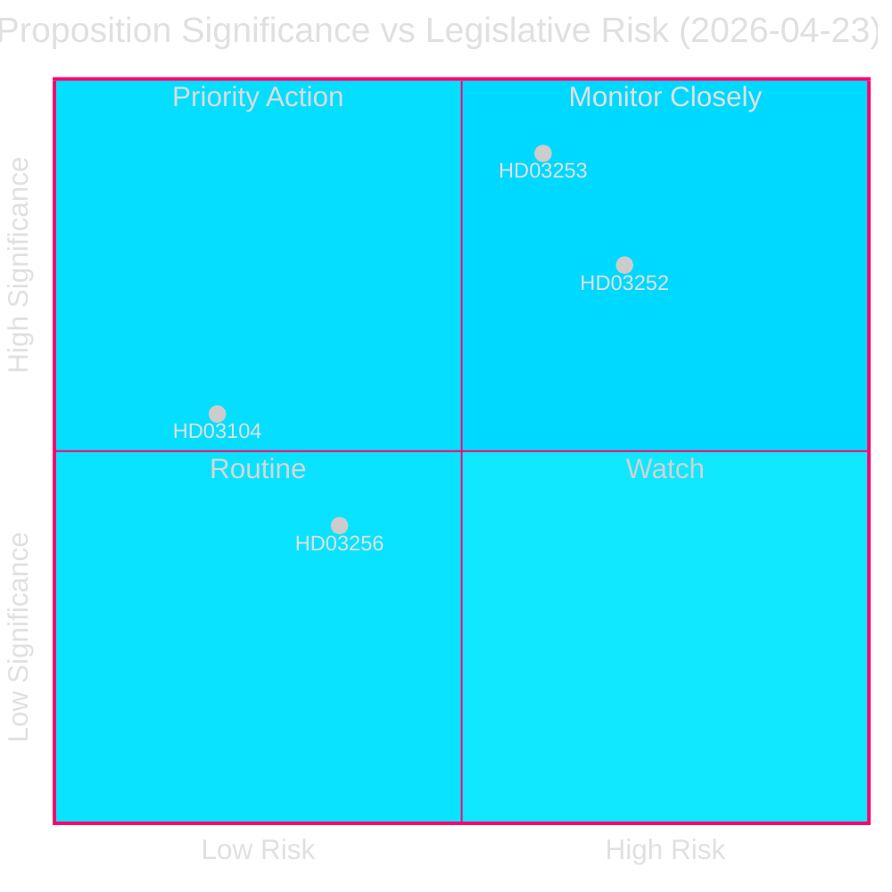
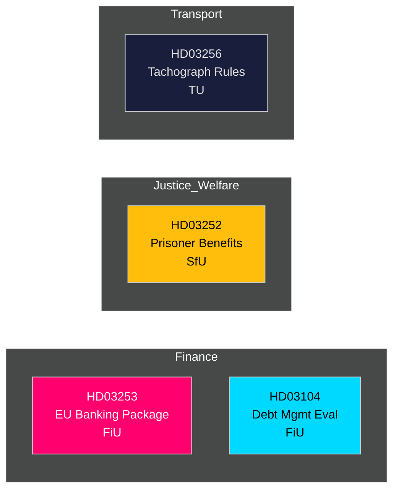

# 📋 Informe de Inteligencia — Propuestas del Gobierno Sueco 2026-04-27

**Autor**: James Pether Sörling
**Fecha**: 2026-04-27
**Período de análisis**: 2026-04-23 (último día parlamentario)
**Confianza**: ALTA [B2]
**Clasificación**: PÚBLICO — RGPD Art. 9(2)(e,g)
**Revisión 2**: 2026-04-27T06:38Z — Procedencia económica mejorada, mensaje central fortalecido, detalles contextuales suecos añadidos

---

## 🎯 Mensaje Central

El gobierno Kristersson presentó cuatro instrumentos legislativos significativos el 23 de abril de 2026, encabezados por el paquete bancario de la UE (Prop. 2025/26:253) — la transposición de regulación financiera más relevante de Suecia en una década — junto con restricciones al seguro social para personas encarceladas (Prop. 2025/26:252), una evaluación de la gestión de deuda pública 2021–2025 (Skr. 2025/26:104) y reglas más estrictas contra el fraude de tacógrafos (Prop. 2025/26:256). El paquete bancario es el elemento central: escribe CRR3/CRD6 de la UE en la ley sueca, reforzando los colchones de capital bajo el `Finansdepartementet` y derivado al `FiU` (Comisión de Finanzas). El ratio de deuda pública de Suecia se mantiene bajo en comparación europea en **~31% del PIB** (FMI WEO abr-2026, indicador GGXWDG_NGDP, recuperado el 2026-04-27), proporcionando margen fiscal mientras los reguladores financieros endurecen el marco. El crecimiento del PIB en **+2,1%** (NGDP_RPCH, misma fuente) apoya una transición controlada hacia mayores requisitos de capital. El superávit de cuenta corriente sueca de **+5,5% del PIB** (BCA_NGDPD, misma fuente) confirma la solidez externa mientras los bancos se adaptan al suelo de producción.

**Procedencia económica** (`economicProvenance`): provider=imf, dataflow=WEO, vintage=abril 2026, retrieved_at=2026-04-27.

## 🧭 3 Decisiones Que Este Informe Apoya

1. **El Riksdag (FiU)**: Si aprobar el paquete bancario de la UE en su totalidad o solicitar enmiendas — crucial dado el sobredimensionado sector bancario de Suecia (≈400% del PIB en activos) y su estatus fuera de la zona euro.
2. **El Riksdag (SfU)**: Si las restricciones de seguro social para prisioneros (HD03252) superan el examen constitucional de proporcionalidad — ahorros fiscales (~200–300 MSEK/año) versus riesgo de reinserción.
3. **Analistas políticos / inversores**: Evaluar la estrategia de deuda pública a la luz de la evaluación (HD03104) que muestra que la Riksgälden cumplió sus objetivos-marco 2021–2025.

---

## 📊 Puntos de Inteligencia en 60 Segundos

- **Paquete bancario UE (HD03253)** [B2 ALTA]: Transpone CRR3/CRD6; introduce un suelo de producción del 72,5% para limitar el alivio de capital de los modelos internos; afecta a Swedbank, SEB, Handelsbanken, Nordea (Suecia). Derivación al FiU.
- **Restricción de seguro social para presos (HD03252)** [B2 ALTA]: Retira subsidio por enfermedad, prestación por maternidad/paternidad y prestación por incapacidad para quienes cumplen condena en `alojamiento controlado` o custodia de seguridad. Justitiedepartementet, derivación SfU. Probable objeción de proporcionalidad de V y MP.
- **Evaluación de gestión de deuda pública (HD03104)** [A2 MUY ALTA]: Autoevaluación de la Riksgälden 2021–2025 — objetivo de endeudamiento neto cumplido 3 de 5 años; estrategia de duración dentro del mandato. Finansdepartementet, derivación FiU. Bajo riesgo legislativo; informativo.
- **Fraude de tacógrafos (HD03256)** [B2 MEDIO]: Refuerza sanciones penales y administrativas para el fraude de tacógrafos; se alinea con el Reglamento UE 2018/1022. Derivación TU. Coste de cumplimiento sectorial.

---

## 🔑 Principal Disparador Futuro

**Semana del 5 de mayo de 2026**: El FiU abre consulta pública sobre HD03253 — se esperan presentaciones del lobby bancario. Cualquier solicitud de enmienda sustancial señala resistencia sueca a la convergencia supervisora europea, con implicaciones para la política EUR/SEK.

---

<!-- source-sha: 7156ec83294bd3d7360cfe9849ab2c3c69f409dc -->
