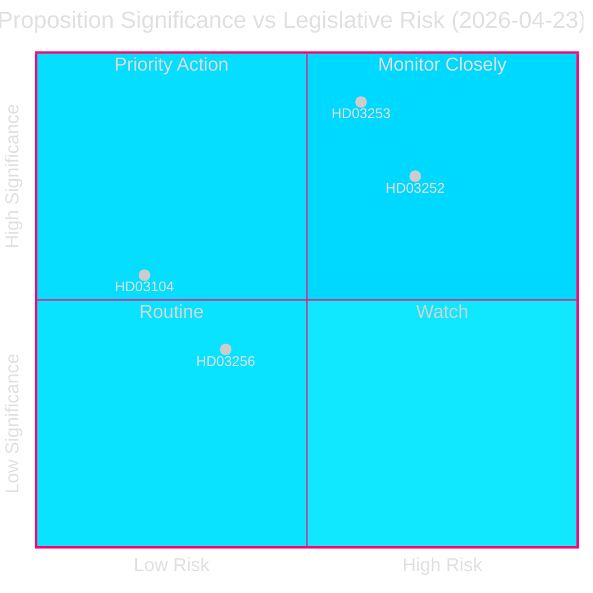
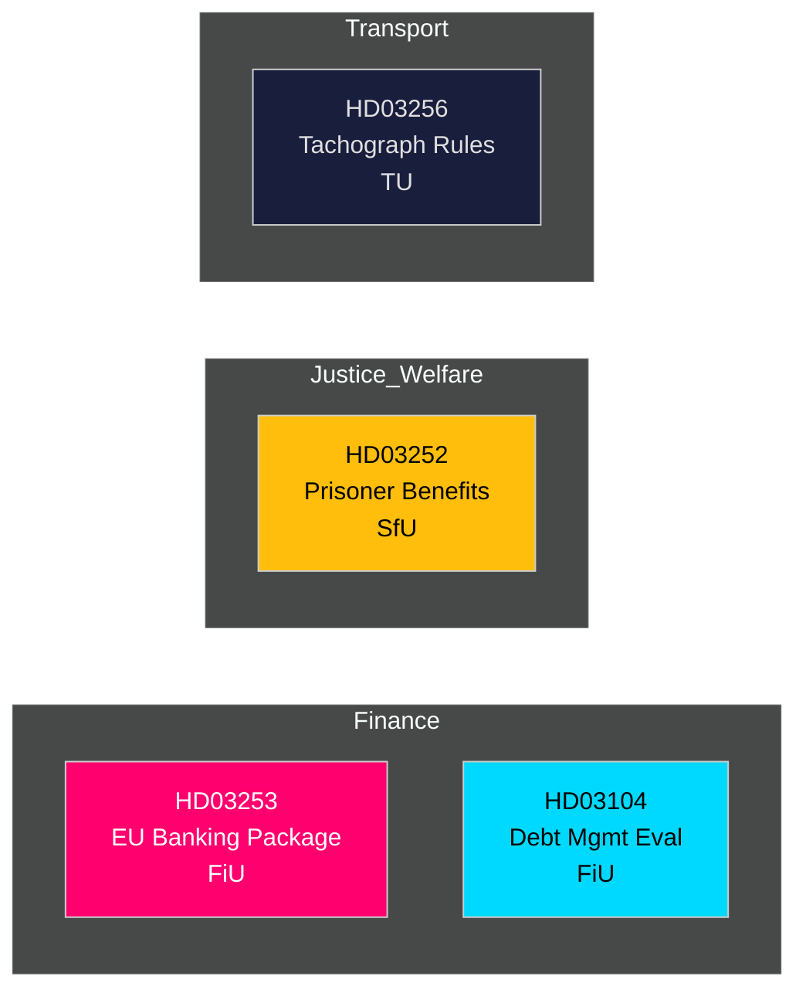

# 📋 Tiedustelukatsaus — Ruotsin Hallituksen Esitykset 2026-04-27

**Tekijä**: James Pether Sörling
**Päivämäärä**: 2026-04-27
**Analysijakso**: 2026-04-23 (viimeisin parlamentaarinen päivä)
**Luottamus**: KORKEA [B2]
**Luokitus**: JULKINEN — GDPR Art. 9(2)(e,g)
**Tarkistus 2**: 2026-04-27T06:38Z — Parannettu taloudellinen alkuperä, vahvistettu ydinviesti, lisätty ruotsalaisia taustatietoja

---

## 🎯 Ydinviesti

Kristersson-hallitus toi esille neljä merkittävää lainsäädäntöinstrumenttia 23. huhtikuuta 2026, joista tärkeimpänä EU:n pankkipaketti (Prop. 2025/26:253) — Ruotsin merkittävin finanssisääntelyn toimeenpano vuosikymmeneen — sekä vankilassa olevien sosiaaliturvarajoitukset (Prop. 2025/26:252), valtion velanhoidon arviointi 2021–2025 (Skr. 2025/26:104) ja tiukennetut säännöt ajopiirturityripeistä (Prop. 2025/26:256). Pankkipaketti on pääaihe: se kirjoittaa EU:n CRR3/CRD6:n ruotsalaiseen lakiin, vahvistaa pääomapuskureita `Finansdepartementet`-alaisuudessa ja ohjataan `FiU` (Finansutskottet)-valiokuntaan. Ruotsin valtionvelkasuhde pysyy alhaisena EU-vertailussa **~31% BKT:sta** (IMF WEO huhtikuu-2026, indikaattori GGXWDG_NGDP, haettu 2026-04-27), mikä antaa finanssipoliittista liikkumavaraa sääntelytiukentuessa. BKT-kasvu **+2,1%** (NGDP_RPCH, sama lähde) tukee hallittua siirtymistä tiukempiin pääomavaatimuksiin. Ruotsin vaihtotaseylijäämä **+5,5% BKT:sta** (BCA_NGDPD, sama lähde) vahvistaa ulkoisen tasapainon pankkien sopeutuessa tuotosgulviin.

**Taloudellinen alkuperä** (`economicProvenance`): provider=imf, dataflow=WEO, vintage=huhtikuu 2026, retrieved_at=2026-04-27.

## 🧭 3 Päätöstä Jota Tämä Katsaus Tukee

1. **Riksdagen (FiU)**: Hyväksytäänkö EU:n pankkipaketti kokonaisuudessaan vai pyydetäänkö muutoksia — kriittistä Ruotsin ylisuuren pankkisektorin (≈400% BKT:sta varoissa) ja euroalueen ulkopuolisen aseman vuoksi.
2. **Riksdagen (SfU)**: Läpäiseekö vankien sosiaaliturvarajoitus (HD03252) perustuslaillisen suhteellisuusarvioinnin — ehdotuksen säästöt (~200–300 MSEK/v) vs. kuntoutusriski.
3. **Poliittiset analyytikot / sijoittajat**: Arvioi valtion velkastrategiaa arvioinnin (HD03104) valossa, joka osoittaa Riksgäldenin täyttäneen 2021–2025-kehyksen tavoitteet.

---

## 📊 60 Sekunnin Tiedustelupisteet

- **EU:n pankkipaketti (HD03253)** [B2 KORKEA]: Toimeenpanee CRR3/CRD6; ottaa käyttöön 72,5%:n tuotosgulvin rajoittamaan sisäisten mallien pääomahelpotusta; koskee Swedbankia, SEBiä, Handelsbankenia, Nordeaa (Ruotsi). FiU-kuuleminen.
- **Vankien sosiaaliturvarajoitus (HD03252)** [B2 KORKEA]: Peruuttaa sairauspäivärahan, vanhempainpäivärahan ja sairaustuen niiltä, jotka suorittavat rangaistusta valvotussa asumisessa tai turvallisuussäilössä. Justitiedepartementet, SfU-kuuleminen. V:n ja MP:n suhteellisuusvastaväite todennäköinen.
- **Valtion velanhoidon arviointi (HD03104)** [A2 HYVIN KORKEA]: Riksgäldenin itsearviointi 2021–2025 — nettolainanottotavoite saavutettu 3 vuonna 5:stä; duraatiostrategia toimeksiannon puitteissa. Finansdepartementet, FiU-kuuleminen. Alhainen lainsäädäntöriski; informatiivinen.
- **Ajopiirturityripeily (HD03256)** [B2 KESKITASO]: Tiukentaa rangaistuksia ja hallinnollisia seuraamuksia ajopiirturityripeistä; sopusoinnussa EU-asetuksen 2018/1022 kanssa. TU-kuuleminen. Alan vaatimustenmukaisuuskustannus.

---

## 🔑 Tärkein Tuleva Laukaisija

**Viikko 5. toukokuuta 2026**: FiU avaa julkisen kuulemisen HD03253:sta — pankkisektorin lausunnot odotettavissa. Mahdolliset oleelliset muutosehdotukset signaloivat ruotsalaista vastustusta EU:n valvontakonvergenssia kohtaan, EUR/SEK-politiikalle.

---

<!-- source-sha: 7156ec83294bd3d7360cfe9849ab2c3c69f409dc -->
