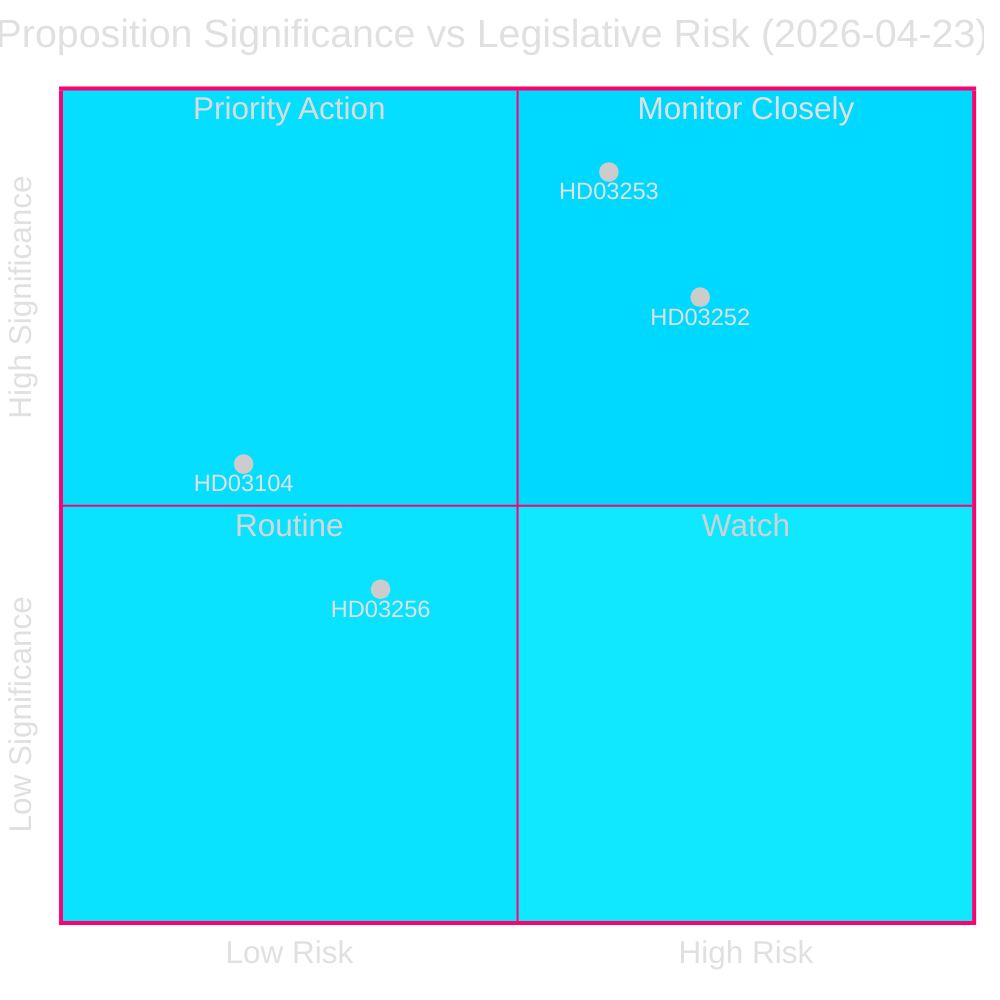
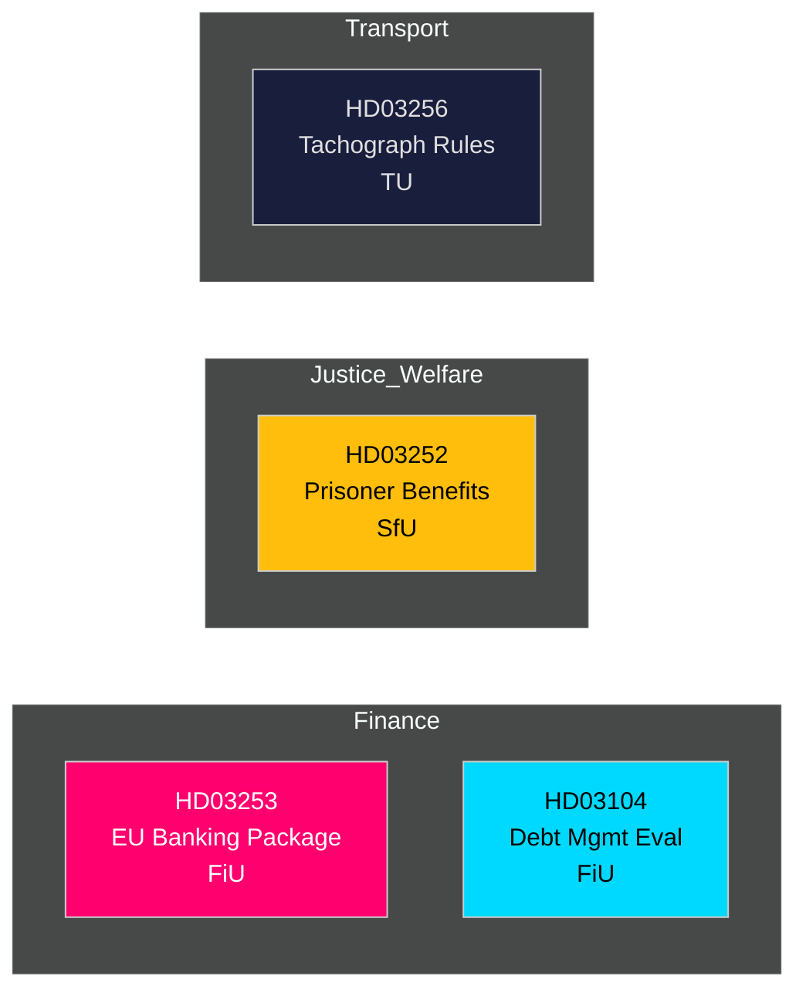

# 📋 Note de Renseignement — Propositions du Gouvernement Suédois 2026-04-27

**Auteur**: James Pether Sörling
**Date**: 2026-04-27
**Période d'analyse**: 2026-04-23 (dernier jour parlementaire)
**Confiance**: ÉLEVÉE [B2]
**Classification**: PUBLIC — RGPD Art. 9(2)(e,g)
**Passage 2**: 2026-04-27T06:38Z — Provenance économique améliorée, message central renforcé, détails contextuels suédois ajoutés

---

## 🎯 Message Central

Le gouvernement Kristersson a présenté quatre instruments législatifs significatifs le 23 avril 2026, menés par le paquet bancaire UE (Prop. 2025/26:253) — la transposition réglementaire financière la plus conséquente de la Suède en une décennie — aux côtés de restrictions sur l'assurance sociale pour les personnes incarcérées (Prop. 2025/26:252), d'une évaluation de la gestion de la dette publique 2021–2025 (Skr. 2025/26:104) et de règles renforcées contre la fraude aux tachygraphes (Prop. 2025/26:256). Le paquet bancaire est l'élément central : il inscrit le CRR3/CRD6 de l'UE dans le droit suédois, renforçant les coussins de fonds propres sous le `Finansdepartementet` et renvoyé au `FiU` (Commission des finances). Le ratio d'endettement public suédois reste faible aux normes européennes à **~31% du PIB** (FMI WEO avr-2026, indicateur GGXWDG_NGDP, récupéré le 2026-04-27), offrant une marge budgétaire alors que les régulateurs financiers durcissent le cadre. La croissance du PIB à **+2,1%** (NGDP_RPCH, même source) soutient une transition maîtrisée vers des exigences de fonds propres plus élevées. L'excédent du compte courant suédois de **+5,5% du PIB** (BCA_NGDPD, même source) confirme la solidité externe alors que les banques s'adaptent au plancher de résultat.

**Provenance économique** (`economicProvenance`): provider=imf, dataflow=WEO, vintage=avril 2026, retrieved_at=2026-04-27.

## 🧭 3 Décisions Que Cette Note Soutient

1. **Le Riksdag (FiU)**: Approuver intégralement le paquet bancaire UE ou demander des amendements — crucial compte tenu du secteur bancaire surdimensionné de la Suède (≈400% du PIB en actifs) et de son statut hors zone euro.
2. **Le Riksdag (SfU)**: Les restrictions d'assurance sociale pour les détenus (HD03252) passeront-elles l'examen constitutionnel de proportionnalité — économies budgétaires (~200–300 MSEK/an) contre risque de réinsertion.
3. **Analystes politiques / investisseurs**: Évaluer la stratégie d'endettement public à la lumière de l'évaluation (HD03104) montrant que la Riksgälden a respecté ses objectifs-cadre 2021–2025.

---

## 📊 Points de Renseignement en 60 Secondes

- **Paquet bancaire UE (HD03253)** [B2 ÉLEVÉE]: Transpose CRR3/CRD6 ; introduit un plancher de résultat de 72,5% pour limiter les allègements en capital des modèles internes ; concerne Swedbank, SEB, Handelsbanken, Nordea (Suède). Renvoi FiU.
- **Restriction d'assurance sociale pour détenus (HD03252)** [B2 ÉLEVÉE]: Supprime les indemnités de maladie, congés parentaux et allocations d'invalidité pour les personnes en `logement contrôlé` ou détention de sécurité. Justitiedepartementet, renvoi SfU. Contestation de proportionnalité probable de V et MP.
- **Évaluation de la gestion de la dette publique (HD03104)** [A2 TRÈS ÉLEVÉE]: Autoévaluation de la Riksgälden 2021–2025 — objectif d'emprunt net atteint 3 ans sur 5 ; stratégie de duration dans le mandat. Finansdepartementet, renvoi FiU. Faible risque législatif ; informatif.
- **Fraude aux tachygraphes (HD03256)** [B2 MOYEN]: Renforce les sanctions pénales et administratives pour fraude aux tachygraphes ; aligne sur le règlement UE 2018/1022. Renvoi TU. Coût de conformité sectoriel.

---

## 🔑 Principal Déclencheur Futur

**Semaine du 5 mai 2026**: Le FiU ouvre la consultation publique sur HD03253 — soumissions du lobby bancaire attendues. Toute demande d'amendement substantielle signale une résistance suédoise à la convergence de supervision européenne, avec des implications pour la politique EUR/SEK.

---

<!-- source-sha: 7156ec83294bd3d7360cfe9849ab2c3c69f409dc -->
