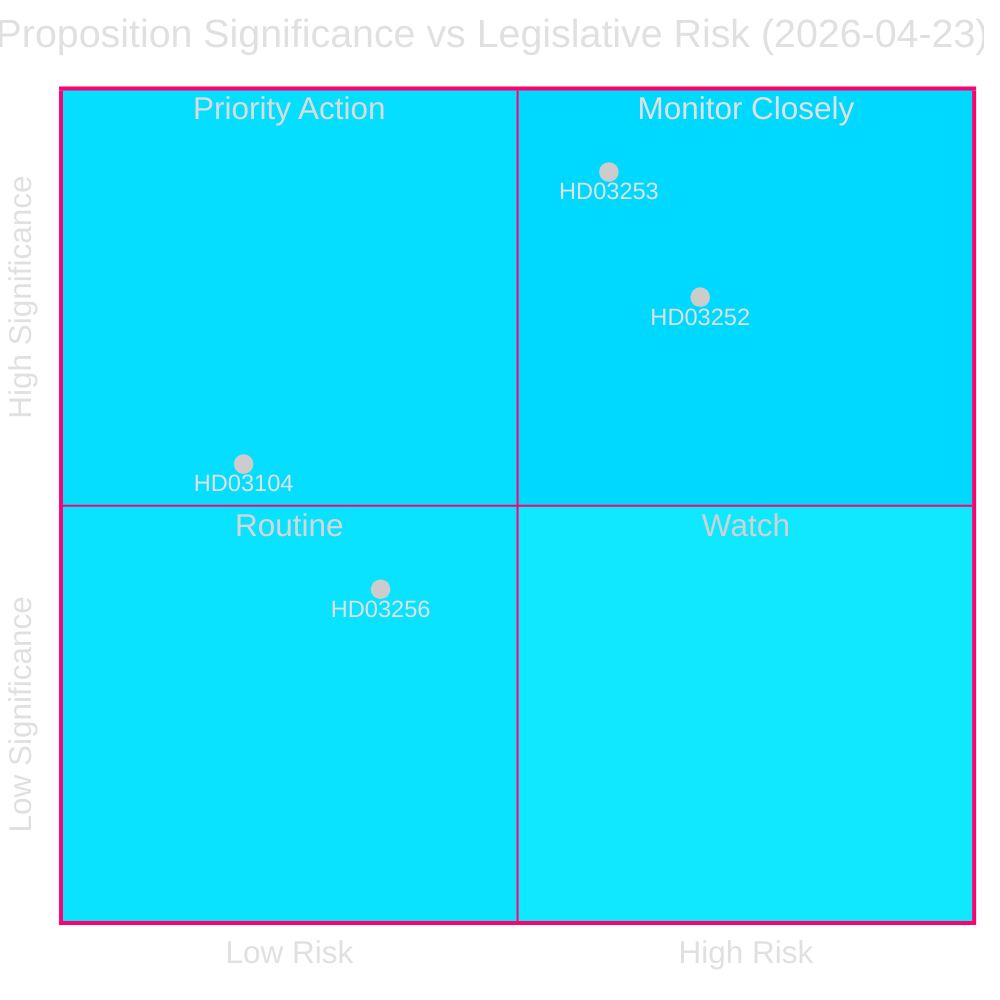
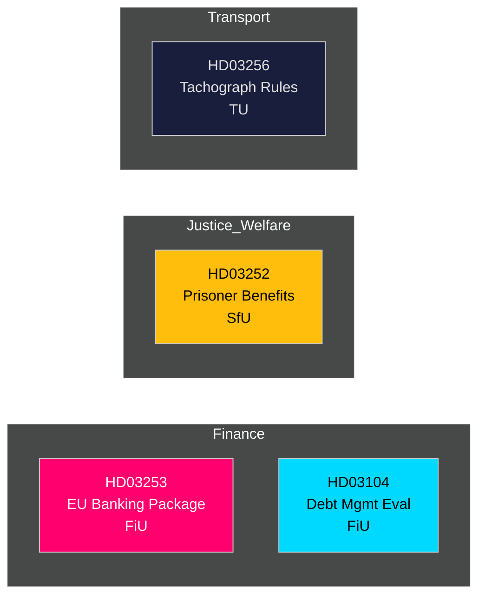

<!-- dir: rtl -->
# 📋 תמצית מודיעינית — הצעות ממשלת שוודיה 2026-04-27

**מחבר**: James Pether Sörling
**תאריך**: 2026-04-27
**תקופת ניתוח**: 2026-04-23 (יום פרלמנטרי אחרון)
**רמת ביטחון**: גבוהה [B2]
**סיווג**: ציבורי — תקנות GDPR סעיף 9(2)(ה,ז)
**סבב 2**: 2026-04-27T06:38Z — שיפור מקור כלכלי, חיזוק המסר המרכזי, הוספת פרטי הקשר שוודיים

---

## 🎯 המסר המרכזי

ממשלת קריסטרסון הגישה ארבעה כלי חקיקה משמעותיים ב-23 באפריל 2026, בראשם חבילת הבנקאות האירופאית (Prop. 2025/26:253) — ההעברה הרגולטורית הפיננסית החשובה ביותר של שוודיה בעשור — לצד הגבלות על ביטוח סוציאלי לכלואים (Prop. 2025/26:252), הערכת ניהול חוב המדינה 2021–2025 (Skr. 2025/26:104) וכללים מחמירים נגד זיוף טכוגרפים (Prop. 2025/26:256). חבילת הבנקאות היא הנושא המרכזי: היא כותבת את CRR3/CRD6 האירופאי לחוק השוודי, מחזקת כריות הון תחת `Finansdepartementet` ומופנית ל-`FiU` (ועדת הכספים). יחס החוב הממשלתי של שוודיה נשאר נמוך לפי סטנדרטים אירופאיים — **~31% מהתוצר הגולמי** (קרן המטבע הבינלאומית, WEO אפריל 2026, מדד GGXWDG_NGDP, נשלף 2026-04-27) — מה שמספק מרחב פיסקלי בעת שהרגולטורים הפיננסיים מחמירים את המסגרת. צמיחת תוצר של **+2.1%** (NGDP_RPCH, אותו מקור) תומכת במעבר מבוקר לדרישות הון גבוהות יותר. עודף החשבון השוטף של שוודיה — **+5.5% מהתוצר** (BCA_NGDPD, אותו מקור) — מאשר איתנות חיצונית כאשר הבנקים מסתגלים לרצפת התפוקה.

**מקור כלכלי** (`economicProvenance`): provider=imf, dataflow=WEO, vintage=אפריל 2026, retrieved_at=2026-04-27.

## 🧭 3 החלטות שתמצית זו תומכת בהן

1. **הריקסדאג (FiU)**: האם לאשר את חבילת הבנקאות האירופאית במלואה או לבקש תיקונים — קריטי לאור המגזר הבנקאי הגדול מאוד של שוודיה (≈400% מהתוצר בנכסים) ומעמדה מחוץ לאיחוד המוניטרי.
2. **הריקסדאג (SfU)**: האם הגבלות ביטוח סוציאלי לאסירים (HD03252) עוברות ביקורת חוקתית של מידתיות — חיסכון פיסקלי (~200–300 מיליון כתר שוודי/שנה) מול סיכון שיקום.
3. **אנליסטים פוליטיים / משקיעים**: הערכת אסטרטגיית החוב הממשלתי לאור ההערכה (HD03104) שמראה שה-Riksgälden עמדה ביעדי מסגרת 2021–2025.

---

## 📊 נקודות מודיעין ב-60 שניות

- **חבילת הבנקאות האירופאית (HD03253)** [B2 גבוהה]: מעבירה CRR3/CRD6; מציגה רצפת תפוקה של 72.5% להגבלת הקלה בהון מדגמים פנימיים; משפיעה על Swedbank, SEB, Handelsbanken, Nordea (שוודיה). הפניה ל-FiU.
- **הגבלת ביטוח סוציאלי לכלואים (HD03252)** [B2 גבוהה]: מסירה דמי מחלה, קצבת הורים וקצבת נכות מכלואים ב`דיור מבוקר` או מעצר ביטחוני. Justitiedepartementet, הפניה SfU. סביר שיישמע ערעור מידתיות מ-V וMP.
- **הערכת ניהול חוב המדינה (HD03104)** [A2 גבוהה מאוד]: הערכה עצמית של Riksgälden 2021–2025 — יעד הלוואה נטו הושג 3 מתוך 5 שנים; אסטרטגיית משך בגדר הסמכות. Finansdepartementet, הפניה FiU. סיכון חקיקתי נמוך; אינפורמטיבי.
- **זיוף טכוגרפים (HD03256)** [B2 בינוני]: מחמיר עונשים פליליים ואדמיניסטרטיביים לזיוף טכוגרפים; מתאים לתקנת האיחוד האירופאי 2018/1022. הפניה TU. עלות ציות ענפית.

---

## 🔑 הגורם המניע המרכזי הבא

**שבוע 5 במאי 2026**: FiU פותח ייעוץ ציבורי על HD03253 — ציפייה להגשות מלובי הבנקים. כל בקשת תיקון מהותית מסמנת התנגדות שוודית להתכנסות פיקוחית אירופאית, עם השלכות על מדיניות EUR/SEK.

---

<!-- source-sha: 7156ec83294bd3d7360cfe9849ab2c3c69f409dc -->
