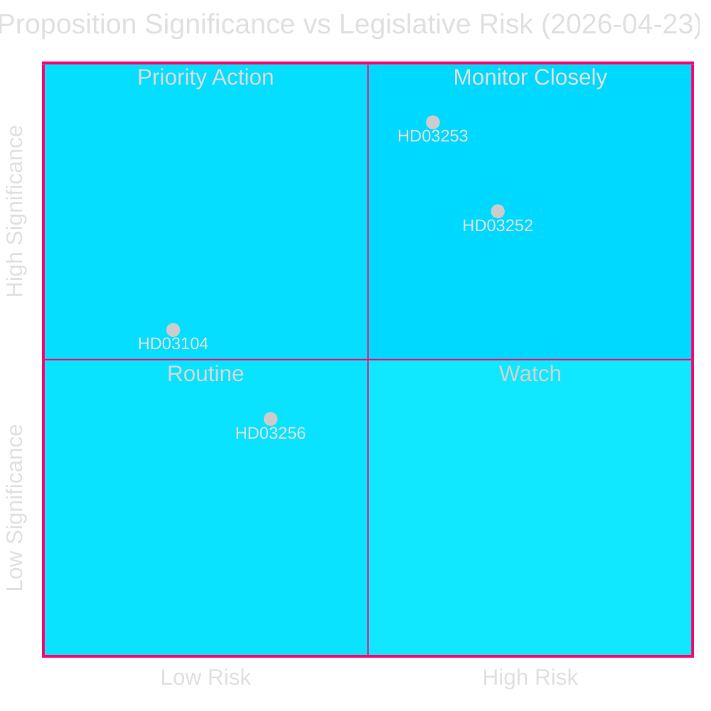
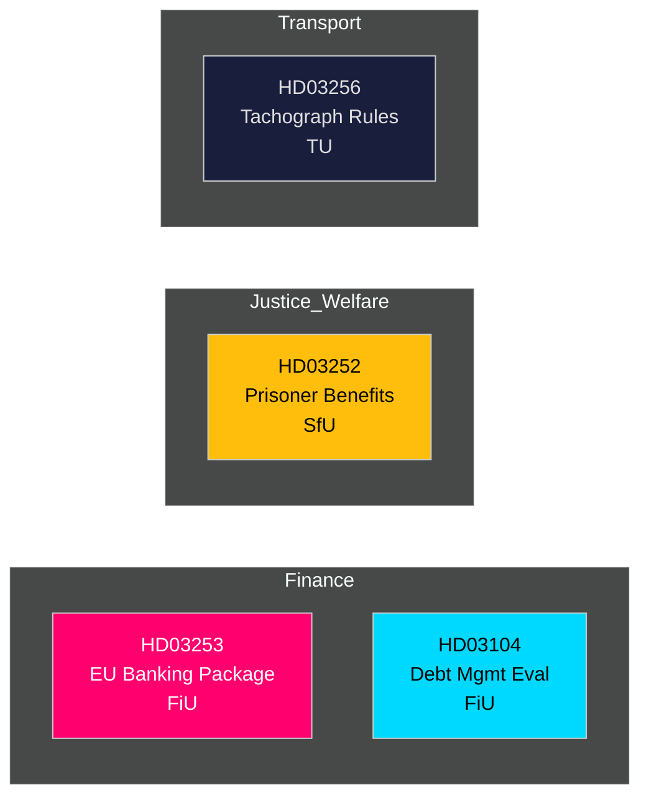

# 📋 インテリジェンス・ブリーフィング — スウェーデン政府提案 2026-04-27

**著者**: James Pether Sörling
**日付**: 2026-04-27
**分析期間**: 2026-04-23（直近の議会日）
**信頼度**: 高 [B2]
**分類**: 公開 — GDPR第9条(2)(e,g)
**第2パス**: 2026-04-27T06:38Z — 経済的出所改善、核心メッセージ強化、スウェーデンの文脈詳細追加

---

## 🎯 核心メッセージ

クリスタション政権は2026年4月23日に4つの重要な立法措置を提出しました。その筆頭はEU銀行パッケージ（Prop. 2025/26:253）— スウェーデンにとって10年で最も重要な金融規制の転換 — であり、収監者に対する社会保険の制限（Prop. 2025/26:252）、2021–2025年の国債管理評価（Skr. 2025/26:104）、タコグラフ不正操作に対する規制強化（Prop. 2025/26:256）が続きます。銀行パッケージが主要テーマです：EUのCRR3/CRD6をスウェーデン法に組み込み、`Finansdepartementet`の下で自己資本バッファーを強化し、`FiU`（財政委員会）に付託されます。スウェーデンの公的債務比率はEU基準で低水準を維持し、**GDP比約31%**（IMF世界経済見通し2026年4月、指標GGXWDG_NGDP、2026-04-27取得）、金融規制当局がフレームワークを強化する中で財政的な余地を提供しています。GDP成長率**+2.1%**（NGDP_RPCH、同一出所）は、より高い自己資本要求への管理された移行を支えます。スウェーデンの経常収支黒字**+5.5%**（BCA_NGDPD、同一出所）は、銀行がアウトプット・フロアに適応する中での対外的な強さを確認します。

**経済的出所**（`economicProvenance`）: provider=imf, dataflow=WEO, vintage=2026年4月, retrieved_at=2026-04-27.

## 🧭 このブリーフィングが支援する3つの決定

1. **Riksdag（FiU）**: EU銀行パッケージを全面承認するか修正を求めるか — スウェーデンの過大な銀行部門（資産でGDP比≈400%）と非ユーロ圏の地位を踏まえ極めて重要。
2. **Riksdag（SfU）**: 受刑者への社会保険制限（HD03252）が憲法上の比例性審査を通過するか — 財政節約効果（年間約200–300百万スウェーデン・クローナ）対リハビリのリスク。
3. **政策アナリスト/投資家**: Riksgäldenが2021–2025年の枠組み目標を達成したことを示す評価（HD03104）を背景に国債戦略を評価する。

---

## 📊 60秒インテリジェンス要点

- **EU銀行パッケージ（HD03253）** [B2 高]: CRR3/CRD6を転換；内部モデルの資本軽減を制限するため72.5%のアウトプット・フロアを導入；Swedbank、SEB、Handelsbanken、Nordea（スウェーデン）に影響。FiU委員会付託。
- **受刑者への社会保険制限（HD03252）** [B2 高]: `管理された居住`または保安拘禁での服役者から疾病給付、育児休業給付、傷病給付を撤回。Justitiedepartementet、SfU付託。VとMPからの比例性への異議申し立て可能性大。
- **国債管理評価（HD03104）** [A2 非常に高]: Riksgälden自己評価2021–2025 — 純借入目標5年中3年達成；デュレーション戦略は委任内。Finansdepartementet、FiU付託。低い立法リスク；情報提供的。
- **タコグラフ不正（HD03256）** [B2 中]: タコグラフ不正に対する刑事・行政制裁を強化；EU規則2018/1022に整合。TU付託。業界コンプライアンスコスト。

---

## 🔑 最重要の将来のトリガー

**2026年5月5日の週**: FiUがHD03253に関する公開協議を開始 — 銀行ロビーからの意見書が予想される。いかなる実質的修正要求もEU監督収斂に対するスウェーデンの抵抗を示し、EUR/SEK政策への含意がある。

---

<!-- source-sha: 7156ec83294bd3d7360cfe9849ab2c3c69f409dc -->
