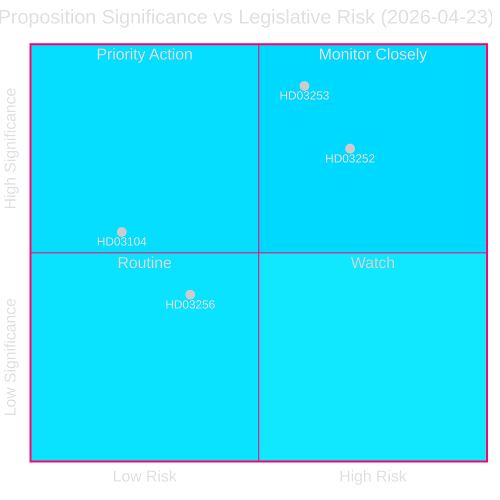
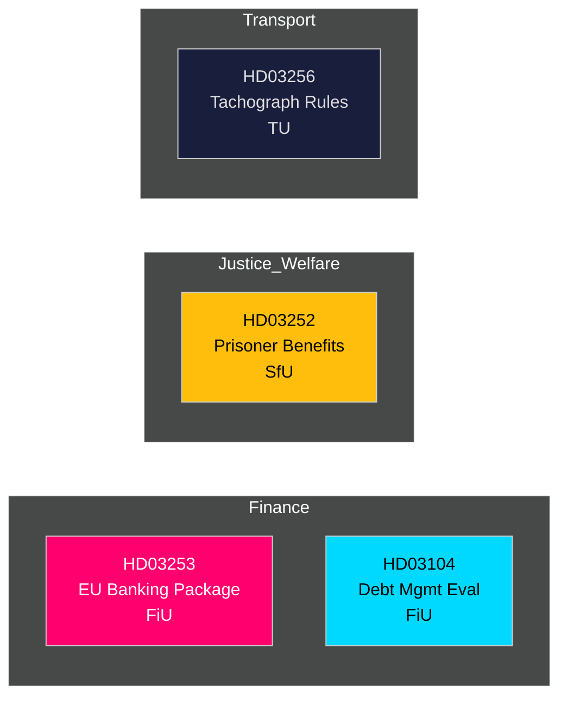

# 📋 정보 브리핑 — 스웨덴 정부 제안서 2026-04-27

**저자**: James Pether Sörling
**날짜**: 2026-04-27
**분석 기간**: 2026-04-23 (최근 의회 개회일)
**신뢰도**: 높음 [B2]
**분류**: 공개 — GDPR 제9조 제2항 (e,g)
**2차 검토**: 2026-04-27T06:38Z — 경제적 출처 개선, 핵심 메시지 강화, 스웨덴 배경 세부사항 추가

---

## 🎯 핵심 메시지

크리스테르손 정부는 2026년 4월 23일 네 가지 중요한 입법 수단을 제출했습니다. EU 은행 패키지(Prop. 2025/26:253)가 선두로, 이는 스웨덴 역사상 10년 만에 가장 중요한 금융 규제 전환입니다. 여기에 수감자에 대한 사회보험 제한(Prop. 2025/26:252), 2021–2025년 국가 채무 관리 평가(Skr. 2025/26:104), 운행기록계 조작에 대한 규제 강화(Prop. 2025/26:256)가 뒤따릅니다. 은행 패키지가 핵심 주제입니다: EU CRR3/CRD6을 스웨덴 법률에 반영하여 `Finansdepartementet` 아래 자본 완충재를 강화하고 `FiU`(재정위원회)에 회부됩니다. 스웨덴의 국가 부채 비율은 EU 기준에서 낮은 수준인 **GDP의 약 31%**로 유지됩니다(IMF 세계경제전망 2026년 4월, 지표 GGXWDG_NGDP, 2026-04-27 조회). GDP 성장률 **+2.1%**(NGDP_RPCH, 동일 출처)는 높은 자본 요건으로의 통제된 전환을 뒷받침합니다. 스웨덴의 경상수지 흑자 **GDP의 +5.5%**(BCA_NGDPD, 동일 출처)는 은행이 산출 하한선에 적응하는 동안 대외 건전성을 확인합니다.

**경제적 출처**(`economicProvenance`): provider=imf, dataflow=WEO, vintage=2026년 4월, retrieved_at=2026-04-27.

## 🧭 이 브리핑이 지원하는 3가지 결정

1. **릭스다겐(FiU)**: EU 은행 패키지를 전체적으로 승인하거나 수정안을 요청할지 여부 — 스웨덴의 과도한 은행 부문(자산 기준 GDP의 ≈400%)과 비유로존 지위를 고려할 때 중요합니다.
2. **릭스다겐(SfU)**: 수감자에 대한 사회보험 제한(HD03252)이 헌법상 비례성 심사를 통과하는지 — 재정 절감 효과(연간 약 2–3억 스웨덴 크로나) 대 재활 위험.
3. **정책 분석가 / 투자자**: 릭스갈덴이 2021–2025년 틀 목표를 달성했음을 보여주는 평가(HD03104)를 배경으로 국가 채무 전략을 평가합니다.

---

## 📊 60초 정보 요점

- **EU 은행 패키지(HD03253)** [B2 높음]: CRR3/CRD6 전환; 내부 모델 자본 경감을 제한하기 위한 72.5% 산출 하한선 도입; Swedbank, SEB, Handelsbanken, Nordea(스웨덴)에 영향. FiU 위원회 회부.
- **수감자 사회보험 제한(HD03252)** [B2 높음]: `통제된 주거` 또는 보안 구금에서 복역 중인 사람들의 상병급여, 육아휴직급여, 장해급여 철회. Justitiedepartementet, SfU 회부. V와 MP의 비례성 이의 제기 가능성 높음.
- **국가 채무 관리 평가(HD03104)** [A2 매우 높음]: 릭스갈덴 자체 평가 2021–2025 — 순 차입 목표 5년 중 3년 달성; 듀레이션 전략이 위임 범위 내. Finansdepartementet, FiU 회부. 낮은 입법 위험; 정보 제공.
- **운행기록계 조작(HD03256)** [B2 보통]: 운행기록계 조작에 대한 형사 및 행정 제재 강화; EU 규정 2018/1022에 맞춤. TU 회부. 업계 준수 비용.

---

## 🔑 가장 중요한 미래 촉발 요인

**2026년 5월 5일 주**: FiU가 HD03253에 대한 공개 협의 개시 — 은행 로비 제출 예상. 실질적인 수정 요청은 EU 감독 수렴에 대한 스웨덴의 저항을 신호하며 EUR/SEK 정책에 영향을 미칩니다.

---

<!-- source-sha: 7156ec83294bd3d7360cfe9849ab2c3c69f409dc -->
