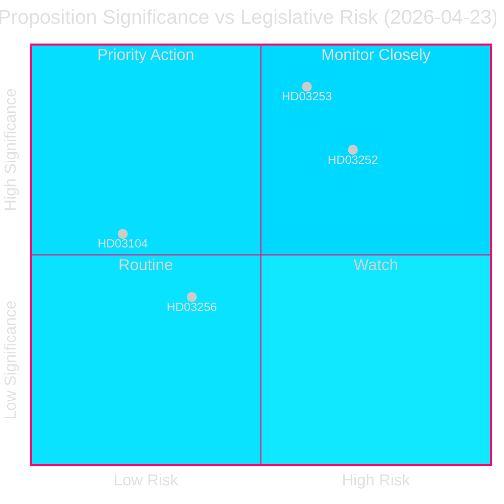
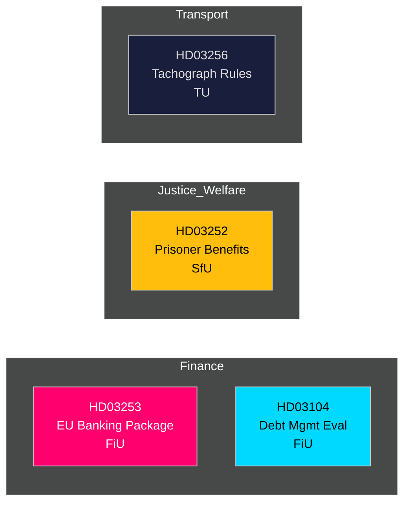

# 📋 Inlichtingenbriefing — Zweedse Regeringsvoorstellen 2026-04-27

**Auteur**: James Pether Sörling
**Datum**: 2026-04-27
**Analyseperiode**: 2026-04-23 (laatste parlementaire dag)
**Betrouwbaarheid**: HOOG [B2]
**Classificatie**: OPENBAAR — AVG Art. 9(2)(e,g)
**Ronde 2**: 2026-04-27T06:38Z — Verbeterde economische herkomst, versterkte kernboodschap, Zweedse contextdetails toegevoegd

---

## 🎯 Kernboodschap

De Kristersson-regering presenteerde op 23 april 2026 vier significante wetgevingsinstrumenten, aangevoerd door het EU-bankenpakket (Prop. 2025/26:253) — Zweden's meest ingrijpende financiële regelgevingstransponering in een decennium — samen met beperkingen op sociale verzekeringen voor gedetineerden (Prop. 2025/26:252), een evaluatie van het staatsvermogensbeheer 2021–2025 (Skr. 2025/26:104) en aangescherpte regels tegen tachograaffraude (Prop. 2025/26:256). Het bankenpakket is het hoofdonderwerp: het schrijft EU CRR3/CRD6 in de Zweedse wet, versterkt kapitaalbuffers onder het `Finansdepartementet` en wordt doorverwezen naar `FiU` (Financiëncommissie). Zweden's staatsschuldquote blijft laag naar EU-maatstaven op **~31% van het BBP** (IMF WEO apr-2026, indicator GGXWDG_NGDP, opgehaald 2026-04-27), wat begrotingsruimte biedt terwijl financiële toezichthouders het kader aanscherpen. BBP-groei van **+2,1%** (NGDP_RPCH, zelfde bron) ondersteunt een beheerste overgang naar hogere kapitaalvereisten. Het Zweedse overschot op de lopende rekening van **+5,5% van het BBP** (BCA_NGDPD, zelfde bron) bevestigt externe kracht terwijl banken zich aanpassen aan de outputbodem.

**Economische herkomst** (`economicProvenance`): provider=imf, dataflow=WEO, vintage=april 2026, retrieved_at=2026-04-27.

## 🧭 3 Beslissingen Die Deze Briefing Ondersteunt

1. **De Riksdag (FiU)**: Of het EU-bankenpakket volledig wordt goedgekeurd of wijzigingen worden gevraagd — cruciaal gezien Zweden's oversized bankensector (≈400% van het BBP aan activa) en niet-eurozonelidmaatschap.
2. **De Riksdag (SfU)**: Of de sociale-verzekeringsbeperkingen voor gevangenen (HD03252) de grondwettelijke evenredigheidstoets doorstaan — fiscale besparingen (~200–300 MSEK/j) tegen het reïntegratierisico.
3. **Politieke analisten / investeerders**: Beoordeel de staatsschuldstrategie in het licht van de evaluatie (HD03104) waaruit blijkt dat de Riksgälden haar 2021–2025-kadersdoelen heeft behaald.

---

## 📊 60-Seconden Inlichtingenpunten

- **EU-bankenpakket (HD03253)** [B2 HOOG]: Transponeert CRR3/CRD6; introduceert een outputbodem van 72,5% om kapitaalverlichting van interne modellen te beperken; betreft Swedbank, SEB, Handelsbanken, Nordea (Zweden). FiU-doorverwijzing.
- **Sociale-verzekeringsbeperking voor gedetineerden (HD03252)** [B2 HOOG]: Trekt ziektegeld, ouderschapsverlof en arbeidsongeschiktheidsuitkeringen in voor personen die straf uitzitten in `gecontroleerde woonsituatie` of beveiligingsbewaring. Justitiedepartementet, SfU-doorverwijzing. Evenredigheidsbetwisting door V en MP waarschijnlijk.
- **Evaluatie staatsschuldbeheer (HD03104)** [A2 ZEER HOOG]: Riksgäldens zelfevaluatie 2021–2025 — nettoleningsdoel 3 van 5 jaar behaald; duratiestrategie binnen het mandaat. Finansdepartementet, FiU-doorverwijzing. Laag wetgevingsrisico; informatief.
- **Tachograaffraude (HD03256)** [B2 MIDDEL]: Verscherpt strafrechtelijke en administratieve sancties voor tachograaffraude; sluit aan op EU-verordening 2018/1022. TU-doorverwijzing. Sectornaleefkosten.

---

## 🔑 Belangrijkste Toekomstige Trigger

**Week 5 mei 2026**: FiU opent publieke consultatie over HD03253 — inzendingen van de banklobby verwacht. Substantiële wijzigingsverzoeken signaleren Zweedse weerstand tegen EU-toezichtconvergentie, met implicaties voor EUR/SEK-beleid.

---

<!-- source-sha: 7156ec83294bd3d7360cfe9849ab2c3c69f409dc -->
