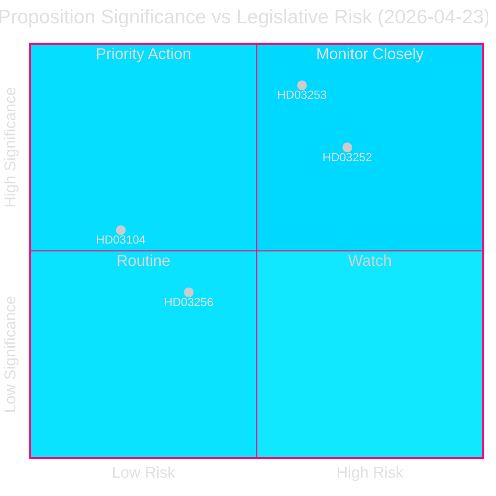
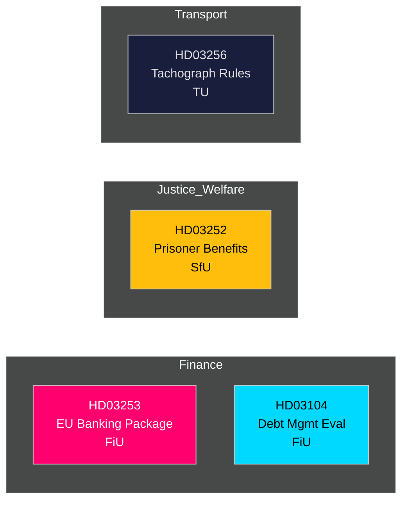

# 📋 Etterretningsoversikt — Svenske Regjeringens Proposisjoner 2026-04-27

**Forfatter**: James Pether Sörling
**Dato**: 2026-04-27
**Analyseperiode**: 2026-04-23 (siste parlamentariske dag)
**Konfidens**: HØY [B2]
**Klassifisering**: OFFENTLIG — GDPR Art. 9(2)(e,g)
**Gjennomgang 2**: 2026-04-27T06:38Z — Forbedret økonomisk opphav, styrket kjernepunkt, lagt til svenske kontekstdetaljer

---

## 🎯 Kjernepunkt

Kristersson-regjeringen la frem fire betydelige lovgivningsinstrumenter 23. april 2026, ledet av EU-bankpakken (Prop. 2025/26:253) — Sveriges mest konsekvensrike finansregulatoriske transponering på et tiår — sammen med restriksjoner på trygdeytelser for innsatte (Prop. 2025/26:252), en evaluering av statsgjeldsforvaltningen 2021–2025 (Skr. 2025/26:104) og skjerpede regler mot fartsskriversvindel (Prop. 2025/26:256). Bankpakken er hovednummeret: den skriver EU's CRR3/CRD6 inn i svensk lov, styrker kapitalbuffere under `Finansdepartementet` og sendes til `FiU` (Finanskomiteen). Sveriges statsgjeldskvote forblir lav etter EU-standarder på **~31% av BNP** (IMF WEO apr-2026, indikator GGXWDG_NGDP, hentet 2026-04-27), noe som gir finanspolitisk handlingsrom mens finansregulatorer strammer til. BNP-vekst på **+2,1%** (NGDP_RPCH, samme kilde) støtter en styrt overgang til høyere kapitalkrav. Sveriges bytesbalansoverskudd på **+5,5% av BNP** (BCA_NGDPD, samme kilde) bekrefter ekstern styrke når banker tilpasser seg gulvkravet.

**Økonomisk opphav** (`economicProvenance`): provider=imf, dataflow=WEO, vintage=april 2026, retrieved_at=2026-04-27.

## 🧭 3 Beslutninger Denne Oversikten Støtter

1. **Riksdagen (FiU)**: Hvorvidt EU-bankpakken godkjennes i sin helhet eller endringsforslag kreves — avgjørende gitt Sveriges overstørre banksektor (≈400% av BNP i eiendeler) og posisjon utenfor euroområdet.
2. **Riksdagen (SfU)**: Hvorvidt trygderestriksjonene for innsatte (HD03252) passerer konstitusjonell forholdsmessighetsprøving — forslagets besparelser (~200–300 MSEK/år) mot rehabiliteringsrisikoen.
3. **Politiske analytikere / investorer**: Vurder statsgjeldsstrategien i lys av evalueringen (HD03104) som viser at Riksgälden møtte 2021–2025-rammemålene.

---

## 📊 60-Sekunders Etterretningspunkter

- **EU-bankpakken (HD03253)** [B2 HØY]: Gjennomfører CRR3/CRD6; innfører et outputgulv på 72,5% for å begrense interne modellers kapitallettelse; berører Swedbank, SEB, Handelsbanken, Nordea (Sverige). FiU-høring.
- **Trygderestriksjon for innsatte (HD03252)** [B2 HØY]: Trekker tilbake sykepenger, foreldrepenger og sykerstønad for dem som soner i `kontrollert bosted` eller `säkerhetsförvaring`. Justitiedepartementet, SfU-høring. Forholdsmessighetsinnsigelse fra V og MP sannsynlig.
- **Evaluering av statsgjeldsforvaltning (HD03104)** [A2 MEGET HØY]: Riksgäldens selveval. 2021–2025 — nettolånsmål oppfylt 3 av 5 år; durasjonsstrategi innenfor mandatet. Finansdepartementet, FiU-høring. Lav lovgivningsrisiko; informativ.
- **Fartsskriversvindel (HD03256)** [B2 MIDDELS]: Skjerper straff og administrative sanksjoner for fartsskriversvindel; tilpasses EU-forordning 2018/1022. TU-høring. Bransjekostnad ved overholdelse.

---

## 🔑 Viktigste Fremtidige Utløser

**Uke 5. mai 2026**: FiU åpner offentlig høring om HD03253 — banksektorens innspill forventes. Eventuelle vesentlige endringsforslag signaliserer norsk/svensk motstand mot EU's tilsynskonvergens, med implikasjoner for EUR/SEK-politikken.

---

<!-- source-sha: 7156ec83294bd3d7360cfe9849ab2c3c69f409dc -->
