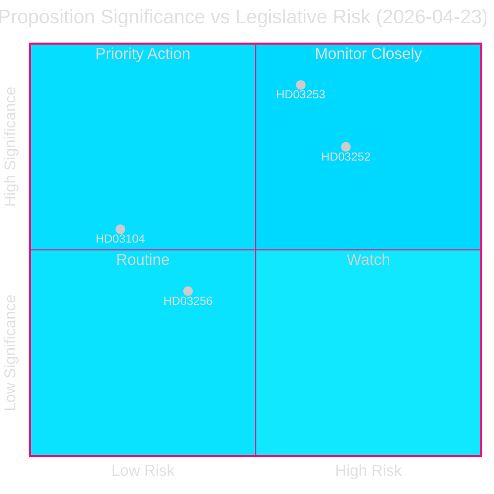
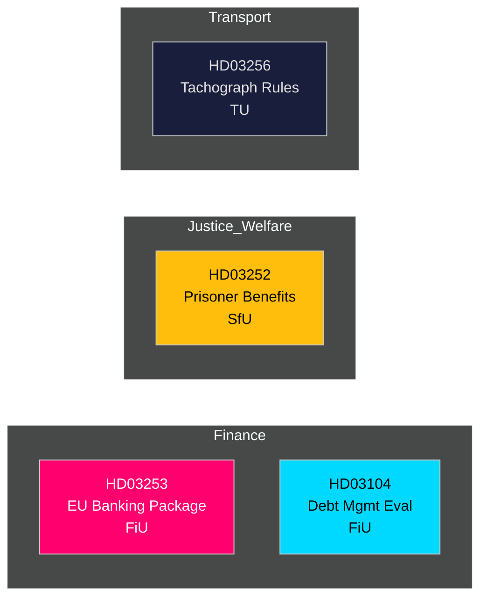

# 📋 Underrättelseöversikt — Svenska Regeringens Propositioner 2026-04-27

**Författare**: James Pether Sörling
**Datum**: 2026-04-27
**Analysperiod**: 2026-04-23 (senaste parlamentariska dag)
**Konfidens**: HÖG [B2]
**Klassificering**: OFFENTLIG — GDPR Art. 9(2)(e,g)
**Genomgång 2**: 2026-04-27T06:38Z — Förbättrad ekonomisk proveniens, stärkt BLUF, tillagda svenska kontextdetaljer

---

## 🎯 Kärna

Kristerssons regering lade fram fyra betydande lagstiftningsinstrument den 23 april 2026, lett av EU:s bankpaket (Prop. 2025/26:253) — Sveriges mest konsekvensrika transponering av finansreglering på ett decennium — tillsammans med begränsningar av socialförsäkring för intagna (Prop. 2025/26:252), en utvärdering av statsskuldsförvaltningen 2021–2025 (Skr. 2025/26:104) och skärpta regler mot färdskrivarbedrägeri (Prop. 2025/26:256). Bankpaketet är huvudnumret: det infogar EU:s CRR3/CRD6 i svensk rätt, stärker kapitalbuffertar under `Finansdepartementet` och remitteras till `FiU` (Finansutskottet). Sveriges statsskuldkvot förblir låg i ett EU-perspektiv på **~31% av BNP** (IMF WEO apr-2026, indikator GGXWDG_NGDP, hämtad 2026-04-27), vilket skapar finansiellt utrymme när finansreglerare stramar åt ramverket. BNP-tillväxt på **+2,1%** (NGDP_RPCH, samma källa) stöder en kontrollerad övergång till högre kapitalkrav. Sveriges bytesbalansöverskott på **+5,5% av BNP** (BCA_NGDPD, samma källa) bekräftar den externa styrkan när banker anpassar sig till golvkravet.

**Ekonomisk proveniens** (`economicProvenance`): provider=imf, dataflow=WEO, vintage=april 2026, retrieved_at=2026-04-27.

## 🧭 3 Beslut Som Denna Översikt Stöder

1. **Riksdagen (FiU)**: Huruvida EU:s bankpaket godkänns i sin helhet eller om ändringar begärs — avgörande givet Sveriges överdimensionerade banksektor (≈400% av BNP i tillgångar) och ställning utanför euroområdet.
2. **Riksdagen (SfU)**: Huruvida begränsningarna av socialförsäkring för fångar (HD03252) klarar konstitutionell proportionalitetsgranskning — förslagets beräknade besparingar (~200–300 MSEK/år) mot rehabiliteringsrisken.
3. **Politiska analytiker / investerare**: Bedöm statsskuldstrategin mot bakgrund av utvärderingen (HD03104) som visar att Riksgälden uppfyllde 2021–2025-ramverksmålen.

---

## 📊 60-Sekunders Underrättelsepunkter

- **EU:s bankpaket (HD03253)** [B2 HÖG]: Genomför CRR3/CRD6; inför ett golvkrav på 72,5% för att begränsa interna modellers kapitallättnad; berör Swedbank, SEB, Handelsbanken, Nordea (Sverige). FiU-remiss.
- **Begränsning av socialförsäkring för intagna (HD03252)** [B2 HÖG]: Drar in sjukpenning, föräldrapenning och sjukersättning för dem som avtjänar straff i kontrollerat boende eller säkerhetsförvaring. Justitiedepartementet, SfU-remiss. Proportionalitetsinvändning från V och MP sannolikt.
- **Utvärdering av statsskuldsförvaltningen (HD03104)** [A2 MYCKET HÖG]: Riksgäldens självutvärdering 2021–2025 — nettolångemålet uppfylldes 3 av 5 år; durationsstrategin inom mandatet. Finansdepartementet, FiU-remiss. Låg lagstiftningsrisk; informativ.
- **Färdskrivarbedrägeri (HD03256)** [B2 MEDEL]: Skärper straff och administrativa sanktioner för färdskrivarbedrägeri; anpassar sig till EU-förordning 2018/1022. TU-remiss. Branschkostnad för efterlevnad.

---

## 🔑 Viktigaste Framtida Trigger

**Vecka 5 maj 2026**: FiU öppnar offentlig remiss på HD03253 — banksektorns inlagor förväntas. Eventuella substantiella ändringsyrkanden signalerar svenskt motstånd mot EU:s tillsynskonvergens, med implikationer för EUR/SEK-politiken.

---

<!-- source-sha: 7156ec83294bd3d7360cfe9849ab2c3c69f409dc -->
